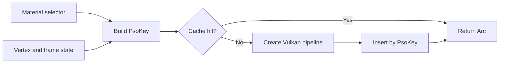

+++
title = 'Materials & PSOs'
weight = 1
+++

# Materials & PSOs

Surface data and pipeline state have different lifetimes. Anima resolves authored material assets into per-submesh data, then selects a Vulkan pipeline state object (PSO) from the small set of properties that affect GPU state.

This split keeps colors, texture choices, and numeric factors out of the PSO cache key. Surfaces with different appearances can share a pipeline and remain eligible for instancing.

## Two material records

A [`MaterialSet`](../native-materials/) resolves each mesh slot into a `SubmeshMaterial`. This record contains the surface inputs needed for rendering, including texture handles, PBR factors, blend mode, culling choice, and height treatment. The instancing path deduplicates the numeric data into `MaterialParamsData` rows and addresses textures through the [bindless arrays](../bindless-textures/).

The renderer's `Material` type is a smaller pipeline selector:

```rust
pub struct Material {
    shader: String,
    unlit: bool,
    blend: bool,
    masked: bool,
}
```

`shader` identifies the mesh shader module. Most surfaces use the shared mesh shader, while a non-foldable [node graph](../node-graph-codegen/) can supply a generated shader. The remaining fields select the unlit, translucent, or alpha-masked behavior for one submesh.

## Cache selection

`request_mesh_pipeline` converts the selector and frame state into a typed `PsoKey`. The key contains the shader name, unlit mode, vertex entry, wireframe mode, blend mode, alpha-to-coverage mode, and sample count. Two requests with equal keys receive the same `Arc<Pipeline>`.



The cache builds on demand. A failed pipeline build produces an error log and no pipeline for that batch; it does not panic the render loop. Unsupported wireframe requests fold to fill mode before key construction, so the cache cannot contain a line-mode key on a device without `fillModeNonSolid`.

## Per-submesh resolution

Blend mode belongs to a material slot rather than the whole mesh. `submit_draw_list` derives one `Material` selector per submesh, requests its PSO, and groups submeshes that resolve to the same pipeline. A model can therefore place opaque bodywork, masked foliage, and translucent glass in their respective passes.

At one sample, opaque and masked submeshes share the opaque PSO because the shader performs the alpha test. With MSAA, a masked submesh selects an alpha-to-coverage PSO. Translucent submeshes use blending with depth writes disabled and remain in individual, back-to-front sorted batches.

Opaque instances can merge when their mesh, base shader, unlit choice, and complete per-submesh blend pattern match. Different texture handles and PBR factors do not split the batch. Skinned, morphing, displaced, or translucent draw items remain separate because their geometry or ordering requirements differ.

## Pipeline state

The PSO bakes the state required by Vulkan pipeline creation:

- shader module and vertex entry point;
- the [`VkSpecializationInfo`](https://registry.khronos.org/vulkan/specs/latest/man/html/VkSpecializationInfo.html) values for unlit, alpha-to-coverage, and translucent variants;
- polygon mode, sample count, blend state, and depth-write state;
- dynamic-rendering color and depth formats;
- descriptor-set layouts and the mesh push-constant range.

Face culling is dynamic state, so a double-sided submesh does not create another PSO. Textures and material parameters also stay outside the key because descriptor tables carry them. On a device without ray tracing, the pipeline loads the shader sibling compiled with `SAFFRON_NO_RT` and uses the layout without ray-tracing sets.

Changing the sample count first idles the GPU and then clears the mesh-pipeline cache. Subsequent requests rebuild entries against the new render targets. `pipeline_count` reports the live mesh-cache size, while `pipelinesCreated` counts builds observed during draw-list submission.

```console
$ sa render-stats
...
"pipelines": 3,
"pipelinesCreated": 0
```

A steady frame normally reports zero newly created pipelines. A nonzero value identifies pipeline construction during that submission, which can explain a frame-time spike.

## In the code

| What | File | Symbols |
|---|---|---|
| Pipeline selector | `gpu_types.rs` | `Material` |
| Resolved surface data | `draw_list.rs` | `SubmeshMaterial`, `DrawItem` |
| Batch and submesh selection | `instancing.rs` | `Instancing::submit_draw_list` |
| Cache key and construction | `pipelines.rs` | `PsoKey`, `request_mesh_pipeline`, `build_mesh_pipeline_with_module` |
| Cache reset and counters | `pipelines.rs` | `set_sample_count`, `pipeline_count`, `pipelines_created` |

## Related

- [Native materials](../native-materials/) — authored assets, instances, and slot overrides
- [Übershader](../ubershader-and-specialization/) — specialization axes inside the shared mesh shader
- [Descriptor sets](../descriptor-sets/) — layouts baked into each mesh pipeline
- [Render graph](../../frame-and-render-graph/render-graph-overview/) — passes that bind the resolved batches
