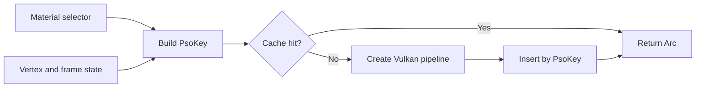

+++
title = 'Materials & PSOs'
weight = 1
+++

# Materials & PSOs

Surface data and pipeline state have different lifetimes. Anima resolves authored material assets into per-submesh data, then selects a Vulkan pipeline state object (PSO) from the small set of properties that affect GPU state.

This split keeps colors, texture choices, and numeric factors out of the PSO cache key. Surfaces with different appearances can share a pipeline and a draw bucket.

## Two material records

A [`MaterialSet`](../native-materials/) resolves each mesh slot into a `SubmeshMaterial`. This record contains the surface inputs needed for rendering, including texture handles, PBR factors, blend mode, culling choice, and height treatment. The GPU-scene mirror packs the numeric data into `MaterialParamsData` blocks in the global material-parameter arena (set 2, binding 2) and addresses textures through the [bindless arrays](../bindless-textures/); a draw record resolves its material to a `parameterIndex` into that arena.

The renderer's `Material` type is a smaller pipeline selector:

```rust
pub struct Material {
    shader: String,
    unlit: bool,
    blend: bool,
    masked: bool,
}
```

`shader` identifies the mesh shader module. Most surfaces use the shared mesh shader, while a non-foldable [node graph](../node-graph-codegen/) can supply a generated shader. The remaining fields select the unlit, translucent, or alpha-masked behavior for one submesh.

## Cache selection

`request_executor_mesh_pipeline` converts the selector and frame state into a typed `PsoKey`. The key contains the shader name, unlit mode, vertex path (the executor and skinned axes), wireframe mode, blend mode, alpha-to-coverage mode, and sample count. Two requests with equal keys receive the same `Arc<Pipeline>`.



The cache builds on demand. A failed pipeline build produces an error log and no pipeline for that bucket; it does not panic the render loop. Unsupported wireframe requests fold to fill mode before key construction, so the cache cannot contain a line-mode key on a device without `fillModeNonSolid`.

## Per-submesh resolution

Blend mode belongs to a material slot rather than the whole mesh. Each submesh's draw record carries a (shader, psoBin) identity; `build_executor_buckets` enumerates the frame's live combos into draw buckets, and `bucket_material` decodes each bucket into the `Material` selector for its PSO request. A model can therefore place opaque bodywork, masked foliage, and translucent glass in their respective passes.

At one sample, opaque and masked submeshes share the opaque PSO because the shader performs the alpha test. With MSAA, a masked submesh selects an alpha-to-coverage PSO. Translucent submeshes use blending with depth writes disabled; a GPU radix sort emits one back-to-front command slice per blend bucket, and the scene's translucent scope replays each slice with its blend PSO.

The scene pass binds one mesh PSO per bucket, while each depth-family pass (depth prepass, shadows, G-buffer, motion) draws every bucket through one shared vertex-only executor PSO. Different texture handles and PBR factors do not split a bucket. Skinning and morphing add no permutations either — their outputs land in per-frame deformed buffers the executor vertex path pulls through device addresses. A displaced instance adds one bucket per live material class rather than a permutation: its records name the displaced representation in their `psoBin`, so the bucket's draw binds the amplification arena's index stream while sharing the pass's PSO.

## Pipeline state

The PSO bakes the state required by Vulkan pipeline creation:

- shader module and vertex entry point;
- the [`VkSpecializationInfo`](https://registry.khronos.org/vulkan/specs/latest/man/html/VkSpecializationInfo.html) values for unlit, alpha-to-coverage, and translucent variants;
- polygon mode, sample count, blend state, and depth-write state;
- dynamic-rendering color and depth formats;
- descriptor-set layouts and the mesh push-constant range.

Face culling is dynamic state, so a double-sided bucket does not create another PSO. Textures and material parameters also stay outside the key because descriptor tables carry them. On a device without ray tracing, the pipeline loads the shader sibling compiled with `SAFFRON_NO_RT` and uses the layout without ray-tracing sets.

Changing the sample count first idles the GPU and then clears the mesh-pipeline cache. Subsequent requests rebuild entries against the new render targets. `pipeline_count` reports the live mesh-cache size, while `pipelinesCreated` counts PSOs compiled during the frame.

```console
$ sa render-stats
...
"pipelines": 3,
"pipelinesCreated": 0
```

A steady frame normally reports zero newly created pipelines. A nonzero value identifies pipeline construction during that submission, which can explain a frame-time spike.

## In the code

| What | File | Symbols |
|---|---|---|
| Pipeline selector | `gpu_types.rs` | `Material` |
| Resolved surface data | `draw_list.rs` | `SubmeshMaterial` |
| Bucket enumeration and decoding | `visibility.rs` | `ExecutorBucket`, `build_executor_buckets`, `bucket_material` |
| Per-bucket draw recording | `scene_pass.rs` | `record_executor_buckets`, `record_executor_depth_family` |
| Cache key and construction | `pipelines.rs` | `PsoKey`, `request_executor_mesh_pipeline`, `build_mesh_pipeline_with_module` |
| Cache reset and counters | `pipelines.rs` | `set_sample_count`, `pipeline_count`, `pipelines_created` |

## Related

- [Native materials](../native-materials/) — authored assets, instances, and slot overrides
- [Übershader](../ubershader-and-specialization/) — specialization axes inside the shared mesh shader
- [Descriptor sets](../descriptor-sets/) — layouts baked into each mesh pipeline
- [Render graph](../../frame-and-render-graph/render-graph-overview/) — passes that bind the resolved buckets
