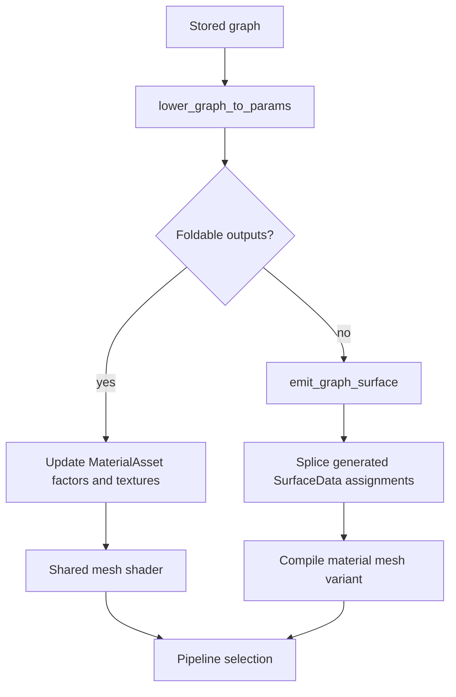

+++
title = 'Node-graph codegen'
weight = 6
+++

# Node-graph codegen

A material node graph expresses surface values as connected constants, texture samples, and math
operations. The graph remains editable JSON on the [native material](../native-materials/). Its
output either lowers to ordinary material parameters or becomes a material-specific shader body.

Both paths end at the same `SurfaceData` seam used by the fixed PBR material. Lighting, shadows,
fog, and post-processing therefore remain shared; the graph controls only the surface values supplied
to them.

## Graph document

The wire model contains a `nodes` array and an `edges` array. Each edge names its source and
destination as `[nodeId, pin]`. Canvas positions live in `props.editorPos`, which the engine ignores
while folding and emitting code.

```jsonc
{
  "nodes": [
    { "id": "tint", "type": "constant", "props": { "value": [0.8, 0.2, 0.1, 1.0] } },
    { "id": "tex", "type": "textureSlot", "props": { "slot": "albedo" } },
    { "id": "mul", "type": "multiply" },
    { "id": "out", "type": "materialOutput" }
  ],
  "edges": [
    { "from": ["tint", "rgba"], "to": ["mul", "a"] },
    { "from": ["tex", "rgba"], "to": ["mul", "b"] },
    { "from": ["mul", "rgba"], "to": ["out", "baseColor"] }
  ]
}
```

The emitter processes nodes in array order rather than sorting the graph. Sources must therefore
appear before their consumers, and every required math input must be connected. Node ids become part
of generated variable names such as `n_tint` and `n_mul`.

## Fold decision

`lower_graph_to_params` inspects the edges entering `materialOutput`. A constant wired directly to a
supported output can become a `MaterialAsset` factor. A direct JSON `texture` node can similarly
become a texture UUID for a compatible material slot.

An intermediate math node or the editor's sampling `textureSlot` node requires code generation. An
unknown output channel or unresolved source also makes the graph non-foldable. The caller folds into
a clone and commits those parameter changes only when the function returns `true`.



Folding avoids shader compilation and keeps the material on the shared mesh shader. Changing a
folded constant changes the per-frame parameter table. A non-foldable edit changes generated source
and produces a distinct shader identity for [pipeline selection](../material-and-pso-selection/).

## Surface emission

`emit_graph_surface` initializes a surface and emits one `float4` statement for each non-output
node. Math nodes refer to their connected source variables, while `textureSlot` samples the material's
bindless texture index for the selected slot.

| Category | Node types |
|---|---|
| Inputs | `constant`, `textureSlot`, `uv` |
| Arithmetic | `multiply`, `add`, `subtract`, `divide`, `lerp` |
| Range and comparison | `saturate`, `clamp`, `step`, `smoothstep` |
| Utility | `oneMinus`, `dot`, `sin`, `cos`, `frac` |
| Sink | `materialOutput` |

All intermediate values are `float4`. Division floors the denominator at `1e-5`, `dot` replicates
its RGB dot product across all lanes, and an unknown node emits zero. The generated mesh body assigns
`baseColor`, `metallic`, `roughness`, and `emissive` when those pins are connected.

The mesh target initializes normal from the world normal, occlusion to one, and opacity from the
material base-color alpha. Those three values remain at their initialized values in generated graph
bodies. The self-contained compile target uses a smaller five-field surface for validating emitted
Slang.

## Mesh variant compilation

`compile_material_mesh_shader` inserts the generated body between the `@graph-begin` and
`@graph-end` markers in `mesh.slang`. It writes
`materials/<uuid>_mesh.slang` and invokes [Slang](https://shader-slang.org/) twice to produce
`materials/<uuid>_mesh.spv` and `materials/<uuid>_mesh_nort.spv` in
[SPIR-V](https://registry.khronos.org/SPIR-V/) form. The second compile defines
`SAFFRON_NO_RT=1` for devices whose pipeline layout omits the ray-tracing sets.

The generated consumer resolves `lighting.slang` and its dependencies from the staged
`shaders/source/` tree. This source-only include path keeps precompiled static modules out of the
compile, allowing `SAFFRON_NO_RT` to propagate through every imported declaration.

`material-set-graph` stores the JSON and attempts a mesh-variant compile when folding fails. Material
resolution selects the `_mesh.spv` artifact when it exists; pipeline creation selects its `_nort`
sibling on a device without ray tracing. A missing generated artifact selects the shared mesh
shader. The live material preview uses this same resolved scene-material path.

`material-compile-graph` provides a separate compiler check. It wraps the emitted preview body in a
self-contained fragment shader and writes `materials/<uuid>.slang` plus `<uuid>.spv`. The editor's
Compile command calls this validation path rather than changing which scene shader is selected.

## Cooking

`material-cook` scans every material asset, skips graphs that lower to parameters, and rebuilds both
mesh artifacts for each non-foldable graph. `export-app` performs the same material-shader cook before
copying the project assets, engine shaders, and player into the application folder.

The compiler path resolves `slangc` from `SAFFRON_SLANGC`, the `saffron-slang` cache under `HOME`, or
`PATH`. Generated paths are passed as discrete process arguments, and compilation succeeds only when
the process exits successfully and the output file exists.

## Editor flow

The editor maps the wire graph to [React Flow](https://reactflow.dev/) nodes and edges through
`graphToFlow`, then restores `editorPos` through `flowToGraph`. Its palette comes from `NODE_SPECS`,
and `TEXTURE_SLOTS` limits texture sampling to albedo, metallic-roughness, normal, emissive,
occlusion, and height.

Graph edits apply through `material-set-graph` after a 500 ms debounce. The material preview is a
live engine subsurface, so cache invalidation makes the edited asset appear on the preview scene
without a PNG readback. Per-tab snapshot history replays the same graph command for undo and redo.

## In the code

| What | File | Symbols |
|---|---|---|
| Fold and emission | `assets/src/graph.rs` | `lower_graph_to_params`, `emit_graph_surface`, `emit_math_node` |
| Generated artifacts | `assets/src/codegen.rs` | `AssetServer::compile_material_graph`, `AssetServer::compile_material_mesh_shader`, `find_slangc` |
| Mesh splice points | `assets/shaders/mesh.slang` | `evalSurface`, `@graph-begin`, `@graph-end` |
| Shared module build | `xtask/src/shaders.rs` | `compile_module`, `LIGHTING_STEM` |
| Store, compile, and cook commands | `control/src/commands_asset.rs` | `material-set-graph`, `material-compile-graph`, `material-cook` |
| Editor graph model | `editor/src/materials/graph.ts` | `NODE_SPECS`, `graphToFlow`, `flowToGraph` |
| Editor canvas | `editor/src/panels/MaterialGraphEditor.tsx` | `MaterialGraphEditor`, `GraphCanvas` |

## Related

- [Native materials](../native-materials/) describes the asset and parameter table.
- [Übershader](../ubershader-and-specialization/) covers the shared shader permutations.
- [Materials and PSOs](../material-and-pso-selection/) explains shader identity in the pipeline key.
- [Shader compilation](../../architecture-and-conventions/shader-compilation/) covers the project-wide Slang build.
