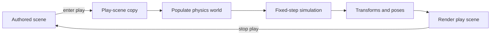

+++
title = 'Physics'
weight = 18
bookCollapseSection = true
+++

# Physics

Anima uses [Jolt Physics](https://jrouwe.github.io/JoltPhysicsDocs/5.3.0/) for rigid bodies, collision queries, character movement, and ragdolls. The safe `saffron-physics` crate translates scene components into a per-play simulation and exposes Jolt-free Rust types to the rest of the engine.

The `saffron-physics-sys` crate owns the [`cxx`](https://cxx.rs/) bridge and the vendored C++ implementation. Jolt handles bodies, constraints, and narrow-phase queries behind an opaque world handle; Rust retains entity mapping, fixed-step accumulation, contact history, and pose write-back.

## Simulation flow

The physics world belongs to the play session. Entering play duplicates the authored scene, creates and populates a world from that copy, and advances it on the gameplay fixed tick. Stopping play drops both the simulation world and the duplicated scene.

Colliders provide shapes and surface properties. A rigidbody adds solver-controlled motion, while character controllers and ragdolls use dedicated Jolt objects. Kinematic bone bodies carry animation motion into collision; ragdoll pose overrides carry simulated motion back into animation.

## Pages

| Page | Covers | Code |
|---|---|---|
| [Physics world lifecycle](physics-world-lifecycle/) | Play-session ownership, fixed stepping, and the Rust/C++ boundary | `World`, `reconcile_play_edge`, `physics-state` |
| [Rigidbody and collider](rigidbody-and-collider/) | Component roles, body creation, simulation, and transform write-back | `Rigidbody`, `Collider`, `World::populate`, `World::step` |
| [Collision shapes and materials](collision-shapes/) | Analytic and cooked shapes, fitting, friction, and restitution | `Shape`, `PhysicsMaterial`, `fit_collider_to_mesh` |
| [Collision layers, sensors, and contact events](collision-layers-and-triggers/) | Pair filtering, trigger bodies, and sequenced contact delivery | `ObjectLayer`, `ContactEvent`, `World::drain_contacts` |
| [Kinematic bodies and bone following](kinematic-bones/) | Swept kinematic motion and animation-driven bone bodies | `KinematicBones`, `World::build_bone_bodies` |
| [Character controller](character-controller/) | Capsule sweeps, slopes, stairs, and root movement | `CharacterController`, `World::step_characters` |
| [Scene queries](scene-queries/) | Ray and sphere casts through control and scripts | `RayHit`, `World::raycast`, `World::sphere_cast` |
| [Ragdoll](ragdoll/) | Constrained bone bodies and physics-to-pose conversion | `BonePhysicsComponent`, `World::enable_ragdoll`, `World::write_ragdoll_poses` |
| [Active ragdoll](active-ragdoll/) | Joint motors and per-bone animation/physics blending | `PoseTarget`, `World::drive_ragdolls_to_pose`, `set-ragdoll` |
| [Vegetation collision residency](vegetation-collision/) | Generation-tagged batched plant proxies | `VegetationCollisionResidency`, `World::add_static_target_bodies` |

## In the code

| What | File | Symbols |
|---|---|---|
| Safe simulation API | `physics/src/world.rs` | `World`, `MeshCook`, `shutdown_physics` |
| Shared physics values | `physics/src/types.rs` | `MotionType`, `ObjectLayer`, `ContactEvent`, `RayHit` |
| Scene components | `scene/src/component.rs` | `Rigidbody`, `Collider`, `CharacterController`, `BonePhysicsComponent` |
| Play-state edge | `host/src/layer.rs` | `update_session`, `reconcile_play_edge` |
| Runtime session | `runtime/src/session.rs` | `RuntimeSession::start`, `RuntimeSession::step`, `RuntimeSession::stop` |
| Jolt bridge | `physics-sys/src/lib.rs` | `JoltWorld`, `BodyCreate`, `CharacterCreate` |

## Related

- [Play mode](../ui-and-editor/play-mode/) — scene duplication and session transitions
- [Animation](../animation/) — pose evaluation consumed by bone bodies and ragdoll motors
- [Scene and ECS](../scene-and-ecs/) — transforms and components used to build bodies
