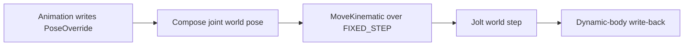

+++
title = 'Kinematic bodies and bone following'
weight = 5
+++

# Kinematic bodies and bone following

A kinematic body participates in collision but takes its motion from the scene rather than forces or gravity. Anima uses this motion type for moving rigidbodies and for optional per-bone capsules that make animated limbs push dynamic objects.

Bone following is animation-to-physics binding. Animation remains authoritative for the skeleton, while physics reads each driven joint's pose and moves a collision body to match it. [Ragdolls](../ragdoll/) use the opposite direction by writing simulated body poses back to bones.

## Swept motion

Each fixed substep calls Jolt's [`BodyInterface::MoveKinematic`](https://jrouwe.github.io/JoltPhysicsDocs/5.3.0/class_body_interface.html) with the target position, target rotation, and `FIXED_STEP`. Jolt derives the linear and angular velocity that reaches the target over that interval.

This velocity lets a moving kinematic body transfer motion through contacts. Setting its transform directly would place the body at the target without describing the intervening motion to the solver.



`World::move_kinematic_bodies` drives free kinematic rigidbodies and bone bodies through the same path. It runs before `world_step` inside each accumulator substep, so target motion and collision integration use the same duration.

## Fresh joint poses

The animation evaluator writes `PoseOverride` values before the runtime steps physics. `fresh_world_pose` calls `Scene::compose_world_matrix` for each body entity, which composes the active local pose through the parent chain.

The follow step does not depend on the cached `WorldTransform`. That cache refresh belongs to scene hierarchy processing, while the fixed step needs the pose produced earlier in the same host update.

## Rig setup

`KinematicBones` lives on the entity with `SkinnedMesh`. Its fields select the active bone bodies:

| Field | Meaning |
|---|---|
| `enabled` | Creates bone bodies for the play session when true |
| `driven` | Bone indices to follow; an empty list selects every bone |

Adding `KinematicBones` through `add-component` also calls `fit_bone_capsules`. The fit measures each bone to its farthest direct child in the rest pose. It uses half the distance as capsule half-height and 30% of that value as radius, with `0.05` and `0.03` minimums for leaf length and radius.

The dimensions are stored in the parallel `BonePhysicsComponent::bones` array. Existing masses, joint limits, and motor values survive a fit because the function updates only `shape_half_extents`.

`World::build_bone_bodies` creates one Y-up capsule for every selected joint. Each body uses kinematic motion, the `Moving` object layer, friction `0.2`, and zero restitution. If fitted metadata is absent, radius and half-height both fall back to `0.03`.

Bone-following capsules have no constraints between them. Their purpose is a moving collision proxy for the animated rig; [ragdoll](../ragdoll/) construction owns the constrained body graph.

## Control surface

`set-kinematic-bones` accepts either the rig entity or its model-container root. The command resolves the descendant carrying `SkinnedMesh`, creates the component when absent, and toggles `enabled` when the field is supplied.

```console
$ sa set-kinematic-bones --entity 42 --enabled true
kinematic-bones=on  entity=42  bones=3
```

The reported entity is the resolved rig UUID and `bones` is its skeleton bone count. The command changes authored configuration in Edit mode; the bodies appear when the next play session populates its [physics world](../physics-world-lifecycle/).

## In the code

| What | File | Symbols |
|---|---|---|
| Component and per-bone metadata | `scene/src/component.rs` | `KinematicBones`, `BonePhysicsComponent`, `BonePhysics` |
| Body construction and drive | `physics/src/world.rs` | `World::build_bone_bodies`, `World::move_kinematic_bodies`, `fresh_world_pose` |
| Capsule fitting | `physics/src/world.rs` | `fit_bone_capsules` |
| Jolt motion bridge | `physics-sys/src/lib.rs` | `move_kinematic` |
| Toggle command | `control/src/commands_physics.rs` | `set-kinematic-bones` |

## Related

- [Physics world lifecycle](../physics-world-lifecycle/) — when bone bodies are built and dropped
- [Rigidbody and collider](../rigidbody-and-collider/) — free kinematic bodies and ordinary collider data
- [Character controller](../character-controller/) — a separate animation-independent collision proxy
- [Ragdoll](../ragdoll/) — physics-to-animation bone binding
