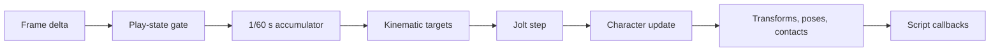

+++
title = 'Physics world lifecycle'
weight = 1
+++

# Physics world lifecycle

The physics world belongs to a runtime session. Entering play creates it from the duplicated play scene, Paused retains it without advancing, and returning to Edit drops it with all simulated state.

The standalone player uses the same `RuntimeSession` API against its loaded scene. Both consumers share one startup, simulation, and teardown path for physics, animation, and scripts.

## Session ownership

The editor duplicates the authored scene through `scene_to_json` and `scene_from_json` before publishing the `Edit` to `Playing` transition. `HostLayer::reconcile_play_edge` observes that edge and calls `RuntimeSession::start` with the play-scene copy.

`RuntimeSession` stores the live `World` in an `Rc<RefCell<Option<World>>>`. The same cell gives the control plane and script bridge temporary access for physics commands and scene queries. It contains `None` in Edit and `Some(World)` throughout Playing or Paused.

Startup follows one order:

1. `World::new` initializes Jolt's process globals and creates the opaque Jolt world.
2. `World::populate` creates bodies from `Collider` and `Rigidbody` components.
3. `World::build_bone_bodies` adds enabled kinematic-bone proxies.
4. `World::add_character` creates each `CharacterVirtual` controller.
5. The runtime starts the script VM against the same play scene.

A collider-specific failure logs and skips that body while the rest of the world remains usable. A failure to create the world leaves the session without physics and prevents script startup for that session.

## Fixed-step execution

The host calls `RuntimeSession::tick_animation` before the gated simulation step. Playing supplies a clamped frame delta; Paused supplies no delta unless a single-step grant is pending. A granted step uses exactly `1/60` second.

`World::step` adds the supplied delta to an accumulator and advances Jolt in `FIXED_STEP = 1/60` increments. It runs at most eight substeps in one call. Each substep drives kinematic targets before `world_step`, then advances character controllers against the settled world.

After at least one substep, dynamic-body transforms return to the play scene and contact transitions enter the sequence-stamped ring. `RuntimeSession::step` also writes ragdoll poses, dispatches new contacts, and runs script `on_update` after releasing the mutable world borrow.



## World and global teardown

`RuntimeSession::stop` stops scripts, replaces the shared world with `None`, and clears per-session buffers. Dropping `World` releases its `cxx::UniquePtr<JoltWorld>`. The C++ destructor removes live ragdolls before their bodies and constraints are destroyed, then member order releases character objects and the physics system safely.

Jolt also owns process-global allocator hooks, a `Factory`, and registered types. `World::new` installs them through the idempotent `saffron_physics_sys::init`, but stopping a play session leaves them installed for later sessions.

Final host and player teardown uses a stricter order: stop scripts, drop the last world, then call `shutdown_physics_globals`. This guarantees the Jolt `Factory` and type registry outlive every body and constraint.

## Rust and C++ boundary

[`cxx`](https://cxx.rs/) defines the bridge in `physics-sys/src/bridge.rs`. Plain scalar records cross the bridge, while `JoltWorld` remains an opaque C++ type containing `PhysicsSystem`, filters, the contact listener, characters, and ragdolls.

`saffron-physics-sys` is the unsafe FFI crate and exposes thin Rust wrappers around the generated bridge. The higher-level `saffron-physics` crate has `#![deny(unsafe_code)]`; it owns entity mapping, deterministic creation order, the accumulator, contact history, and the public Jolt-free types.

## Deterministic build contract

Anima builds Jolt 5.3.0 from a pinned, checksum-verified source archive. The source enters a gitignored vendor cache, and the same `JoltBuildFlags` apply to Jolt, the shim, and generated bridge translation units.

Jolt's [deterministic simulation contract](https://jrouwe.github.io/JoltPhysicsDocs/5.3.0/) requires identical ordered API inputs, source, and compile defines. The build enables `JPH_CROSS_PLATFORM_DETERMINISTIC`, uses single-precision positions, applies `-ffp-model=precise` and `-ffp-contract=off`, and omits fused multiply-add support.

The target-specific flag table has explicit x86-64 and aarch64 variants. x86-64 selects its paired AVX2 feature defines and compiler flags; aarch64 uses Jolt's baseline NEON path. An unsupported architecture fails the build instead of inheriting another target's flags.

Two compile-time checks enforce the configuration. The C++ shim rejects a build without the deterministic define or with `JPH_DOUBLE_PRECISION`; `build.rs` emits `cfg(jolt_deterministic)` only when both conditions hold. Deterministic results also depend on callers presenting state changes in the same order, so `World` creates and tracks bodies in scene iteration order rather than hash-map order.

## Observing the world

`physics-state` returns an inactive zero summary in Edit, which makes it safe to poll without a live world. During play it reports the body count from Jolt and the number of tracked dynamic bodies.

```console
$ sa physics-state
physics=inactive  bodies=0  dynamic=0

$ sa play
state=playing  playVersion=1  sceneVersion=1  camera=ok

$ sa physics-state
physics=active  bodies=12  dynamic=4
```

Paused keeps the active counts because the world still exists. `sa stop` returns to the authored scene, and the next `physics-state` reports inactive again.

## In the code

| What | File | Symbols |
|---|---|---|
| Session lifecycle | `runtime/src/session.rs` | `RuntimeSession::start`, `RuntimeSession::step`, `RuntimeSession::stop` |
| Host play edge and teardown | `host/src/layer.rs` | `reconcile_play_edge`, `teardown_recording` |
| World ownership and accumulator | `physics/src/world.rs` | `World`, `World::new`, `World::populate`, `World::step` |
| Safe physics values | `physics/src/types.rs` | `FIXED_STEP`, `WorldStats`, `MotionType`, `ObjectLayer` |
| Jolt bridge lifecycle | `physics-sys/src/lib.rs` | `init`, `shutdown`, `world_new`, `world_step` |
| Build configuration | `physics-sys/src/jolt_build_flags.rs` | `JoltBuildFlags::for_arch` |
| Control summary | `control/src/commands_physics.rs` | `physics-state` |

## Related

- [Play mode](../../ui-and-editor/play-mode/) — play-scene duplication and state transitions
- [Rigidbody and collider](../rigidbody-and-collider/) — component-to-body population
- [Collision layers, sensors, and contact events](../collision-layers-and-triggers/) — events produced during fixed steps
- [Kinematic bodies and bone following](../kinematic-bones/) — motion driven before each Jolt update
