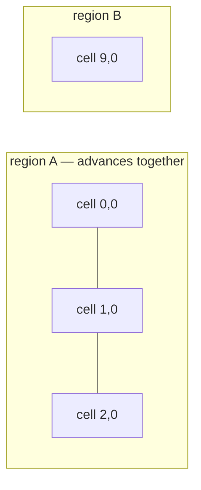

+++
title = 'Ecology ticks and catch-up'
weight = 12
+++

# Ecology ticks and catch-up

A forest keeps growing while nobody is looking. Anima simulates that in fixed ecology ticks over the
macro plant rows, and brings unloaded ground forward when it comes back — reaching exactly the state
continuous simulation would have reached, byte for byte.

## Biological time is not the calendar

Two clocks run. Time of day and the calendar drive appearance and seasonal rates; they are
presentation inputs, and rewinding them previews a different season. Biological time is separate,
counted in fixed ticks by a clock that only moves forward.

World time may jump. Loading a save a hundred ticks later moves the clock a hundred ticks in one
step. The cells behind it do not jump: each records the tick it has been simulated to, and catch-up
executes every owed tick. There is no closed-form fast-forward operator to prove equivalent to,
because there is no fast-forward — a plant that spent forty ticks in shade lost health forty times.

## What moves the clock

Simulated play time does. Every play step folds its `dt` into the runtime's ecology clock in integer
microseconds, and each whole `tickMilliseconds` of it earns one ecology tick; the vegetation
synchronization point then advances world time by the ticks that came due and catches the dependency
regions up, within a per-synchronization budget. Nothing in that path reads the calendar or the time
of day, so an hour of play ages the forest by the same amount wherever the year is set.

The clock also works off what a region still owes when no new tick is due — a jump the budget could
not finish is paid off over the following frames. Stopping the clock stops both: no new tick, and no
payment of the arrears. That is what makes the Ecology Timeline's pause honest, and it is why an
explicit step is a separate call rather than a nudge to the clock.

Arrears come in two kinds and only one of them is work. A resident region behind world time will run
its ticks on the next synchronization, so the clock keeps asking. A region spanning ground outside the
streaming window owes ticks nothing can spend, and in a world larger than the window that is the
normal condition — polling for it would rebuild the whole world's region closure every frame to run
nothing. So the report separates `ticksOwed` from `ticksAwaitingResidency`, the clock keys on the
first, and the world's *ecology ground revision* — bumped when a cell generation is published or
unloaded, or when a mutation plants into ground the cook left empty — is what re-arms the poll when
that ground arrives.

One clock owns the rules every tick runs under — the sampled weather, the influence radii, and the
worker count — so an authored step and the world's own ticks cannot diverge on them. Weather is
sampled *into* the clock: vegetation consumes water and warmth and owns only the biological response,
so until a weather system writes them the clock holds a temperate growing sample.

```sh
sa vegetation-ecology-clock
#   clock=running  tick=60000ms (+1500ms pending)  budget=8 ticks/sync  workers=4  water=40000  warmth=45000  owed=0
sa vegetation-ecology-clock --running false        # biology holds still with the world
```

The physics and navigation facets read only *settled* biology. A cell is settled when its tick equals
world time, and also when its region cannot run at all — some cell the region spans is not resident.
What is not settled is a cell mid-catch-up: its region is loaded and behind, so its lifecycle state
changes every executed tick, and the collision facet materializes no proxy bodies and the navigation
seam publishes no contribution until it lands. Either would otherwise rebuild the whole cell once per
executed tick, from biology nobody was ever meant to observe.

Readiness is relative to what a cell's own region can reach, not to the world clock. A loaded cell
whose planted neighbour sits outside the streaming window never reaches world time, and in a world
larger than the window most loaded ground is in that position — measuring it against the clock would
leave it uncollidable for as long as it stayed loaded. No tick is coming for it, so its last committed
generation is the newest one there will be, and it publishes.

Rendering is the exception on purpose. It draws whichever generation is published, because hiding a
forest while it catches up would be a worse lie than drawing it a few ticks behind.

## One tick

A tick is a pure function of immutable state. It takes a cell's plants at tick `N` plus its
neighbours' boundary summaries at tick `N`, and returns the owned changes for `N+1` as typed
mutations for the one reducer:

```rust
let output = advance_cell(&EcologyTickInputs {
    cell, tick, map,
    plants,            // the macro SoA rows, in canonical identity order
    neighbours,        // boundary summaries at the completed tick
    rules, weather,
})?;
```

Nothing in the step reads wall-clock time, iteration order, or a running accumulator. Ambient shade
is computed once for the whole tick from the immutable input, so no plant sees a partially updated
world. Every stochastic decision draws from a counter-based Philox stream keyed by (map, species,
plant, rule channel) at sample index `tick`, one channel per rule, so a plant's coin flips are the
same whichever worker asks and however many neighbours happen to be loaded.

The rules are legible game-world biology, not a botanical model: stage advancement by biological
age, suitability from the worse of light and water, health integrating suitability, mortality at
zero health, dormancy below a warmth threshold (age advances, growth does not), seed spread from
mature plants, deadfall to a stump, and regrowth. `ECOLOGY_SIMULATION_VERSION` names the set; state
carrying a different version is a loud mismatch, not a silent re-simulation.

Competition runs on two budgets, not one. The canopy budget is the shade a cell casts; the root
budget is what its plants demand below ground, and it takes its cut of the water before a species'
drought tolerance sees any. Both cross borders the same way: what this cell holds, plus a quarter of
what each neighbour holds.

## Species relations

A species declares how it responds to its neighbours, on the family asset rather than in a biome —
an oak shades out what it shades out wherever it grows. The cook bakes the declarations into the
manifest, so a tick resolves them without the asset catalog:

| Relation | What it does to the subject |
|---|---|
| `Companion` | Raises suitability in proportion to the other's canopy |
| `Antagonist` | Lowers it — allelopathy, root crowding, canopy exclusion |
| `Understory` | Relieves the shade it perceives, so deep shade suits it |
| `Successor` | Same relief, and its seedlings hold their stage while the canopy above stays healthy |

Relations need to know *which* neighbour is there, not just how much shade arrives, so the boundary
summary carries a per-family presence list — canopy and mean health per species, in canonical family
order. A successor watches exactly that health: above half it waits, below half it advances and
gains the suitability the failing canopy leaves behind.

## Dependency regions

Shade, competition, and seed spread cross cell borders, so a cell cannot be caught up alone — its
neighbours would still be at the old tick and it would read stale shade. `EcologyInfluence` declares
one radius per effect, and a region uses the widest of them:

```rust
EcologyInfluence { shade_cells: 1, competition_cells: 1, propagation_cells: 4, .. }
    .region_radius_cells()   // 4
```

A dependency region is the transitive closure of "within that radius": a chain of neighbours pulls
the whole chain in, because advancing any link needs the next one's tick-`N` state.

Both the closure and the per-cell halo lookup go through a uniform grid index over cell keys,
bucketed at the influence radius, so building regions and reading a halo cost their own neighbourhood
rather than a walk of every planted cell in the world. The index is an ordered map and each bucket
stays sorted — a query's result is an input to a tick, so an iteration order that varied would reach
published bytes.



A region advances or it does not; there is no half. Every cell computes its result before anything
is committed, and the publication checks each cell's successor tick before storing any of them. A
region also only runs while every cell it spans is resident — one absent neighbour would read as
empty ground, so the region waits instead.

## Budgets delay, they never drop

A catch-up budget bounds region ticks per call, and it is spent a round at a time: every region that
owes a tick advances once, then the next round begins, so a region cannot starve another out of the
call. What the budget does not run is reported as owed and resumes at the same tick next call, in the
same order. Three budgeted calls and one unbudgeted call reach the same bytes.

Within a round the regions are independent, so their rules run across `workers` threads and the
results commit in canonical region order rather than in completion order. A worker count changes how
long a catch-up takes and nothing else — one worker and three reach the same persistent bytes. The
report says how many threads the call really spread across, which is the configured count bounded by
how many regions were ever due at once.

```sh
# a biological tick crosses the wire as a string, so the quotes are part of the value
sa vegetation-advance-ecology --targetTick '"64"' --maxTicks 8
#   worldTick=64  ticksRun=8 on 4 workers  ticksOwed=56 (+64 awaiting residency)  regions=2 (0 caught up, 1 awaiting residency)  checkpoint=9f21c4b0aa73
sa vegetation-ecology-status
#   worldTick=64  ruleSet=2  regionRadius=1 cells  regions=2  checkpoint=9f21c4b0aa73
#     clock=running  tick=60000ms (+0ms pending)  budget=8 ticks/sync  workers=4  water=40000  warmth=45000  owed=56
#     region 0,0,0 L0    tick=8   behind
#     region 9,0,0 L0    tick=0   awaiting residency
```

The checkpoint identity hashes the rule-set version, world time, and every boundary summary in
canonical cell order. Two runs that reached the same tick by different routes produce the same
identity exactly when their committed state agrees, so equivalence is one comparison rather than a
rule per caller.

## What a fire system reads

Vegetation owns fuel, moisture, health, occupancy, and the persistent record of what is alight. Heat
propagation and smoke belong elsewhere. `combustion_sample` answers the first half over a volume,
and the typed replies are `Ignite`, `Burn`, `Extinguish`, and `MoistureFuel`:

```sh
sa -o json vegetation-combustion '{"bounds":{...}}'
#   plants=41  ignited=3  fuel=52104  moisture=9210  occupancy=18337
```

Weather works the same way round. `EcologyWeather { water, warmth }` is a per-tick input; nothing in
vegetation computes or stores weather. What vegetation owns is the response — moisture settles
toward the supply, fuel accumulates with dryness, and suitability governs health.

## In the code

| What | File | Symbols |
|---|---|---|
| Clock, summaries, checkpoints | `vegetation/src/ecology.rs` | `EcologyClock`, `EcologyState`, `publish_region_tick`, `cell_tick`, `checkpoint_identity` |
| The tick rules | `vegetation/src/ecology_tick/` | `advance_cell`, `EcologyPlantState`, `EcologySpeciesRules`, `EcologyWeather` |
| Species relations | `vegetation/src/asset/`, `ecology_tick/` | `PlantEcologyDeclaration`, `PlantRelationKind`, `EcologyRelations` |
| Per-family presence | `vegetation/src/ecology.rs` | `EcologyFamilyPresence`, `EcologyCellSummary` |
| Regions, halo index, budgets | `vegetation/src/ecology_region.rs` | `EcologyInfluence`, `dependency_regions`, `CellSpatialIndex`, `advance_region`, `EcologyCatchUpBudget` |
| Driving catch-up | `vegetation/src/runtime_world/simulation.rs` | `advance_ecology`, `compute_region_ticks`, `commit_region_tick`, `EcologyRegionPartition` |
| Facet readiness | `vegetation/src/runtime_world/simulation.rs` | `simulation_facet_is_settled`, `ecology_region_standings`, `ecology_ground_revision` |
| The world clock | `runtime/src/vegetation_ecology.rs` | `VegetationEcologyClock`, `accumulate`, `wants_advance`, `advance`, `advance_to` |
| Reading settled biology | `runtime/src/vegetation_collision.rs`, `vegetation_navigation.rs` | `VegetationCollisionResidency::advance`, `VegetationNavigationSeam::advance` |
| Control surface | `control/src/commands_vegetation_runtime/` | `vegetation-advance-ecology`, `vegetation-ecology-status`, `vegetation-ecology-clock`, `vegetation-combustion` |

## Related

- [Vegetation state](../vegetation-state/) — the reducer, typed transitions, and strict persistence
- [Plant promotion](../plant-promotion/) — why simulating a plant never promotes it
- [Spatial world](../spatial-world/) — cells, quantized positions, and facet residency
- [Wind field](../wind-field/) — the other deterministic field vegetation consumes
