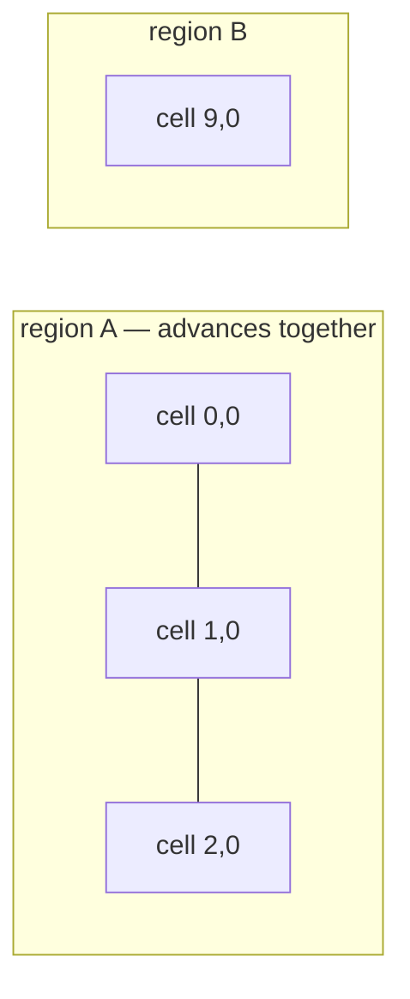

+++
title = 'Ecology ticks and catch-up'
weight = 12
+++

# Ecology ticks and catch-up

A forest keeps growing while nobody is looking. Anima simulates that in fixed ecology ticks over the
macro plant rows, and brings unloaded ground forward when it comes back — reaching exactly the state
continuous simulation would have reached, byte for byte.

## Biological time is not the calendar

Two clocks run. Time of day and the calendar drive appearance and seasonal rates; they are
presentation inputs, and rewinding them previews a different season. Biological time is separate,
counted in fixed ticks by a clock that only moves forward.

World time may jump. Loading a save a hundred ticks later moves the clock a hundred ticks in one
step. The cells behind it do not jump: each records the tick it has been simulated to, and catch-up
executes every owed tick. There is no closed-form fast-forward operator to prove equivalent to,
because there is no fast-forward — a plant that spent forty ticks in shade lost health forty times.

A cell whose tick equals world time is caught up, and its simulation facet is readable. One behind
is not, and readers that need committed truth read the last published generation instead.

## One tick

A tick is a pure function of immutable state. It takes a cell's plants at tick `N` plus its
neighbours' boundary summaries at tick `N`, and returns the owned changes for `N+1` as typed
mutations for the one reducer:

```rust
let output = advance_cell(&EcologyTickInputs {
    cell, tick, map,
    plants,            // the macro SoA rows, in canonical identity order
    neighbours,        // boundary summaries at the completed tick
    rules, weather,
})?;
```

Nothing in the step reads wall-clock time, iteration order, or a running accumulator. Ambient shade
is computed once for the whole tick from the immutable input, so no plant sees a partially updated
world. Every stochastic decision draws from a counter-based Philox stream keyed by (map, species,
plant, rule channel) at sample index `tick`, one channel per rule, so a plant's coin flips are the
same whichever worker asks and however many neighbours happen to be loaded.

The rules are legible game-world biology, not a botanical model: stage advancement by biological
age, suitability from the worse of light and water, health integrating suitability, mortality at
zero health, dormancy below a warmth threshold (age advances, growth does not), seed spread from
mature plants, deadfall to a stump, and regrowth. `ECOLOGY_SIMULATION_VERSION` names the set; state
carrying a different version is a loud mismatch, not a silent re-simulation.

Competition runs on two budgets, not one. The canopy budget is the shade a cell casts; the root
budget is what its plants demand below ground, and it takes its cut of the water before a species'
drought tolerance sees any. Both cross borders the same way: what this cell holds, plus a quarter of
what each neighbour holds.

## Species relations

A species declares how it responds to its neighbours, on the family asset rather than in a biome —
an oak shades out what it shades out wherever it grows. The cook bakes the declarations into the
manifest, so a tick resolves them without the asset catalog:

| Relation | What it does to the subject |
|---|---|
| `Companion` | Raises suitability in proportion to the other's canopy |
| `Antagonist` | Lowers it — allelopathy, root crowding, canopy exclusion |
| `Understory` | Relieves the shade it perceives, so deep shade suits it |
| `Successor` | Same relief, and its seedlings hold their stage while the canopy above stays healthy |

Relations need to know *which* neighbour is there, not just how much shade arrives, so the boundary
summary carries a per-family presence list — canopy and mean health per species, in canonical family
order. A successor watches exactly that health: above half it waits, below half it advances and
gains the suitability the failing canopy leaves behind.

## Dependency regions

Shade, competition, and seed spread cross cell borders, so a cell cannot be caught up alone — its
neighbours would still be at the old tick and it would read stale shade. `EcologyInfluence` declares
one radius per effect, and a region uses the widest of them:

```rust
EcologyInfluence { shade_cells: 1, competition_cells: 1, propagation_cells: 4, .. }
    .region_radius_cells()   // 4
```

A dependency region is the transitive closure of "within that radius": a chain of neighbours pulls
the whole chain in, because advancing any link needs the next one's tick-`N` state.



A region advances or it does not; there is no half. Every cell computes its result before anything
is committed, and the publication checks each cell's successor tick before storing any of them. A
region also only runs while every cell it spans is resident — one absent neighbour would read as
empty ground, so the region waits instead.

## Budgets delay, they never drop

A catch-up budget bounds ticks per call. What it does not run is reported as owed and resumes at the
same tick next call, in the same order. Three budgeted calls and one unbudgeted call reach the same
bytes.

```sh
sa -o json vegetation-advance-ecology '{"targetTick":"64","maxTicks":8,"water":40000,"warmth":45000}'
#   worldTick=64  ticksRun=8  ticksOwed=56  regionsCaughtUp=0
sa vegetation-ecology-status
#   worldTick=64  regionRadiusCells=1  regions=2 (1 caught up, 1 awaiting residency)
```

The checkpoint identity hashes the rule-set version, world time, and every boundary summary in
canonical cell order. Two runs that reached the same tick by different routes produce the same
identity exactly when their committed state agrees, so equivalence is one comparison rather than a
rule per caller.

## What a fire system reads

Vegetation owns fuel, moisture, health, occupancy, and the persistent record of what is alight. Heat
propagation and smoke belong elsewhere. `combustion_sample` answers the first half over a volume,
and the typed replies are `Ignite`, `Burn`, `Extinguish`, and `MoistureFuel`:

```sh
sa -o json vegetation-combustion '{"bounds":{...}}'
#   plants=41  ignited=3  fuel=52104  moisture=9210  occupancy=18337
```

Weather works the same way round. `EcologyWeather { water, warmth }` is a per-tick input; nothing in
vegetation computes or stores weather. What vegetation owns is the response — moisture settles
toward the supply, fuel accumulates with dryness, and suitability governs health.

## In the code

| What | File | Symbols |
|---|---|---|
| Clock, summaries, checkpoints | `vegetation/src/ecology.rs` | `EcologyClock`, `EcologyState`, `publish_region_tick`, `checkpoint_identity` |
| The tick rules | `vegetation/src/ecology_tick.rs` | `advance_cell`, `EcologyPlantState`, `EcologySpeciesRules`, `EcologyWeather` |
| Species relations | `vegetation/src/asset.rs`, `ecology_tick.rs` | `PlantEcologyDeclaration`, `PlantRelationKind`, `EcologyRelations` |
| Per-family presence | `vegetation/src/ecology.rs` | `EcologyFamilyPresence`, `EcologyCellSummary` |
| Regions and budgets | `vegetation/src/ecology_region.rs` | `EcologyInfluence`, `dependency_regions`, `advance_region`, `EcologyCatchUpBudget` |
| Driving catch-up | `vegetation/src/runtime_world.rs` | `advance_ecology`, `ecology_regions`, `combustion_sample` |
| Control surface | `control/src/commands_vegetation_runtime.rs` | `vegetation-advance-ecology`, `vegetation-ecology-status`, `vegetation-combustion` |

## Related

- [Vegetation state](../vegetation-state/) — the reducer, typed transitions, and strict persistence
- [Plant promotion](../plant-promotion/) — why simulating a plant never promotes it
- [Spatial world](../spatial-world/) — cells, quantized positions, and facet residency
- [Wind field](../wind-field/) — the other deterministic field vegetation consumes
