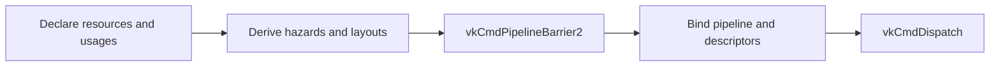

+++
title = 'Compute post-process'
weight = 8
+++

# Compute post-process

A compute post-process combines a compute shader with a render-graph pass declaration. The shader
samples or loads screen-space data and writes a storage image. The declaration tells the graph which
resources are read or written, allowing it to derive synchronization and image layouts before the
dispatch records.

Anima uses this structure for full-screen compute effects including tonemapping, FXAA, TAA, GTAO,
SSGI, bloom, and fog compositing. Some passes write a separate result image; others update the
offscreen color image in place.

## Shader shape

The common full-screen shaders use 8x8 thread groups and dispatch enough groups to cover the target.
Because the extent rarely divides evenly by eight, each shader rejects invocations outside the
image:

```hlsl
[numthreads(8, 8, 1)]
void computeMain(uint3 tid : SV_DispatchThreadID)
{
    uint width;
    uint height;
    target.GetDimensions(width, height);
    if (tid.x >= width || tid.y >= height)
    {
        return;
    }

    float2 uv = (float2(tid.xy) + 0.5) / float2(width, height);
    float3 value = source.SampleLevel(uv, 0).rgb;
    target[tid.xy] = float4(value, 1.0);
}
```

The renderer computes the two-dimensional group count with `div_ceil(8)` and uses one group in Z.
Volume effects use the same pass helper with an explicit Z group count and a shader-specific thread
group size.

A filtered or neighborhood input is a sampled texture. The output is an `RWTexture2D` with an
explicit Vulkan image format. An in-place pass, such as tonemapping, binds the color image once as an
`RWTexture2D` and reads and writes the same texel through that binding.

## Graph declaration

The pass body captures the resolved pipeline, descriptor set, push data, and dispatch dimensions.
The graph receives only the resource contract and a closure that records commands:

```rust
let pass = RgPass::compute("fxaa")
    .access(scene_output, RgUsage::SampledReadCompute)
    .access(color, RgUsage::StorageImageRwCompute)
    .body(move |cmd, _scopes| {
        unsafe {
            raw.cmd_bind_pipeline(cmd, vk::PipelineBindPoint::COMPUTE, handle);
            raw.cmd_bind_descriptor_sets(
                cmd,
                vk::PipelineBindPoint::COMPUTE,
                layout,
                0,
                &[set],
                &[],
            );
            raw.cmd_dispatch(cmd, width.div_ceil(8), height.div_ceil(8), 1);
        }
    });
graph.add_pass(pass);
```

`RgPass::body` accepts the command buffer and a `NestedScopeRecorder`. Most post-process bodies ignore
the recorder; a pass with internal phases can use it to add child profiler scopes. The closure is
`FnOnce` because graph execution consumes it exactly once while recording the frame's command buffer.

`Renderer::add_compute_pass` packages this repeated bind, optional push-constant, and dispatch code.
Callers still provide every `(RgResource, RgUsage)` pair, so the effect-specific function remains the
source of truth for dependencies.

## Usage mapping

Two image usages carry the basic pattern:

- `SampledReadCompute` maps to the compute stage, `SHADER_SAMPLED_READ`, and
  `SHADER_READ_ONLY_OPTIMAL`.
- `StorageImageRwCompute` maps to the compute stage, storage read plus storage write access, and
  `GENERAL`.

This follows Vulkan's Synchronization 2 stage, access, and layout model; the
[Khronos synchronization examples](https://github.khronos.org/Vulkan-Site/guide/latest/synchronization_examples.html)
show the same dependency components at the API level. `usage_info` is Anima's single mapping from
each `RgUsage` variant to those Vulkan values.

Before each pass, `derive_pass_barriers` compares the requested usage with the resource's tracked
state. A layout change always produces an image barrier. A write after any earlier access, or a read
after a write, also produces a barrier. Read after read in the same layout needs no barrier.

The graph does not append a fixed transition after a compute pass. The next pass determines the next
layout. For example, a sampled input moves to `SHADER_READ_ONLY_OPTIMAL` before FXAA; the separate FXAA
output moves to `GENERAL` before the dispatch. A later graphics or sampled use triggers its own
transition from that state.



> [!NOTE]
> Import one graph resource for one Vulkan image. An image used for in-place compute appears once in
> the pass as `StorageImageRwCompute`; importing the same handle under a second graph identity would
> split its tracked layout and hazard history.

## In the code

| What | File | Symbols |
|---|---|---|
| Usage and barrier model | `engine/crates/rendering/src/render_graph/` | `RgUsage`, `usage_info`, `apply_access`, `derive_pass_barriers` |
| Compute pass declaration | `engine/crates/rendering/src/render_graph/` | `RgPass::compute`, `RgPass::access`, `RgPass::body`, `RenderGraph::add_pass` |
| Shared recording helper | `engine/crates/rendering/src/renderer/` | `Renderer::add_compute_pass` |
| Separate-output example | `engine/crates/rendering/src/renderer/`, `engine/assets/shaders/fxaa.slang` | `add_fxaa_pass`, `computeMain` |
| In-place example | `engine/crates/rendering/src/renderer/`, `engine/assets/shaders/tonemap.slang` | `add_tonemap_pass`, `computeMain` |

## Related

- [Tonemapping](../tonemap-and-exposure/): an in-place compute pass over the HDR color image
- [Render graph](../../frame-and-render-graph/render-graph-overview/): owns pass order and execution
- [Usage and barrier derivation](../../frame-and-render-graph/usage-and-barrier-derivation/): covers the complete usage table
