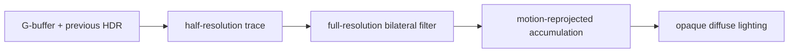

+++
title = 'SSGI'
weight = 4
math = true
+++

# SSGI

Screen-space global illumination (SSGI) estimates one bounce of diffuse indirect light from visible
scene data. Rays march against the thin G-buffer and gather the previous frame's scene-linear HDR
colour where they hit.

## Trace and gather

The trace reconstructs view-space position and normal from the [thin G-buffer](../thin-gbuffer/). It
builds a tangent frame around the normal and draws tier-controlled samples from a
[cosine-weighted hemisphere](https://pbr-book.org/4ed/Sampling_Algorithms/Sampling_Multidimensional_Functions#Cosine-WeightedHemisphereSampling):

$$
\mathbf{d}_\mathrm{local}=
(\sqrt{u_1}\cos\phi,\sqrt{u_1}\sin\phi,\sqrt{1-u_1}),
\qquad \phi=2\pi u_2
$$

Each ray advances in view space, projects each step to screen UV, and compares its depth with the
stored surface depth. The first sample inside the thickness window is a hit:

```hlsl
float diff = surfZ - sp.z;
if (diff > 0.02 && diff < radius * 0.5)
{
    float3 c = prevColor.SampleLevel(suv, 0.0).rgb;
    float lum = max(c.r, max(c.g, c.b));
    if (lum > 8.0) { c *= 8.0 / lum; }
    indirect += c;
    break;
}
```

The shader implements the luminance clamp inline. It limits a single bright hit before spatial
filtering can spread it. The accepted radiance is averaged across the rays and multiplied by the
SSGI intensity.

Pixel seeds use
[interleaved gradient noise](https://www.iryoku.com/next-generation-post-processing-in-call-of-duty-advanced-warfare),
offset by the frame index and distributed across rays. `Ssao::next_ssgi_push` increments that frame
index and supplies the radius, intensity, march steps, and ray count. The active
[render quality tier](../render-quality-tiers/) selects the last two values.

## Spatial denoising

The raw `ssgi_map` is half the input width and height. `ssgi_blur.slang` runs a $5\times5$ bilateral
filter at full input resolution, sampling the half-resolution radiance through a linear sampler.
Gaussian spatial weights smooth the signal, while an exponential view-depth weight prevents most
cross-edge bleeding.

The filter writes full-resolution radiance to `ssgi_denoised`. Its alpha channel carries the current
view-space depth for the temporal disocclusion test; mesh shading reads only RGB.

## Temporal accumulation

SSGI owns two history images and a resolved image. `ssgi-accum` reprojects the prior history with the
[motion-vector](../motion-vectors/) texture, clamps its RGB into the current $3\times3$ neighbourhood,
and blends it with the spatially filtered result. `SSGI_HISTORY_WEIGHT` is `0.9`, so a valid history
contributes 90 percent.

History weight becomes zero when the view history is invalid, the reprojected UV leaves the image, or
the reprojected depth differs from current depth by more than 10 percent. The accumulator writes both
`ssgi_resolved` for shading and the next ping-pong history image.

Motion vectors are built when either TAA or SSGI needs them. SSGI accumulation therefore runs with
FXAA, MSAA, or no final-image anti-aliasing as well as with [TAA](../taa/).



## Previous-frame radiance

The gather samples `prev_color`, which contains the prior frame's resolved scene-linear HDR image.
After the current scene pass, `ssgi-history` copies the new HDR colour into that image. The copy occurs
before fog, bloom, and tonemapping alter the frame for display.

The render graph imports `prev_color` once for the SSGI read and the later copy write. A
`ssgi-history-restore` pass returns it to `SHADER_READ_ONLY_OPTIMAL` for the next frame.

## Lighting integration

Opaque mesh shading adds resolved SSGI to the ambient term:

```hlsl
float3 gi = ssgiMap.SampleLevel(screenUv, 0.0).rgb;
ambient += gi * albedo * (1.0 - metallic) * ao;
```

The diffuse albedo and `(1 - metallic)` factor keep the contribution on diffuse materials. GTAO
modulates the bounce near occluded creases. Transparent materials use world-space indirect sources
because their screen UV corresponds to opaque G-buffer data behind them.

SSGI cannot gather off-screen surfaces or geometry hidden by a nearer depth sample. [DDGI](../../global-illumination-and-raytracing/ddgi-overview/)
provides world-space diffuse illumination where those cases matter.

## In the code

| What | File | Symbols |
|---|---|---|
| Hemisphere trace and previous-colour gather | `ssgi.slang` | `Push`, `viewPosFromUv`, `computeMain` |
| Bilateral upsample | `ssgi_blur.slang` | `computeMain` |
| Temporal reprojection | `ssgi_accum.slang` | `Push`, `computeMain` |
| Push constants and quality settings | `ssao.rs` | `SsgiPush`, `SsgiAccumPush`, `SSGI_HISTORY_WEIGHT`, `Ssao::next_ssgi_push`, `Ssao::apply_quality` |
| Screen-space render-graph chain | `renderer.rs` | `add_screen_space_passes`, `import_ssgi_history`, `writeback_ssgi_history_layout` |
| Previous-HDR copy | `copy_color.slang`, `renderer.rs` | `computeMain`, `ssgi-history`, `ssgi-history-restore` |
| Diffuse-lighting contribution | `lighting.slang` | `ssgiMap`, `screenFlags` |
| Per-view images and descriptors | `view_target.rs` | `ssgi_map`, `ssgi_denoised`, `ssgi_resolved`, `ssgi_history`, `prev_color` |

## Related

- [Thin G-buffer](../thin-gbuffer/) — supplies view-space depth and normals
- [Motion vectors](../motion-vectors/) — reproject the history image
- [GTAO](../gtao/) — modulates the diffuse bounce at contact scale
- [Render quality tiers](../render-quality-tiers/) — choose SSGI ray and step counts
