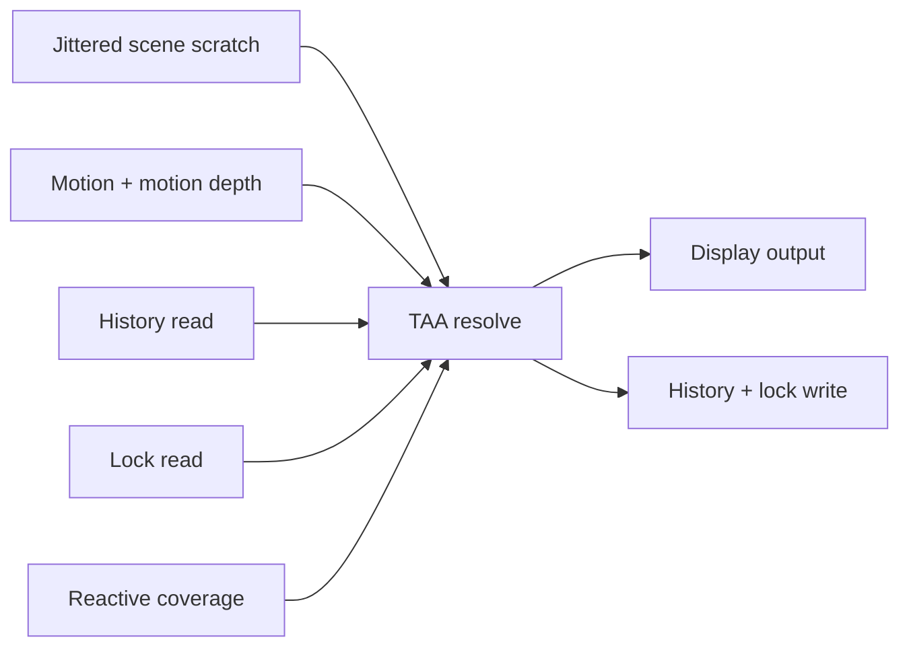

+++
title = 'TAA'
weight = 6
math = true
+++

# TAA

Temporal anti-aliasing (TAA) combines jittered scene samples across frames. Motion-vector
reprojection follows each surface into history, while clipping, disocclusion tests, and reactive
coverage limit stale colour.

## Jitter and motion

The scene projection receives a subpixel offset from a
[Halton sequence](https://doi.org/10.2307/2007444) in bases 2 and 3. Native-resolution TAA uses eight
phases. `jitter_offset` converts each sample into an NDC translation of at most half an input pixel:

$$
j_x=\frac{2H_2(i)-1}{w}, \qquad
j_y=\frac{2H_3(i)-1}{h}
$$

`render_scene` applies that translation to the combined view-projection matrix. Camera culling,
clustered lighting, picking, and the motion prepass keep the unjittered projection.

The [motion-vector](../motion-vectors/) pass renders `prevUv - curUv` from unjittered current and
previous matrices. Static geometry therefore writes zero velocity even though the colour pass moves
within the pixel from one frame to the next.

## Resolve

The scene renders into an input-extent scratch image. `taa.slang` dispatches one compute invocation per
display pixel and evaluates this sequence:

1. Reconstruct the current colour on the display grid.
2. Select the nearest-depth motion vector in a $3\times3$ input neighbourhood.
3. Reproject and reconstruct the previous history.
4. Clip history against current-frame colour statistics.
5. Apply validity, lock, confidence, reactive, velocity, and shading weights.
6. Write unsharpened history and an optionally sharpened display result.

`DilatedMotion` chooses the motion vector associated with the minimum device depth in the local
neighbourhood. This lets a foreground silhouette carry its velocity into nearby display pixels instead
of using the background vector at the pixel centre.

History uses a nine-tap optimized
[Catmull-Rom spline](https://doi.org/10.1016/B978-0-12-079050-0.50020-5) reconstruction. The resolve
clamps the result to non-negative values because the filter's negative lobes can produce negative HDR
radiance around a sharp transition.

## Variance clipping and feedback

The current $3\times3$ input neighbourhood is transformed to
[YCoCg](https://www.microsoft.com/en-us/research/wp-content/uploads/2016/06/2004-ycocg.pdf). Its first
and second moments define a variance box:

$$
[\mu-\gamma\sigma,\ \mu+\gamma\sigma]
$$

`clip_aabb`, from Playdead's
[temporal-reprojection presentation](https://www.advances.realtimerendering.com/s2016/Playdead_TemporalAA_3.pptx),
pulls history toward the box centre along the history-to-centre line. `clipGamma` controls $\gamma$.

History is invalid when its UV leaves the image, the view has no valid prior frame, or reprojected
linear depth differs from current depth by more than `disocclusionThreshold`. A large luma change also
breaks the pixel lock.

For valid history, feedback starts between `feedbackMax` for a still pixel and `feedbackMin` for a fast
pixel. Luma disagreement reduces it further. The resolve then applies current and history weights of
$1/(1+\mathrm{luma})$ before normalization, which reduces the effect of isolated HDR spikes.

## Locks, reactive coverage, and sharpening

The display-extent lock images ping-pong with colour history. A stable, high-contrast pixel receives a
short lock that widens its variance box and raises its history floor. Locks preserve thin features
while the Halton cycle covers their display pixels.

A separate reactive-coverage pass clears an input-extent `r8` image and replays the blend buckets'
GPU-binned indirect commands into it, depth-tested read-only against the scene depth. Reactive pixels
reduce history feedback because their motion and opaque depth do not fully describe the blended
surface.

The optional contrast-adaptive sharpen reads reconstructed neighbours on the display grid. It writes
only `outColor`; `outHistory` stores the unsharpened resolve so sharpening does not accumulate from one
frame to the next.



## Temporal upsampling

Temporal upsampling uses the same resolve when the input extent is smaller than the display extent.
`ReconstructCurrent` applies a $4\times4$
[Lanczos-2 filter](https://en.wikipedia.org/wiki/Lanczos_resampling) to place input colour on the
display grid. At a 1:1 ratio, the covering tap has weight 1 and the gather returns the source texel.

The jitter cycle grows with the display-to-input ratio $n$:

$$
N_\mathrm{phases}=\lceil8n^2\rceil
$$

History alpha stores the accumulated sample count for each display pixel. The feedback confidence
rises as that count approaches the phase count. Display-extent history remains allocated across a
render-scale-only resize, while input colour, depth, motion, reactive coverage, and screen-space
targets follow the scaled extent.

`get-upscale` reports the ratio, dynamic state, target budget, and input/display extents. These
commands select a fixed 0.67 ratio or enable the [frame-budget controller](../render-quality-tiers/):

```sh
sa set-upscale '{"ratio":0.67}'
sa set-upscale '{"dynamic":true,"targetMs":16.67}'
```

## Runtime parameters

The blend, clip, and sharpen values are live renderer state. `set-taa-params` performs a partial
update, so omitted fields keep their values:

```sh
sa get-taa-params
sa set-taa-params --feedbackMax 0.95 --clipGamma 0.9 --sharpness 0.5
```

The resolve reads and writes scene-linear HDR. [Tonemapping](../tonemap-and-exposure/) runs after TAA,
so exposure and display encoding do not enter the accumulated history.

## In the code

| What | File | Symbols |
|---|---|---|
| Jitter sequence and resolve parameters | `aa.rs` | `TAA_JITTER_PHASES`, `halton`, `jitter_offset`, `jitter_phase_count`, `TaaParams`, `TaaPush` |
| Jittered scene projection | `render_scene.rs` | `render_scene`, `Mat4::from_translation` |
| Resolve shader | `taa.slang` | `LinearizeDepth`, `ReconstructCurrent`, `SampleHistoryCatmullRom`, `clip_aabb`, `DilatedMotion`, `computeMain` |
| Motion, reactive, and TAA passes | `renderer.rs` | `scene_view_proj_unjittered`, `add_motion_pass`, `add_reactive_coverage_pass`, `add_taa_pass`, `apply_render_extent` |
| Reactive draw | `scene_pass.rs` | `record_executor_depth_family` |
| Per-view history and extents | `view_target.rs` | `history`, `lock`, `reactive`, `scaled_render_extent`, `published_extent`, `build_aa_targets_preserving_temporal`, `advance_jitter` |
| Control-plane surfaces | `commands_render.rs`, `dto.rs` | `get-taa-params`, `set-taa-params`, `TaaParamsDto`, `get-upscale`, `set-upscale`, `UpscaleDto` |

## Related

- [Motion vectors](../motion-vectors/) — provide surface reprojection
- [Render quality tiers](../render-quality-tiers/) — describe the frame-budget controller
- [Tonemapping and exposure](../tonemap-and-exposure/) — follows the linear-HDR resolve
- [AA modes](../../anti-aliasing/aa-modes/) — compares TAA with FXAA and MSAA
