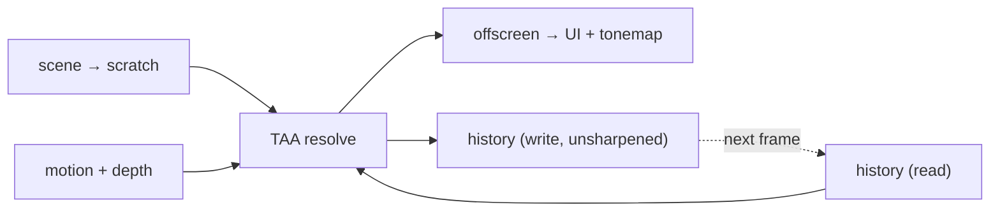

+++
title = 'TAA'
weight = 6
math = true
+++

# TAA

Temporal anti-aliasing (TAA) smooths edges and noise by blending each frame with the accumulated
result of the frames before it. Spread over time, the blend averages out aliasing and sampling noise
at a fraction of the cost of supersampling a single frame — the many samples come from many frames
rather than many rays.

For that averaging to converge on a supersampled image rather than just a blurred one, two things have
to be true. Each frame must sample the scene at a *different* sub-pixel position, so successive frames
carry genuinely new information about what lies between pixel centers; and last frame's color must be
followed to the surface it belongs to now, so the blend combines the same surface over time rather than
smearing one surface's color across the pixels a moving edge sweeps through. The first is **jitter**;
the second is **reprojection**. The failure mode when reprojection is imperfect — a stale color
surviving where it no longer belongs — is what the resolve's clip and adaptive weighting exist to
suppress.

## Jitter

Each frame the projection is nudged by a sub-pixel offset drawn from a **Halton(2, 3)** low-discrepancy
sequence of length `TAA_JITTER_PHASES`, so over a cycle the sample positions tile the pixel evenly with
no clustering a regular grid would leave. The offset is applied as a clip-space translation composed
onto the combined view-projection:

$$
M_\text{jittered} = T\!\left(j_x,\, j_y,\, 0\right)\, \cdot\, M_\text{view-proj}
$$

Composing the jitter as a translation of the *combined* matrix (rather than baking it into the
projection before the view multiply) keeps it exactly reversible from that one matrix, which the motion
pass relies on. Culling, clustered lighting, GTAO, and picking all read the **un-jittered** projection —
jitter is a resolve-time trick, not a scene-space one, and leaking it into those systems would jitter
their results too.

The motion pass must produce velocities free of the jitter, or the per-frame offset would read as
whole-scene motion and defeat reprojection. It reconstructs current and previous clip positions from the
un-jittered view-projection, so a static surface reports exactly zero motion. The current and previous
jitter offsets ride along in the resolve push (`jitter`, `prevJitter`) for the temporal-upsampling seam,
which needs them to place samples in the display grid.

## The resolve

The scene renders its 1× result into a scratch image (shared with FXAA). A single compute pass reads the
current frame, the history, the [motion vector](../motion-vectors/) buffer, and the motion-pass depth,
then resolves the blended result in five steps.

**Dilate + reproject.** A naive reprojection reads the motion vector at the pixel center, but on a
silhouette that center may sit on the background while the edge belongs to the foreground — the classic
source of edge ghosting. Closest-depth dilation instead picks the motion vector of the *nearest* pixel
in the 3×3 (the projection is `perspective_rh` with a `LESS` test, so nearest depth is the minimum), so
edges reproject with their foreground surface's velocity. The chosen vector is added to the UV to find
last frame's location; it only selects *which* stored velocity to read and never alters one, so static
geometry keeps its exact zero.

**Reconstruct history.** History is resampled with an **optimized Catmull-Rom** filter — a 4×4 bicubic
footprint gathered as 9 bilinear taps. Feeding history back through a single bilinear tap every frame
low-passes it into mush; the negative Catmull-Rom lobes preserve the sub-pixel sharpness the accumulation
is supposed to build. The negative lobes can push a value below zero, so the reconstructed color is
clamped non-negative before use — the buffer is linear HDR and must not carry negative radiance.

**Clip.** A 3×3 neighborhood of the current frame gives the plausible-color statistics, computed in
**YCoCg** rather than RGB: decorrelating luma from the two chroma axes lets the box hug the local color
distribution tightly instead of the loose, purple-fringing cube a raw-RGB min/max leaves on
high-contrast edges. The box is built from the neighborhood mean and standard deviation,

$$
\left[\mu - \gamma\sigma,\ \mu + \gamma\sigma\right]
$$

and the reprojected history is pulled toward the box center along the line from history to center
(Playdead's `clip_aabb`) rather than clamped per-axis — a tighter, more stable rejection. The tightness
$\gamma$ is a runtime parameter (`clipGamma`): lower rejects more history (less ghosting, more
flicker), higher trusts it further.

**Blend.** The clipped history mixes with the current frame by a feedback weight that is neither fixed
nor global. It rises with screen-space velocity — fast motion leans on the current frame, a still image
leans on history — interpolating between `feedbackMin` and `feedbackMax` by `velocityRejection · |v|`;
and it falls when the pixel's luma disagrees with history's, which distrusts a shading change that
reprojection can't explain. The mix itself is weighted by the Karis tonemap term $1/(1+\text{luma})$,
which suppresses fireflies in the pre-tonemap linear HDR. Disocclusion (history reprojected off-screen)
or the first frame after a resize or mode switch forces the weight to zero — the current frame is taken
whole, since there is no trustworthy history to blend.

**Sharpen (optional).** Temporal accumulation is mildly softening even with a good history filter, so an
RCAS-style contrast-adaptive sharpen can lift local contrast on the way out. It runs over a `+`-shaped
tap of the current-frame neighborhood, with a lobe that self-limits near the neighborhood min/max so
already-sharp edges don't ring. It is off at `sharpness == 0` (fully bypassed) and scales with the
`sharpness` parameter. Crucially the sharpen is a *display-time* filter: the history is written
**unsharpened**, so sharpening never compounds across frames into oversharpened crawl.

### History ping-pong

Two history images exist per view. The resolve reads one and writes the other, flipping parity each
frame:



Each view tracks `history_index` and `history_valid`; reading and writing distinct images keeps the
resolve well-defined, where a single in-place history would be a read-write hazard on its own data. The
offscreen output (what the UI and tonemap read) carries the optional sharpen; the history copy never
does.

## Runtime tuning

The blend and sharpen parameters are a live `TaaParams` on the renderer, inspectable and adjustable over
the control plane without a rebuild — handy for dialing the ghosting/flicker trade-off against a moving
scene:

```sh
sa get-taa-params
sa set-taa-params --sharpness 0.6 --feedbackMax 0.95   # partial update; omitted fields keep their value
```

`set-taa-params` is a partial merge: each present field overwrites, each omitted field keeps its current
value, and the reply echoes the fully-resolved set.

## Temporal upsampling (TAAU)

The same resolve doubles as a temporal upsampler. The scene, depth, and motion render at an **input**
extent below the display size (`round(display × ratio)`), and the resolve reconstructs a sharp
**display**-extent image — one path, no separate upscaler, degenerating to native TAA at ratio 1. Two
extent classes run side by side: the input class (`scaled_render_extent()` — scene color scratch,
depth, motion, the whole screen-space chain) and the display class (`published_extent()` — the history
ping-pong, the resolve output, tonemap, overlays, the present source).

What upsampling adds on top of the native resolve:

- **Resolution-aware jitter.** The Halton cycle grows with the upscale: `ceil(8·n²)` phases, `n =
  display / input`, so every display pixel is eventually covered by a jittered input sample (32 phases
  at a 2× upscale).
- **Lanczos reproject-and-accumulate.** The current frame is resampled into the display grid with a
  4×4 Lanczos-2 kernel (the negative lobes recover the sharpness a bilinear stretch smears); at 1:1 the
  gather collapses to the exact texel.
- **Accumulation confidence.** History alpha carries a per-output sample count that grows toward the
  cycle length; a freshly-covered display pixel leans on the reconstructed current and converges over
  the jitter cycle.
- **Pixel locks + reactive mask + disocclusion.** FSR2-style locks protect stable thin features from
  the variance clip; a reactive mask (translucent coverage, marked by a dedicated pass) biases
  alpha-blended pixels toward the current frame; and a parallax disocclusion gate (reprojected linear
  depth carried in the lock's `.b` channel) forces the current frame whole on gross reveals.
- **Sharpen at display extent.** The RCAS sharpen taps the display-grid reconstructed neighbours, and
  its lobe firms up as the ratio rises — recovering exactly the softness the resample introduced. At
  ratio 1 the branch is bit-identical to the native sharpen.

The whole chain stays pre-tonemap in one linear-HDR domain, and a render-scale change never flushes the
display-extent history — the resolve resamples the newly-sized input into the fixed display grid every
frame, so the accumulator rides the change (see [Render-quality tiers](../render-quality-tiers/) for the
frame-budget driver). The ratio + dynamic-resolution surface is a separate control command from the
blend/sharpen tunables:

```sh
sa get-upscale                                  # ratio, dynamic state, input/display extents
sa set-upscale '{"ratio":0.67}'                 # pin a 1.5× upscale
sa set-upscale '{"dynamic":true,"targetMs":16.7}'  # hand the input extent to the 60 fps budget driver
```

## In the code

| What | File | Symbols |
|---|---|---|
| Halton jitter sequence | `aa.rs` | `TAA_JITTER_PHASES`, `halton`, `jitter_offset` |
| Jitter applied to the combined matrix | `render_scene.rs` | `jitter_offset`, the `Mat4::from_translation` compose |
| Un-jittered velocity | `renderer.rs` | `scene_view_proj_unjittered`, `add_motion_pass` |
| Resolve (dilate → Lanczos reconstruct → lock-scaled YCoCg clip → disocclusion gate → reactive blend → display-extent sharpen) | `taa.slang` | `computeMain`, `DilatedMotion`, `ReconstructCurrent`, `SampleHistoryCatmullRom`, `clip_aabb`, `LinearizeDepth` |
| Params + push | `aa.rs` | `TaaParams`, `TaaPush`, `jitter_phase_count`, `REACTIVE_FORMAT` |
| Two extent classes | `view_target.rs` | `scaled_render_extent`, `published_extent`, `build_aa_targets_preserving_temporal` |
| Pass wiring + ping-pong + reactive coverage | `renderer.rs`, `scene_pass.rs` | `add_taa_pass`, `add_reactive_coverage_pass`, `apply_render_extent`, `record_reactive_coverage` |
| Control commands | `commands_render.rs`, `dto.rs` | `get-taa-params` / `set-taa-params` (`TaaParamsDto`), `get-upscale` / `set-upscale` (`UpscaleDto`) |

> [!NOTE]
> The resolve reads and writes linear HDR, not display color. It runs before the
> [tonemap](../tonemap-and-exposure/), so history accumulates in the same linear space the scene was
> rendered in. Blending tonemapped values would accumulate in the wrong color space and shift as
> exposure changes.

## Related

- [Motion vectors](../motion-vectors/) — the reprojection velocity TAA follows, and the depth it dilates
- [Tonemapping](../tonemap-and-exposure/) — the next step, after the resolve
- [Compute post-process](../compute-post-process-pattern/) — the dispatch + RMW shape it shares
- [AA modes](../../anti-aliasing/aa-modes/) — where TAA sits among the selectable modes
