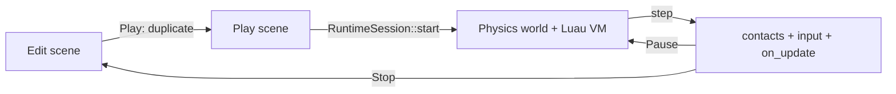

+++
title = 'Script components and the play runtime'
weight = 2
+++

# Script components and the play runtime

An entity's `Script` component is an ordered list of `.lua` slots. Each slot stores a path relative to
the project's `src/` directory and the per-instance overrides for its
[declared fields](../script-declared-fields/).

Execution belongs to the shared play-mode `RuntimeSession`. The editor host and standalone player use
the same simulation sequence for animation, physics, contacts, and scripts.

## Script shape

The runtime uses [Luau](https://luau.org/) through [mlua](https://github.com/mlua-rs/mlua). A script
file returns a class table with `on_update(self, dt)`. `on_create` and `on_destroy` are optional.

```lua
---@class Mover : sa.ScriptSelf
---@field speed number
local Mover = {}

Mover.properties = { speed = 3.0 }

function Mover:on_update(dt)
  local direction = sa.vec3(0, 0, 0)
  if sa.is_key_down("w") then
    direction = sa.vec3(0, 0, -1)
  end
  self.entity:set_position(
    self.entity:get_position() + direction * self.speed * dt
  )
end

return Mover
```

`ScriptHost` creates one VM per play session and caches each returned class table by resolved path.
Every slot receives its own `self` table with an `EntityHandle` in `self.entity`; its metatable points to
the cached class. Slots run in component order within an entity. Scene iteration determines the order
between entities.

A missing file, invalid chunk, non-table return, or class without `on_update` skips that slot and logs
the load error. Other valid slots continue to run.

## Play lifecycle

Entering Play creates the editable scene's duplicate, then `RuntimeSession::start` builds the physics
world and starts scripts against that duplicate. `on_create` runs once for every loaded instance.
Pause keeps the world, VM, instance tables, and scheduled tasks alive.

Each simulation step follows this order:

1. Advance animation and snapshot ragdoll targets.
2. Step physics and write dynamic poses into the play scene.
3. Dispatch new trigger and contact events to scripts.
4. Derive key, button, and pointer edges from the input snapshot.
5. Run each instance's `on_update(dt)`.
6. Flush queued entity destruction, dispatch queued messages, and resume ready tasks.

Stopping returns to Edit, calls `on_destroy`, drops the VM and physics world, and discards the play
scene. `on_destroy` runs without a scene session, so entity operations inside it return their documented
no-op values.



## Scene access

`EntityHandle` stores an entity id, not a Rust scene reference. A scoped session guard lends the active
scene, component registry, input snapshot, and host bridge only while a script callback is on the stack.
Keeping a handle is valid, but using it outside a callback returns a neutral value or logs a no-op.

Most entity changes happen immediately. `spawn` creates a root entity, `set_parent` relinks the
hierarchy after cycle checks, and transform setters update local components. `destroy` queues the
entity's UUID until the instance loop finishes, then the runtime destroys it and relinks the hierarchy
once.

The generic component bridge uses registered wire names such as `"Camera"` and
`"DirectionalLight"`. `get_component` returns a serialized snapshot; `set_component` merges a table
patch. Structural components reject generic writes and use their dedicated APIs.

## Script-facing values and services

`sa.Vec3` is userdata with writable `x`, `y`, and `z` fields. It supports vector arithmetic,
normalization, dot and cross products, and interpolation. Script methods that consume vectors require
`sa.Vec3` values created by `sa.vec3` or another API call.

The binding table groups the rest of the surface as follows:

| Area | Representative API |
|---|---|
| Input | `sa.is_key_down`, `sa.is_key_pressed`, `sa.mouse_delta`, `sa.mouse_scroll` |
| Scene lookup | `sa.get_entity_by_name`, `sa.find_all_by_name`, `sa.find_by_uuid`, `sa.primary_camera` |
| Entity state | `:get_position`, `:set_position`, `:get_component`, `:set_component`, `:has_component` |
| Hierarchy and lifetime | `sa.spawn`, `:parent`, `:children`, `:set_parent`, `:destroy` |
| Physics | `sa.raycast`, `sa.spherecast`, `:apply_impulse`, `:move_character`, `:ragdoll_state` |
| Vegetation | `sa.vegetation_raycast`, `sa.vegetation_nearest`, `sa.vegetation_in_radius`, `sa.vegetation_damage`, `sa.vegetation_harvest` |
| Communication | `:send`, `sa.broadcast`, `sa.spawn_task`, `sa.wait`, `sa.delay` |
| Logging | `sa.log` |

`sa.log` records the sender entity and routes the line to the editor's
[Script Logs panel](../../ui-and-editor/script-logs-panel/). `script-input` supplies held keys, mouse
buttons, pointer position, and scroll; `derive_script_input_edges` calculates press, release, and delta
values once per simulation tick.

## Vegetation interaction

The vegetation calls reach the same authority the renderer and the control plane read, so a script
sees the world as it is rather than a copy. Queries are bounds-level over CPU-resident macro
plants, which is a different question from a physics cast: they report plants that carry no
collision body at all.

```lua
local hit = sa.vegetation_raycast(px, py, pz, dx, dy, dz, 8.0)
if hit.hit and hit.interaction_policy == "harvestable" then
    sa.vegetation_harvest(hit.plant, 4)
elseif hit.hit then
    sa.vegetation_damage(hit.plant, 0.25)
end
```

A hit table carries the canonical `plant` identity, its render-relative `position`, the `distance`,
its `lifecycle` and `interaction_policy` names, and `health`. A miss is `{ hit = false }`, the same
shape the physics casts return. `sa.vegetation_in_radius` returns an array ordered nearest first,
capped by its optional limit.

`sa.vegetation_damage` and `sa.vegetation_harvest` reduce a typed mutation through the one
vegetation reducer and return whether it committed. The header is minted from the plant's owner
cell and that cell's current revision, so the revision doubles as the optimistic precondition and
two identical calls both commit rather than one being mistaken for a replay. Each committed
mutation emits a [typed transition](../../scene-and-ecs/vegetation-state/) any consumer can read.

## Messages, tasks, and callbacks

`entity:send(handler, payload)` targets every slot on one entity. `sa.broadcast` targets every loaded
instance. Both queue `handler(self, sender, payload)` calls until the instance loop ends, which avoids
re-entering the loop from `on_update`.

`sa.spawn_task(fn)`, `sa.wait(seconds)`, and `sa.delay(seconds, fn)` use a Luau coroutine scheduler.
The scheduler advances from simulation `dt`, after message dispatch. Calling `sa.wait` outside a
scheduler task logs a message and returns without yielding.

Physics dispatches `on_trigger_enter(other)` and `on_trigger_exit(other)` for sensor transitions.
Solid contact begin invokes `on_contact(other, point, normal)` with world-space `sa.Vec3` values. A
solid contact end has no script callback. `other` is the touching entity's handle when a scene
entity owns the body, the plant's canonical hex identity string when a macro plant does, and the
null handle for an unowned body.

## Error containment

Every callback resets the VM instruction budget. An `on_update` or contact error stops that loop,
stores a `ScriptRunError`, and causes the host to pause after the simulation step. The error ring is
available through `drain-script-errors`, while `get-script-status` reports its high-water sequence.

Load and `on_create` failures are logged during session start. Message-handler, scheduled-task, and
`on_destroy` failures are logged and contained without pausing the session. The VM remains allocated
across a paused error, so Resume continues with the instance state intact.

## Generated editor types

`BINDINGS` describes function names, arguments, return types, and documentation. Protocol generation
uses that table plus the component registry to produce `schemas/control/sa.generated.luau`.

Project opening writes those definitions to `library/sa.lua` and creates `.luarc.json` when absent.
The latter points [Lua Language Server](https://luals.github.io/) at the generated library. The generated
file defines `sa.ScriptSelf`, `sa.Vec3`, entity methods, free functions, component-name literals, and
typed `get_component` overloads.

## In the code

| What | File | Symbols |
|---|---|---|
| Data-only component and slots | `component.rs` | `Script`, `ScriptSlot` |
| Shared simulation lifecycle | `runtime/src/session.rs` | `RuntimeSession`, `start`, `step`, `stop` |
| VM instances and callbacks | `script/src/runtime.rs` | `ScriptHost`, `start_scripts`, `tick_scripts`, `dispatch_contact`, `stop_scripts`, `build_instance` |
| Scoped scene access | `script/src/session.rs` | `enter_session`, `ScopedSession`, `queue_message`, `defer_destroy` |
| Binding descriptors | `bindings.rs` | `BINDINGS`, `register_no_scene_globals`, `register_scene_globals` |
| Entity and vector userdata | `entity.rs`, `value.rs` | `EntityHandle`, `SaVec3`, `vec3`, `lerp`, `look_at` |
| Coroutine scheduler | `scheduler.rs` | `install`, `SCHEDULER_PRELUDE` |
| Input edges | `script_input.rs` | `ScriptInputState`, `derive_script_input_edges` |
| Host play edge and error routing | `layer.rs` | `reconcile_play_edge`, `enter_play_session`, `exit_play_session`, `drain_runtime_sinks` |
| Project scaffold | `project.rs` | `ensure_script_src`, `ensure_script_library`, `STARTER_SCRIPT`, `LUARC_JSON` |
| Generated Luau definitions | `luau.rs` | `emit_api_defs`, `emit_component_defs`, `emit_defs` |
| Script slots in the Inspector | `ScriptSlots.tsx` | `ScriptSlots` |

## Related

- [Lua runtime](../lua-runtime/) — describes VM sandboxing and execution limits
- [Script-declared fields](../script-declared-fields/) — explains defaults and per-slot overrides
- [Play mode](../../ui-and-editor/play-mode/) — owns the duplicate-and-discard scene lifecycle
- [Script Logs panel](../../ui-and-editor/script-logs-panel/) — displays `sa.log` output
