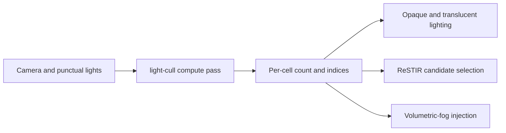

+++
title = 'Light culling'
weight = 6
math = true
+++

# Light culling

Anima uses [clustered forward shading](https://doi.org/10.1145/2383795.2383809) to limit the punctual lights evaluated at each fragment. A compute pass divides the camera frustum into cells, assigns point and spot light indices to those cells, and stores the lists for the lighting shaders. Directional light is global and does not enter the lists.

## Grid and records

The grid contains 16 columns, 9 rows, and 24 depth slices: 3,456 cells in total. X and Y divide the current viewport. Z uses exponential spacing between the camera's near and far planes:

$$
z_n = -\text{near}\left(\frac{\text{far}}{\text{near}}\right)^{n / N_z}
$$

View space looks down the negative Z axis, which accounts for the leading minus sign. Exponential slices put more boundaries near the camera, where a small depth interval covers more screen space.

Each frame slot owns one cluster buffer. A cell record contains a `u32` count followed by 64 `u32` light indices, for a stride of 260 bytes. `ClusterParams` supplies the view and inverse-projection matrices, grid dimensions, light count, viewport size, near and far planes, and a flag that tells consumers whether the lists are valid.

## Cell bounds

`computeMain` reconstructs the four corners that bound a screen tile at the slice's near and far depths. The component-wise minimum and maximum form a view-space axis-aligned bounding box. [Froxel bounds](../froxel-bounds/) derives this construction in detail.

The cull represents every punctual light as a sphere whose center is its view-space position and whose radius is its authored range. This applies to spot lights as well as point lights; the spot cone is evaluated during shading, not during assignment. The sphere intersects a cell when its closest point on the cell's box lies inside the radius:

```hlsl
float3 closest = clamp(posView, aabbMin, aabbMax);
float3 delta = posView - closest;
if (dot(delta, delta) <= radius * radius) {
    // Append this light index.
}
```

The kernel visits lights in their buffer order and keeps the first 64 intersections. Further intersections for that cell are omitted. The same cap and ordering appear in the CPU mirror used by the rendering tests.

## Dispatch and consumption

`Lighting::set_cluster_camera` marks the lists valid only when clustered culling is enabled and the frame has at least one punctual light. The renderer then adds a `light-cull` compute pass with a `StorageWriteCompute` access on the cluster buffer. The shader runs one invocation per cell in 64-thread groups, so the 3,456 cells require 54 workgroups.



The mesh shader reconstructs a cell index from the fragment's pixel coordinates and view-space depth. It inverts the exponential slice equation with a logarithm, clamps the result to the last slice, and combines the three coordinates as `x + y * gridX + z * gridX * gridY`.

When the valid flag is set, `evalLighting` calls `punctual` for the indices in that cell. When the flag is clear, it calls the same function for every punctual light. This all-lights path is also available through `sa set-clustered 0`. It can differ from clustered output in a cell that intersects more than 64 lights because the clustered record has a fixed capacity.

Opaque surfaces use the same lists as the candidate pool when ReSTIR direct lighting is active. The resolved ReSTIR sample replaces their explicit punctual-light loop. Translucent surfaces still use the clustered or all-lights loop because the ReSTIR buffers describe the opaque G-buffer.

## In the code

| What | File | Symbols |
|---|---|---|
| Grid dimensions, record capacity, and params | `engine/crates/rendering/src/lighting/` | `CLUSTER_GRID_X`, `CLUSTER_GRID_Y`, `CLUSTER_GRID_Z`, `CLUSTER_COUNT`, `MAX_LIGHTS_PER_CLUSTER`, `ClusterParams` |
| Cluster-buffer allocation and dispatch gate | `engine/crates/rendering/src/lighting/` | `build_frame`, `Lighting::set_cluster_camera`, `Lighting::take_cluster_dispatch_pending` |
| GPU bounds and sphere assignment | `engine/assets/shaders/light_cull.slang` | `screenToView`, `rayToZ`, `computeMain` |
| Graph pass and dispatch | `engine/crates/rendering/src/renderer/` | `Renderer::record_scene_graph`, `"light-cull"` |
| Fragment lookup and lighting loops | `engine/assets/shaders/lighting.slang` | `clusterIndexFor`, `evalLighting` |
| CPU mirror | `engine/crates/rendering/src/lighting/` | `cluster_aabb`, `light_intersects_cluster`, `cull_clusters_cpu` |
| Runtime control | `engine/crates/control/src/commands_render/` | `register_render_commands`, `"set-clustered"` |

## Related

- [Froxel bounds](../froxel-bounds/) — reconstruction of each cell's view-space box
- [Clustered forward](../../lighting-and-brdf/clustered-forward/) — how the lists fit into forward lighting
- [Punctual lights](../../lighting-and-brdf/punctual-lights-and-attenuation/) — the light data and BRDF evaluated for each index
- [ReSTIR passes](../../global-illumination-and-raytracing/restir-passes/) — stochastic direct-light sampling from the candidate lists
- [Render graph](../../frame-and-render-graph/render-graph-overview/) — pass scheduling and resource declarations
