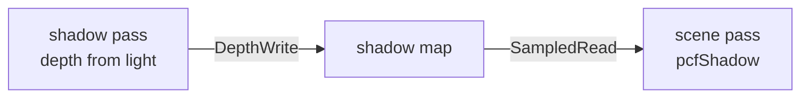

+++
title = 'Directional shadows'
weight = 1
math = true
+++

# Directional shadows

A directional shadow treats the light as parallel rays from infinity, like the sun. Anima uses
[shadow mapping](https://doi.org/10.1145/800248.807402): it renders the scene into one 2D depth map
from the light's point of view, then compares each shaded fragment with the stored depth.

A shadow map records the nearest light-space depth at each texel. For a directional source, one
orthographic frustum encloses the scene bounds. There is no cascade split; the 2,048×2,048 map
spreads its texels across that complete fit.

## Light view and the depth pass

A directional light has a direction but no position, so its view uses an orthographic projection
looking down that direction. `render_scene` encloses the frame's world-space scene AABB in a sphere:

$$
c = \frac{b_{min}+b_{max}}{2}, \qquad
r = \frac{\lVert b_{max}-b_{min}\rVert}{2} + 0.5.
$$

The light eye is $c-d(r+1)$, and the projection spans $[-r,r]$ in X and Y with depth
$[0,2r+2]$. The sphere keeps the extent invariant under light rotation. `orthographic` emits
Vulkan's $[0,1]$ clip depth directly. `set_directional_shadow` stores the transform and arms the
pass; `Lighting` uploads it as `shadow_view_proj` in the light UBO.

The pass is a depth-only draw. The graph adds it before the scene pass when a directional light and
scene items are present and shadow rendering is enabled. Its sole attachment is the 2,048² `D32`
shadow map. `record_shadow_depth` binds the vertex-only shadow pipeline, sets the
[depth bias](../shadow-bias/) once, pushes the light transform, and draws every batch using the
per-frame instance set.

The [render graph](../../frame-and-render-graph/render-graph-overview/) derives both transitions across that arrow from the declared usages (`RgUsage::DepthWrite`, then `RgUsage::SampledRead`); no barrier is hand-written.

## Sampling in the scene pass

The mesh fragment evaluates the directional light through the same BRDF as every other light. When
ray-query shadows are disabled and `globals.counts.y` is set, `pcfShadow` projects the world position
into light clip space and applies a 3×3 comparison filter. The
[PCF filtering](../pcf-filtering/) page covers the kernel. Ray-query shadows take precedence when
enabled, and the opaque contact-shadow term multiplies either visibility result.

The volumetric-fog injector can sample the same map for sun shafts. Its per-light
`cast_volumetric_shadow` flag controls that sample independently of opaque surface contact shadows.

## Coverage and retained layout

The single orthographic fit gives the whole scene uniform shadow texel density. Expanding scene
bounds therefore reduces world-space resolution everywhere; there is no camera-weighted cascade to
concentrate texels near the viewer. `pcfShadow` treats coordinates outside the map and depths beyond
the far plane as lit.

The map's layout travels through an external-layout slot. A frame that renders the map transitions
it from `SHADER_READ_ONLY_OPTIMAL` to the depth-attachment layout and back before the scene samples
it. A frame without a valid caster leaves the map untouched, keeps the retained read-only layout,
and clears `globals.counts.y` so surface shading does not sample stale contents.

## In the code

| What | File | Symbols |
|---|---|---|
| Fit the ortho frustum | `assets/src/render_scene.rs` | `render_scene` (shadow-fit block), `orthographic` |
| Store + flag the transform | `crates/rendering/src/lighting.rs` | `Lighting::set_directional_shadow`, `shadow_view_proj` |
| Add the pass | `crates/rendering/src/renderer.rs` | `add_shadow_pass`, `"shadow"` pass |
| Record depth from the light | `crates/rendering/src/scene_pass.rs` | `record_shadow_depth` |
| Map size + bias constants | `crates/rendering/src/lighting.rs` | `SHADOW_MAP_SIZE`, `SHADOW_DEPTH_BIAS_CONSTANT`, `SHADOW_DEPTH_BIAS_SLOPE` |
| Sample + compare | `assets/shaders/lighting.slang` | `pcfShadow`, `evalLighting` (`counts.y` branch) |

## Related

- [PCF filtering](../pcf-filtering/) — the 3×3 comparison kernel that samples the map
- [Shadow bias](../shadow-bias/) — the constant + slope bias that fights acne
- [Spot-light shadows](../spot-light-shadows/) — the same depth path with a perspective frustum
- [Render graph](../../frame-and-render-graph/render-graph-overview/) — where the shadow pass slots in
