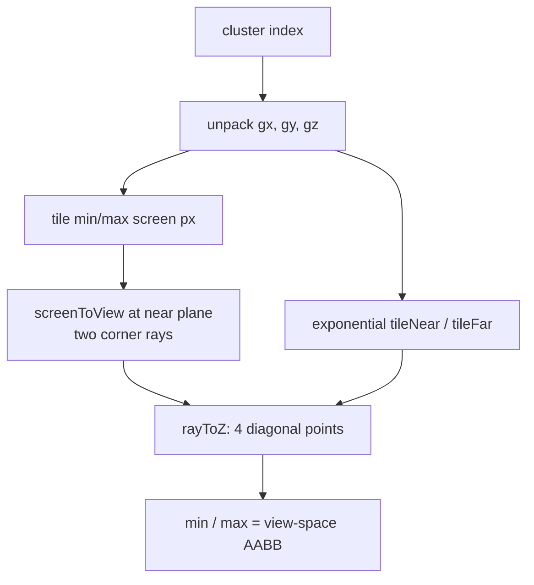

+++
title = 'Froxel bounds'
weight = 7
math = true
+++

# Froxel bounds

A froxel bound is the view-space axis-aligned bounding box of one cluster in the 16×9×24 froxel
grid.

A froxel is a frustum voxel: a screen tile extruded between two depth planes. Perspective makes its
true shape a truncated pyramid. The [light culling](../clustered-light-culling/) pass encloses that
volume in a box, then tests each punctual light's bounding sphere against the box.

## From cluster index to screen tile

The flat cluster index unpacks into 3D grid coordinates with the encoding `index = x + y·gridX + z·gridX·gridY`. The X/Y pair gives a screen tile. Tiles split the screen evenly, so the tile's min and max screen-pixel corners are the grid coordinate times the tile size:

```hlsl
float2 tileSize = float2(params.screenSize.xy) / float2(params.gridSize.xy);
float2 minSS = float2(float(gx),     float(gy))     * tileSize;
float2 maxSS = float2(float(gx + 1), float(gy + 1)) * tileSize;
```

## Screen pixels to view-space rays

`screenToView` maps a pixel to NDC, multiplies by `inverseProjection`, and does the perspective divide. Both tile corners are unprojected at the near plane (`ndcZ = 0`), giving two view-space points on the camera's near plane. The eye sits at the view-space origin, so the line from the origin through each point is the frustum edge ray for that screen corner.

## Slicing the rays at the Z planes

The cluster's depth extent comes from the exponential Z formula, which
[light culling](../clustered-light-culling/) covers. Each diagonal corner ray is intersected with
the two planes $z = z_\text{near}$ and $z = z_\text{far}$. `rayToZ` scales a point $P$ on an
eye-origin ray by $z_d / P_z$ so it lands on depth plane $z_d$.

```hlsl
float3 rayToZ(float3 p, float zDist) { return p * (zDist / p.z); }
```

Two diagonal rays at two depth planes give four view-space points. At either depth, the two points
carry the minimum and maximum X/Y components of that tile, so their component-wise minimum and
maximum also enclose the two unsampled corners. Reducing all four points produces the complete
view-space AABB.



## Conservative overlap

The AABB includes space outside the truncated pyramid. `light_intersects_cluster` transforms a
light centre into view space, clamps it to the box, and compares the squared centre-to-box distance
with the squared light range. A rejected sphere cannot touch the enclosed froxel. An accepted sphere
may touch only the box's extra volume, producing a false positive.

False positives lengthen a cluster's shading loop and consume slots in its 64-light record. Once
that record is full, later intersections are omitted in buffer order, so conservative assignments
can affect which lights survive the cap. The CPU functions `cluster_aabb`,
`light_intersects_cluster`, and `cull_clusters_cpu` mirror the shader for unit tests.

## In the code

| What | File | Symbols |
|---|---|---|
| Unpack index → grid coords | `engine/assets/shaders/light_cull.slang` | `computeMain` (`gx`/`gy`/`gz`) |
| Screen tile corners | `engine/assets/shaders/light_cull.slang` | `computeMain` (`tileSize`, `minSS`/`maxSS`) |
| Unproject to view space | `engine/assets/shaders/light_cull.slang` | `screenToView` |
| Slice rays at Z planes | `engine/assets/shaders/light_cull.slang` | `rayToZ`, `tileNear`/`tileFar` |
| The view-space AABB | `engine/assets/shaders/light_cull.slang` | `aabbMin`/`aabbMax` |
| View and inverse-projection inputs | `engine/crates/rendering/src/lighting/` | `ClusterParams` (`view`, `inverse_projection`) |
| CPU mirror for tests | `engine/crates/rendering/src/lighting/` | `cluster_aabb`, `light_intersects_cluster`, `cull_clusters_cpu` |

## Related

- [Light culling](../clustered-light-culling/) — the sphere-vs-AABB test these bounds feed
- [Clustered forward](../../lighting-and-brdf/clustered-forward/) — the lighting model behind it
- [Per-cluster cap](../../lighting-and-brdf/per-cluster-cap/) — the 64-slot limit affected by conservative assignments
