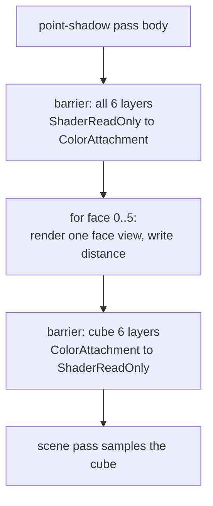

+++
title = 'Point shadows'
weight = 3
math = true
+++

# Point shadows

A point shadow extends
[shadow mapping](https://doi.org/10.1145/800248.807402) over all directions around a point light.
The renderer writes world-space light-to-occluder distance into six cubemap faces. Shading samples
the cube along the light-to-fragment direction and compares that stored distance with the fragment's
distance from the light.

A point light has no preferred projection direction, so one 2D map cannot cover it. A cubemap tiles
the sphere, while linear distance remains comparable across every face. Directional and spot maps
instead store projection depth for one view.

> [!NOTE]
> Only the first point light receives map-based shadows. It uses a cached static cube plus a dynamic
> cube for deformed casters. Ray-query shadows override the cube path when enabled.

## Distance, not depth

The shadow fragment writes `length(input.worldPos - pc.lightPos.xyz)`. Each cube is a single-mip
`R32_SFLOAT` image with six 512×512 array layers, six 2D color-attachment views, and one cube sampling
view. A separate `D32_SFLOAT` depth image tests visibility while each face renders; its values are
not sampled by lighting.

## Rendering the six faces

`point_shadow_face_matrices` builds six world-to-clip matrices, one per face, with a 90° vertical FOV
and aspect 1. The views follow `+X, -X, +Y, -Y, +Z, -Z` cube order with face-specific up vectors.
The projection deliberately has no window Y flip; the matrices and `SamplerCube` therefore address
the same texel for a world direction. Each face clears its color to `far_plane * 2`, so uncovered
texels represent no occluder inside the light range.

The cube cannot be a single graph attachment, because its six array layers exceed the graph's
single-layer image barrier. Both point-shadow passes therefore use `RgPassKind::Compute`, which keeps
the graph from opening a rendering scope. `record_point_shadow` opens six per-face dynamic-rendering
scopes and manages each cube's all-layer transitions directly.



## Sampling and comparing

In the mesh fragment, `pointShadow` reconstructs the fragment's distance to the light and samples
both cubes along the light-to-fragment direction:

```hlsl
float3 toFrag = worldPos - lightPos;
float dist = length(toFrag);
float3 dir = normalize(toFrag);
float stored = min(
    staticCube.SampleLevel(dir, 0.0).r,
    dynamicCube.SampleLevel(dir, 0.0).r);
return dist - bias <= stored ? 1.0 : 0.0;
```

The minimum selects the nearest static or deformed occluder. A fragment at most `stored + bias` from
the light is lit. The `0.08` bias is measured in world units; [shadow bias](../shadow-bias/) explains
the comparison. `pointShadowMeta.x` identifies the shadowed point-light index and `.y` enables its
cube lookup. `.z` selects ray-query shadows instead of all map-based punctual shadow paths.

## Caching the cube

The static cube is camera-independent. `point_shadow_content_key` hashes the light position and
range, then each `MeshComponent` entity's world matrix and mesh asset ID. Entities carrying
`SkinnedMesh` are excluded because they render into the dynamic cube. The static cube renders when
that hash or its Vulkan image handle differs from the last recorded values.

A camera-only change leaves the hash stable and reuses the cube in
`SHADER_READ_ONLY_OPTIMAL`. Moving the light, transforming a non-skinned mesh, changing its mesh ID,
or adding or removing one changes the hash. The image-handle comparison also invalidates the cache
if the cube resource is replaced.

## Static and dynamic cubes

`record_point_shadow` filters draw batches by `batch.deformed`. `point-shadow-static` draws
non-deformed batches only when the static cache is dirty. `point-shadow-dynamic` draws skinned and
morph-deformed batches every active frame. A physics-moved rigid body remains non-deformed, so its
world-transform change invalidates the static hash.

The dynamic pass still opens and clears all six faces when no deformed batches exist. Its
`far_plane * 2` contents then lose the `min` comparison to real static occluders. Each pass manages
its cube layout and leaves it in `SHADER_READ_ONLY_OPTIMAL` for surface and volumetric-fog sampling.
Directional and spot shadow maps use their own per-frame depth passes rather than this content-key
cache.

## Filtering and limits

The distance comparison is a hard `<=` test with no PCF kernel, so cube resolution appears directly
in shadow-edge aliasing. The fixed `0.08` world-unit bias has a larger relative effect at small scene
scales and a smaller relative effect at large scales. Map-based point shadows cover one point light;
other point lights remain unshadowed unless ray-query shadows are active.

## In the code

| What | File | Symbols |
|---|---|---|
| Write distance per face | `engine/assets/shaders/point_shadow.slang` | `fragmentMain` |
| Six face matrices | `engine/crates/rendering/src/lighting.rs` | `point_shadow_face_matrices` |
| Cube + face views + clear | `engine/crates/rendering/src/scene_pass.rs` | `PointShadowTarget`, `record_point_shadow` |
| Cube format + size | `engine/crates/rendering/src/lighting.rs` | `POINT_SHADOW_SIZE`, `POINT_SHADOW_COLOR_FORMAT` |
| Static and dynamic passes | `engine/crates/rendering/src/renderer.rs` | `"point-shadow-static"`, `"point-shadow-dynamic"` |
| Static cache key | `engine/crates/assets/src/render_scene.rs` | `point_shadow_content_key` |
| Cache state and dirty gate | `engine/crates/rendering/src/renderer.rs` | `last_point_shadow_key`, `last_point_shadow_cube`, `static_point_shadow_dirty` |
| Sample + compare distance | `engine/assets/shaders/lighting.slang` | `pointShadow` |

## Related

- [Shadow bias](../shadow-bias/) — the world-space distance bias used here
- [Directional shadows](../directional-shadows/) — the 2D depth-map alternative
- [Render graph](../../frame-and-render-graph/render-graph-overview/) — why this is a compute-kind pass
