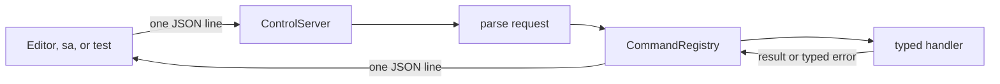

+++
title = 'Control plane'
weight = 1
+++

# Control plane

Anima's control plane is a local request/reply channel into the running viewport host. The React editor, `sa` CLI, and end-to-end tests use the same named commands to inspect or change scenes, assets, renderer settings, play state, and physics.

The host serves newline-delimited JSON over an `AF_UNIX` stream socket. It drains requests on the main thread once per frame, giving handlers direct, lock-free access to live engine state at a defined point in the loop.

## Transport and framing

`ControlServer` owns a non-blocking listener and an input buffer for each connected client. A drain accepts every pending connection, reads available bytes, and retains an incomplete final line for the next frame.

Each complete line produces exactly one compact JSON reply followed by a newline. Reply writes handle short sends and suppress `SIGPIPE` on platforms that provide `MSG_NOSIGNAL`; when a socket buffer fills, the server polls for writability before continuing.



The socket path resolves in this order:

1. `SAFFRON_CONTROL_SOCK`
2. `$XDG_RUNTIME_DIR/saffron-control.sock`
3. `/tmp/saffron-control-<uid>.sock`

Startup removes a stale path, binds with backlog `8`, and applies owner-only mode `0600`. Dropping `ControlServer` closes its file descriptors and unlinks the bound path.

## Wire envelope

A request contains a command name, parameters, and an optional correlation ID:

```json
{"id": 7, "cmd": "ping", "params": {}}
```

The reply echoes `id`, always includes `ok`, and carries either `result` or `error`. Command failures also include a machine-readable `code`.

```json
{"id": 7, "ok": true, "result": {"pong": true, "engine": "Saffron Anima", "version": "0.1.0-vulkan", "pid": 1234}}
```

An absent ID is echoed as `null`. An unknown command returns code `command`; invalid typed parameters return `params`; commands rejected during project loading return `busy-loading`. A line that is not valid JSON receives the fixed invalid-request envelope.

Entity and asset IDs use decimal JSON strings in DTO fields, preserving the full `u64` range across JavaScript clients. Selector inputs accept an ID or exact name where the command contract declares a selector.

## Typed command registry

`CommandRegistry` stores insertion-ordered `Command` rows plus a name index. Most commands register a parameter DTO `P` and result DTO `R`:

```rust
registry.register::<PingParams, PingResult>(
    "ping",
    "liveness + engine info",
    |_ctx, _params| Ok(PingResult { /* ... */ }),
);
```

The wrapper deserializes `params`, runs the typed handler, and serializes its result. Serde attributes on protocol DTOs define wire spellings once for the editor, CLI, schema generator, and host.

The CLI may send positional values in `params.args`. `fold_positional_args` maps them onto the DTO's declaration-ordered fields from its generated schema; an explicitly named field takes precedence. The reflective `help` command uses `register_raw` and reads the live registry order.

Built-ins register `ping`, `help`, then render, scene, animation, physics, and asset command groups. The host adds `get-script-schema` because that handler depends on `saffron-script`.

## Main-thread execution

`ControlContext::poll` constructs an `EngineContext` from frame-local mutable borrows:

| Field | Access |
|---|---|
| `window` | Window lifecycle facade |
| `renderer` | Object-safe `ControlRenderer` command surface |
| `scene_edit` | Scene, selection, play state, and version counters |
| `assets` | Catalog and CPU/GPU asset caches |
| `physics` | Live play world, or `None` in Edit |

Handlers run synchronously and cannot retain these references. `ControlRenderer` limits command coupling to an object-safe interface and allows registry tests to use an in-memory implementation.

Successful commands not classified by `is_read_only_command` request a viewport redraw. Query polling therefore leaves a static viewport idle, while any unclassified command conservatively counts as a mutation.

During a project load, dispatch permits only a small query and control allowlist. Other requests fail immediately with `busy-loading`; they are not queued. `ProjectLoader` advances separately in bounded steps after control polling, keeping the socket responsive while scene and asset state are prepared.

## Editor reconciliation

The protocol is request/reply rather than server-push. The editor polls lightweight selection and status commands, then compares monotonic versions from `SceneEditContext`:

| Version | Invalidates |
|---|---|
| `scene_version` | Hierarchy, components, environment, and other authored scene state |
| `selection_version` | Selected entity and Inspector contents |
| `play_version` | Edit, Play, and Pause state |
| `animation_version` | Timeline and animation-specific state |

A changed counter triggers the heavier authoritative query for that area. Unchanged counters avoid rebuilding editor state or requesting unnecessary rendered frames.

## Lifecycle

`ControlContext::new` builds the registry and attempts to bind the socket. A bind failure logs a warning and leaves the context inactive without preventing the host from running. `shutdown` drops the optional server and is idempotent.

Command handlers must keep synchronous work bounded. Operations such as project loading and thumbnail rendering start state machines or queued work that progresses outside the handler.

## Source map

| What | File | Symbols |
|---|---|---|
| Command rows, typed dispatch, and redraw classification | `engine/crates/control/src/registry.rs` | `CommandRegistry`, `EngineContext`, `is_read_only_command` |
| Socket framing and path lifecycle | `engine/crates/control/src/server.rs` | `ControlServer`, `start_control_server`, `control_socket_path` |
| Per-frame assembly and polling | `engine/crates/control/src/context.rs` | `ControlContext::poll`, `ControlContext::advance_project_load` |
| Error codes | `engine/crates/control/src/error.rs` | `Error`, `Error::code` |
| Host loop integration | `engine/crates/host/src/layer.rs` | `poll_control`, `advance_project_load` |
| Editor version reconciliation | `editor/src/state/store.ts` | `startReconcile` |

## Related

- [sa CLI](../sa-cli-protocol/)
- [Scene commands](../scene-commands/)
- [Render commands](../render-commands/)
- [Asset commands](../asset-commands/)
- [Main loop](../../app-lifecycle-and-window/main-loop-and-run/)
