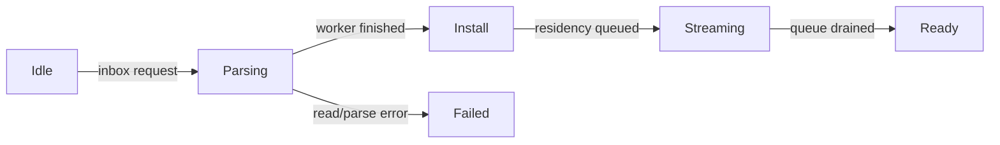

+++
title = 'Project loading'
weight = 8
+++

# Project loading

Bringing a project up — reading `project.json`, reconciling the asset catalog against disk,
deserializing the scene, and making the referenced meshes and textures GPU-resident — is heavy work
that scales with project size. The host main loop drains the [control plane](../control-plane-architecture/)
and publishes the viewport frame *once per frame*, so if that bring-up runs synchronously on the main
thread the whole editor freezes: the socket buffers commands instead of answering them, and the
viewport stops updating until the load returns. A large project can stall for seconds.

Anima loads projects **without ever stalling the main loop**. The load is a per-frame state machine
that does one bounded step per frame. `on_update` — the control drain — runs *every* loop iteration
regardless of whether a frame renders, so commands are answered and the loading screen's progress
advances in real time throughout the load. The engine stays responsive from the first frame to the
last.

Rendering is **held** while the phase is `Loading`: the scene and asset caches are being swapped
across frames, so a mid-load frame would draw against a torn scene — and with the caches mid-clear it
can wedge the GPU. There is nothing worth showing anyway; the viewport is parked behind the loading
screen. The host suppresses redraws for the whole `Loading` span and requests one when the phase flips
to `Ready`, so the loaded scene draws exactly once the load settles. Holding redraws is not what keeps
the engine responsive — the every-iteration control drain is — so nothing is lost by not rendering.

## Phases and boot stages

The editor project state is a coarse **phase** — `Unloaded`, `Loading`, `Ready`, `Failed` — and,
while `Loading`, a finer **boot stage** with a progress count. The phase gates command dispatch; the
stage drives the loading screen's label and bar.

| Boot stage | What is happening | Progress |
|---|---|---|
| `Manifest` | reading + parsing `project.json`, version gate | indeterminate |
| `Catalog` | reconciling the asset catalog against disk (the cold scan) | `n/m` files |
| `Scene` | GPU idle + cache clear, about to swap | indeterminate |
| `Install` | `scene_from_json` on the main-thread registry | indeterminate |
| `Assets` | warming scene-referenced meshes/textures to GPU residency | `n/m` assets |
| `Ready` | load complete | done |

`Skybox` and `Accel` are reserved stages; today the sky panorama warms as part of `Assets`.

## The non-blocking loader

A load is seeded by setting an inbox request on the editor context — from a lifecycle command
(`open-project`, `new-project`, `load-project`, `reload-project`) or the startup bootstrap. Each
frame the host advances the loader one step:

- **Parsing** runs the blocking CPU/IO — read, parse, and the cold catalog disk reconcile (walking +
  hashing every asset file, the dominant variable cost) — on a **worker thread** (`ProjectDocWorker`),
  building a fresh owned catalog. The main loop keeps running; each frame it copies the worker's
  progress snapshot into the boot stage.
- **Install** is a single bounded main-thread step: idle the GPU, clear the asset caches, swap in the
  loaded catalog + scene (`scene_from_json` needs the main-thread `ComponentRegistry`), and apply the
  saved render settings. The GPU-idle-before-clear is the load-order guard — no in-flight frame can be
  reading a cache entry as its `Arc` drops.
- **Streaming** warms a few scene-referenced meshes/textures per frame to GPU residency, so a large
  scene's uploads are spread over frames rather than blocking one. `.smat` materials and their nested
  textures resolve lazily on the draw path.

The phase flips to `Ready` only once residency drains, so `Loading` covers the whole span.

The synchronous `AssetServer::load_project` still exists — it is what [`saffron-player`](../../app-lifecycle-and-window/)
(the standalone exported game) uses to boot, where a blocking load is correct because there is no
control plane to keep responsive. Both paths share the catalog scan; the host has exactly one
bring-up path, the loader.

## Commands are discarded during load, not queued

While `Loading`, the scene and catalog are mid-swap, so most commands would observe a torn state.
The dispatch gate answers every non-allow-listed command with a typed **`busy-loading`** error
instead of running or queuing it — a moved gizmo sent mid-load is dropped, not replayed when the load
finishes. Only a tiny allow-list stays serviceable: `ping`, `help`, `quit`, `get-project`, and the
two below.

| Command | Purpose |
|---|---|
| `project-status` | the live phase + boot stage + `n/m` progress + label (or the error); the editor loading screen polls it each tick |
| `cancel-load` | abort the in-flight load; the loader resets to `Unloaded` at its next step |

`open-project` / `new-project` / `load-project` / `reload-project` return a `ProjectStatusDto`
immediately (the initial `Loading` snapshot) rather than blocking until the project is up — the
caller then follows progress via `project-status`.

## What | File | Symbols

| What | File | Symbols |
|---|---|---|
| Off-thread doc worker | `engine/crates/assets/src/project_load.rs` | `ProjectDocWorker`, `LoadedDoc`, `DocStage` |
| Catalog scan (shared) | `engine/crates/assets/src/scan.rs` | `resolve_catalog_from_disk`, `reconcile_catalog_from_disk` |
| Per-frame loader | `engine/crates/control/src/project_loader.rs` | `ProjectLoader`, `install_doc`, `scene_residency_ids` |
| Phase + progress state | `engine/crates/sceneedit/src/project.rs` | `ProjectPhase`, `BootStage`, `ProjectLoadProgress` |
| Dispatch gate | `engine/crates/control/src/registry.rs` | `is_loading_safe_command` |
| Status commands + DTO | `engine/crates/control/src/commands_asset.rs` | `project_status_dto` |
