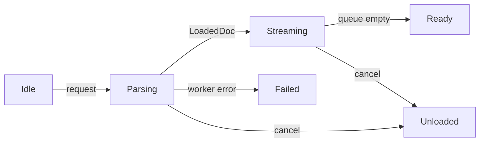

+++
title = 'Project loading'
weight = 8
+++

# Project loading

Project loading separates blocking document work from renderer-owned installation. The host keeps
draining the [control plane](../control-plane-architecture/) while a worker reads `project.json` and
reconciles the asset catalog, then swaps the prepared state on the main thread and spreads selected
GPU uploads across updates.

The viewport renderer is suppressed for the entire `Loading` phase. Scene and asset caches change
during installation, so no frame is allowed to observe an intermediate combination. `on_update`
continues to poll commands and advance the loader while rendering is suppressed; the transition to
`Ready` requests the first frame of the loaded project.

## Phase and progress

`ProjectPhase` is the command-facing lifecycle: `Unloaded`, `Loading`, `Ready`, or `Failed`.
`ProjectLoadProgress` adds a boot stage, progress counts, a label, the active item, an error string,
and a monotonic version used by the editor poll.

| Boot stage | Work | Progress |
|---|---|---|
| `Manifest` | Read, parse, and validate `project.json` | Indeterminate |
| `Catalog` | Reconcile catalog metadata against asset files | Files completed / total |
| `Scene` | Enter main-thread installation and idle the GPU | Indeterminate |
| `Install` | Swap catalog and scene, then apply project sidecars | Indeterminate |
| `Assets` | Warm the explicit residency queue | Assets completed / total |
| `Ready` | Mark the project available and reset frame telemetry | Complete |
| `Failed` | Report a document-worker failure | Error text |

A `total` of zero means indeterminate progress. The editor polls `project-status` every 100 ms and
uses a spinner or progress bar accordingly. A loading result has this shape:

```json
{
  "phase": "loading",
  "stage": "assets",
  "done": 12,
  "total": 40,
  "label": "Loading assets 12/40",
  "currentItem": "Courtyard",
  "error": "",
  "version": 31,
  "name": "demo",
  "path": "/projects/demo/project.json"
}
```

## Loader state machine

Lifecycle commands write a `ProjectLoadRequest` to `SceneEditContext::project_load_inbox`.
`ProjectLoader::advance` consumes one request and moves through three internal states:



`Parsing` owns a `ProjectDocWorker`. For an existing project, the worker reads and parses the JSON,
checks the project version, creates the script scaffold, seeds catalog metadata from the document,
then scans and hashes the assets directory into a fresh `AssetCatalog`. It reports `Manifest` and
`Catalog` progress through a mutex-protected snapshot. No live engine object crosses into this
thread.

When the worker completes, `install_doc` runs on the main thread. It waits for the GPU to become
idle before clearing asset caches, replaces the catalog and asset root, deserializes the scene with
the live component registry, and applies render settings. It also restores the editor camera, debug
overlays, store configuration, and project identity, then clears selection and script input.

A new-project request creates its identity and script directories in the worker. Installation seeds
the shared starter scene, saves `project.json`, and then enters residency warming.

## Residency warming

`scene_residency_ids` builds a distinct queue from ordinary `Mesh.mesh` references and the
environment sky texture. Material assets, textures referenced inside materials, animation clips,
and other draw-time dependencies resolve lazily through their normal loaders.

The streaming step calls `AssetServer::warm_asset` until its 6 ms frame budget is reached or the
queue empties. The budget is checked after each asset, so one large decode or upload can take longer
than 6 ms; the loader yields between assets. When the queue drains, it resets frame telemetry, writes
the `Ready` progress snapshot, and releases render suppression.

## Dispatch during loading

Most commands return an envelope whose `error.code` is `busy-loading` while the phase is `Loading`. They are
discarded rather than queued, because replaying a scene edit after a project swap could target an
unrelated entity. The loading-safe commands are:

- `ping` and `help`
- `get-project` and `project-status`
- `cancel-load`
- `viewport-native-info`
- `quit`

`open-project`, `new-project`, `load-project`, and `reload-project` return the initial status instead
of waiting for completion. The editor follows the monotonic progress version until it sees `Ready`
or `Failed`.

`cancel-load` sets a flag consumed by the next loader step. During parsing, the loader drops its
worker handle and ignores the eventual result; the detached worker thread can finish its filesystem
work in the background. During streaming, the remaining residency queue is discarded. Both active
cases return the engine phase to `Unloaded`.

Worker read, parse, version, and catalog failures produce `Failed`. A scene-document error occurs
during main-thread installation; it is logged, the replacement scene stays empty, and installation
continues through residency.

## Startup selection

Startup uses the same inbox and loader. `SAFFRON_PROJECT` opens the selected project or creates an
unborn valid project name. `SAFFRON_SCRATCH_PROJECT` creates the deterministic scratch project. A
`project.json` in the working directory is opened when neither variable selects a project; otherwise
the host remains `Unloaded` for the editor picker.

## In the code

| What | File | Symbols |
|---|---|---|
| Off-thread document work | `assets/src/project_load.rs` | `ProjectDocWorker`, `LoadedDoc`, `DocProgress` |
| Catalog reconciliation | `assets/src/scan.rs` | `resolve_catalog_from_disk`, `reconcile_catalog_from_disk` |
| Per-update loader | `control/src/project_loader.rs` | `ProjectLoader::advance`, `install_doc`, `scene_residency_ids` |
| Lifecycle state | `sceneedit/src/project.rs` | `ProjectPhase`, `BootStage`, `ProjectLoadProgress`, `ProjectLoadRequest` |
| Dispatch gate | `control/src/registry.rs` | `is_loading_safe_command`, `Error::Busy` |
| Status mapping | `control/src/commands_asset.rs` | `project_status_dto`, `bootstrap_project_from_env` |
| Editor polling | `editor/src/app/useProjectLoadPoll.ts` | `useProjectLoadPoll`, `PROJECT_POLL_MS` |

## Related

- [Asset commands](../asset-commands/) — lifecycle commands and project persistence.
- [Project serialization](../../geometry-and-assets/project-serialization/) — the document installed by the loader.
- [Control plane](../control-plane-architecture/) — per-frame socket dispatch and error envelopes.
