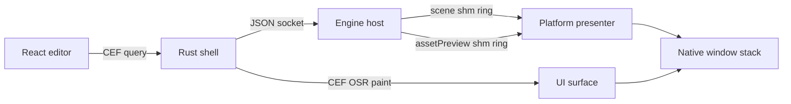

+++
title = 'UI & editor'
weight = 14
bookCollapseSection = true
+++

# UI & editor

Anima's editor is a [React](https://react.dev/) application rendered through the [Chromium Embedded Framework](https://bitbucket.org/chromiumembedded/cef/wiki/Home) inside a Rust desktop shell. The engine runs as a separate present-only host process and exposes editor operations over its JSON control socket.

The shell owns the native window, CEF off-screen rendering, input translation, host-process supervision, and platform presentation. Linux compiles the Wayland backend; macOS compiles the AppKit and Core Animation backend. Both implement one backend contract used by the shared shell.

## Process and image flow

CEF paints the web UI into a native compositor surface. The engine renders the `scene` and `assetPreview` views offscreen and publishes each view to its own shared-memory frame ring. A platform presenter places the active engine surface below the UI, so transparent viewport regions reveal the live image.

Engine calls use one typed frontend helper and one generic shell command: `call(cmd, params)` invokes `control`, which forwards the request to the host socket. Window actions, file dialogs, viewport geometry, settings, and store connectors terminate in the shell because they operate on native editor resources.

The [Zustand](https://zustand.docs.pmnd.rs/) store holds editor-facing state. Its reconcile loops poll cheap state frequently and fetch heavier entities or component data only when version stamps change. Focus, visibility, drag, and project-load gates keep polling from fighting direct manipulation or inactive windows.

## Pages

| Page | Covers | Code |
|---|---|---|
| [Editor shell and the viewport bridge](editor-shell-and-viewport-bridge/) | CEF lifecycle, native IPC, host supervision, and platform backends | `App`, `CommandQueryHandler`, `backend`, `start_session` |
| [Viewport compositing](viewport-compositing/) | Shared-memory rings and platform surface stacking | `ShmPublish`, `Viewports`, `presenter::install` |
| [Viewport panel](viewport-panel/) | Bounds sync, parking, picking, gizmo, and fly input | `ViewportPanel`, `useSubsurfaceBounds` |
| [Editor camera](editor-camera/) | Fly navigation and control-plane camera state | `SceneEditCamera`, `update_scene_edit_camera` |
| [Transform gizmo](gizmo/) | Native transform handles, modes, and pointer routing | `build_scene_edit_overlay`, `gizmo-pointer` |
| [Play mode](play-mode/) | Session states, scene duplication, and camera handover | `SceneEditContext::enter_play`, `play_step_dt` |
| [Debug visualization](debug-visualization/) | Native viewport overlays and Render-panel controls | `build_debug_overlay`, `RenderPanel` |
| [Asset editor](asset-editor/) | Isolated model preview and rig-focused workspace | `AssetEditorWorkspace`, `enter-asset-preview` |
| [Material-graph live preview](material-graph-live-preview/) | Graph preview sphere and shared orbit controls | `MaterialGraphEditor`, `useOrbitCamera` |
| [Editor settings](editor-settings/) | Persisted keybindings and native settings bridge | `SettingsModal`, `load_editor_settings` |
| [Hierarchy panel](hierarchy-panel/) | Scene tree, reparenting, presets, and Environment row | `HierarchyPanel`, `HierarchyTree` |
| [Inspector](inspector/) | Typed component fields, ordering, and guarded edits | `InspectorPanel`, `renderField` |
| [Physics inspector](physics-inspector/) | Collider, rigidbody, controller, and rig field editors | `EnumField`, `LockAxesField`, `InspectorPanel` |
| [Asset pickers](asset-pickers-and-drag-drop/) | Typed asset selection and viewport placement previews | `AssetPicker`, `AssetTile`, `ViewportPanel` |
| [Assets panel & thumbnails](assets-panel-and-thumbnails/) | Asset browsing, viewers, imports, and thumbnail caching | `AssetsPanel`, `AssetViewer`, `get-thumbnail` |
| [Selection](selection/) | Authoritative selection, optimistic clicks, and reconciliation | `selectEntity`, `refreshHeavyState` |
| [Undo/redo](undo-redo/) | Inverse commands, tab histories, and gesture grouping | `appendEdit`, `takeUndo`, `useTabSnapshotHistory` |
| [Dock system](dock-system/) | Dock trees, tab isolation, tear-out, and persistence | `DockRoot`, `dockLayouts`, `dockDrag` |
| [Environment and presentation panels](environment-and-presentation-panels/) | Environment authoring, profiles, quality ownership, and post-processing groups | `EnvironmentPanel`, `RenderPanel`, `PostProcessPanel` |
| [Theme & fonts](theme-and-fonts/) | Theme tokens, typography, and shared UI styling | `styles.css` |
| [Mesh thumbnails](mesh-thumbnails/) | Engine-rendered model previews and PNG readback | `render_mesh_thumbnail`, `encode_active_offscreen_png` |
| [Metrics dashboard](metrics-dashboard/) | Frame graphs, pass timings, memory, and alarms | `RenderStatsPanel`, `FrameTimeGraph` |
| [Profiler panel](profiler-panel/) | Capture controls, flame views, and trace export | `ProfilerPanel`, `spansToFlameTree` |
| [Physics panel](physics-panel/) | Live body diagnostics, contacts, and ragdoll controls | `PhysicsPanel`, `physics-state`, `drain-contacts` |
| [Script logs panel](script-logs-panel/) | Script log draining, filtering, and entity navigation | `ScriptLogsPanel`, `drain-script-logs` |
| [Vegetation mode](vegetation-mode/) | Tool palette, brush strokes, layer transactions, cook and review | `VegetationPanel`, `commitStroke`, `VEGETATION_TOOLS` |
| [Vegetation asset workspaces](vegetation-asset-workspaces/) | Plant and biome authoring panels around the asset preview | `AssetEditorWorkspace`, `PlantGraphPanel`, `GraphEditor`, `StructureTree`, `BiomeGraphPanel` |
| [Ecology and telemetry panels](ecology-and-telemetry-panels/) | Biological clock transport, stage times, and vegetation budgets | `EcologyTimelinePanel`, `VegetationTelemetryPanel` |

## In the code

| What | File | Symbols |
|---|---|---|
| Editor application | `editor/src/app/App.tsx` | `App`, `startReconcile` |
| Typed engine client | `editor/src/control/client/` | `call`, `client`, `ControlError` |
| Browser-to-shell IPC | `editor/shell/src/ipc.rs` | `CommandQueryHandler`, `browser_router` |
| Native command dispatch | `editor/shell/src/commands.rs` | `dispatch` |
| Platform contract | `editor/shell/src/backend/mod.rs` | `Handles`, `UiCompositor`, `presenter` |
| View identities and ring ABI | `editor/shell/src/viewport.rs` | `View`, `Viewports`, `SHM_MAGIC` |

## Related

- [Tooling and control](../tooling-and-control/) — host socket, commands, schemas, and CLI
- [Scene and ECS](../scene-and-ecs/) — scene state presented by the editor
- [Materials & pipelines](../materials-and-pipelines/) — material authoring and preview rendering
- [Physics](../physics/) — runtime state exposed through editor panels
