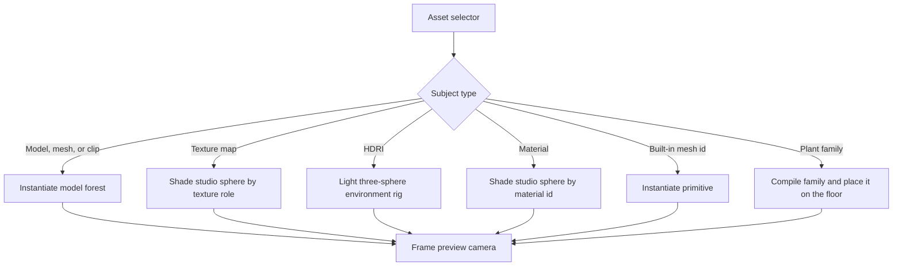

+++
title = 'Asset editor'
weight = 6
+++

# Asset editor

The asset editor is a full work-area tab for inspecting an asset without placing it in the authored scene. It gives models, model sub-assets, textures, HDRIs, and materials a live preview built by the same renderer used for the scene viewport.

## Preview subjects

The Assets panel routes models, meshes, animation clips, textures, and materials to the asset editor. A mesh or clip resolves to its owning [`.smodel` container](../../geometry-and-assets/smodel-container/), so all sub-assets from one model share one tab. Files with no 3D preview route to the [image viewer](../viewport-panel/).

`enter-asset-preview` selects the preview scene from the asset type:

Model metadata determines which panels open. `get-asset-model` returns counts, rig availability, a parent-indexed bone tree, and the clips stored in the container.

| Model capability | Workspace |
|---|---|
| No rig or clips | Preview and floor control |
| Rig | Skeleton tree and overlay controls |
| Animation clips | Clip list, details, and timeline |

A material subject also opens the Material panel, pinned to that material. The Tools menu can add render statistics to the asset-editor dock space.

A plant, biome, or vegetation-map subject opens a [vegetation workspace](../vegetation-asset-workspaces/) in the same tab. A plant previews its compiled family mesh; a biome or map has no renderable form, so its tab skips the preview and works from the summary panel.

## Isolated scene state

The preview is a separate `Scene` owned by `SceneEditContext`. While its view is active, `active_scene` returns that scene. Play mode remains unavailable because preview entry requires `PlayState::Edit`.

Project saving reads the authored scene directly. Preview entities, animation state, furnishing, and synthetic materials therefore never enter `project.json`. Commands that change projects or asset storage guard against an active preview where their operation requires the authored scene.

The first preview entry saves the authored camera, selection, skeleton overlay settings, and tonemap exposure. Switching to the scene tab parks the preview camera and restores those authored values. Returning to the asset tab restores the preview camera, overlay, and root selection.

Closing the tab runs `exit-asset-preview`, drops the temporary scene, and restores authored state if the preview view is active. Keeping the workspace mounted during an ordinary tab switch preserves its panel layout and selected bone without keeping the preview on screen.

## Dedicated view and surface

The renderer has separate `Scene` and `AssetPreview` editor views. Each owns its offscreen targets and screen-space descriptor sets. The host publishes each view through its own shared-memory ring, and the shell gives it a presented surface on Wayland or AppKit.

`useSubsurfaceBounds` keeps the `assetPreview` surface attached to the preview panel. It sends logical panel bounds and the display scale to the shell, then commits the matching device-pixel render size after resizing settles. The scene surface keeps its own bounds throughout the tab switch.

Only the selected view renders. The editor unparks its surface before reveal and parks the hidden surface after the incoming tab paints. A parked surface retains its last frame, while `Renderer::set_active_view` resets temporal state for the view that starts rendering.

`set-active-view scene` leaves the preview scene alive but routes `active_scene` back to the authored scene. `set-active-view assetPreview` reactivates the stored preview. This view switch is distinct from `exit-asset-preview`, which destroys the preview scene.

## Model inspection

A model preview instantiates the complete entity forest from its container. Static and skinned meshes use the same framing path, which derives a renderable bounds and adjusts the camera near plane for the subject's scale. The preview adds a procedural sky, key light, and optional floor.

Opening an animation sub-asset selects that clip on the model's animation authority and pauses it at time zero. The clip list can select another container clip. The shared timeline provides playback, looping, stepping, and seek control against the preview root.

For a rigged model, the skeleton tree includes joints and the intermediate ancestors needed to show their hierarchy. A tree selection writes the overlay's joint-index highlight instead of changing scene selection. Clicking a joint marker in the viewport performs a screen-space joint pick and drives the same highlight.

The toolbar controls the floor, skeleton lines, and joint axes where those controls apply. Orbit input eases the camera toward a target state, and model or HDRI previews also accept dolly input.

## Texture, HDRI, and material inspection

A non-HDR texture uses an ephemeral material on a studio sphere. Its [catalog role](../../geometry-and-assets/asset-server-and-catalog/) determines the material input: normal maps affect normals, packed ORM maps feed occlusion and surface response, and height maps use parallax occlusion. Unknown and color-like roles use the base-color input.

An HDRI becomes both the visible sky and the image-based lighting source. Chrome, diffuse, and satin spheres expose reflections, irradiance, and color response. The preview omits the floor and provides a `-6` to `+6` EV exposure control; the authored exposure returns when the scene view becomes active.

A material preview binds the `.smat` asset by id to a studio sphere. Material graph or parameter edits update the cached asset, so the preview reflects the same material data that scene entities resolve. The floor starts hidden for texture and material subjects but remains available from the toolbar.

## In the code

| What | File | Symbols |
|---|---|---|
| Preview state and scene routing | `engine/crates/sceneedit/src/context.rs` | `SceneEditContext`, `active_scene`, `previewing` |
| Subject resolution and preview construction | `engine/crates/control/src/commands_asset/` | `register_asset_commands`, `enter_asset_preview`, `build_preview_scene`, `furnish_preview_scene` |
| View activation and state restoration | `engine/crates/control/src/commands_asset/` | `activate_asset_preview_view`, `activate_preview_view`, `deactivate_preview_view`, `leave_asset_preview` |
| Per-view render resources | `engine/crates/rendering/src/renderer/` | `ViewId`, `Renderer::set_active_view`, `Renderer::reset_view_temporal` |
| Workspace and capability-driven panels | `editor/src/panels/AssetEditorWorkspace.tsx` | `AssetEditorWorkspace` |
| Preview panels | `editor/src/panels/assetEditorPanels.tsx` | `AssetPreviewPanel`, `AssetSkeletonPanel`, `AssetClipsPanel`, `AssetTimelinePanel` |
| Tab routing and view parking | `editor/src/state/store.ts`, `editor/src/app/App.tsx` | `openAssetEditorForAsset`, `mountedAssetId`, `setActiveView` |
| Presented surfaces | `editor/shell/src/backend/wayland/presenter.rs`, `editor/shell/src/backend/appkit/presenter.rs` | `ViewSurface`, `PresenterTick`, `install` |

## Related

- [Play mode](../play-mode/) - the separate runtime scene used for simulation
- [Skeleton overlay](../../animation/skeleton-overlay/) - joint lines, axes, highlighting, and picking
- [Timeline](../../animation/timeline/) - the shared animation transport and scrub surface
- [Material graph live preview](../material-graph-live-preview/) - material editing through the same preview view
- [Vegetation asset workspaces](../vegetation-asset-workspaces/) - the plant and biome panels hosted in this tab
- [Viewport compositing](../viewport-compositing/) - shared-memory presentation below the CEF interface
