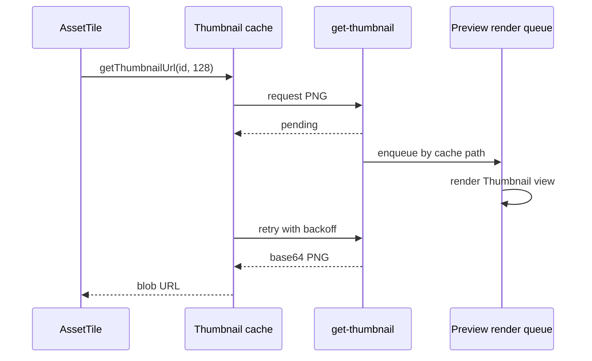

+++
title = 'Assets panel & thumbnails'
weight = 8
+++

# Assets panel & thumbnails

The Assets panel is the editor surface over the project's [asset catalog](../../scene-and-ecs/asset-catalog-in-scene/). A folder tree and tile grid organize catalog entries, while thumbnails identify render assets and vegetation data without opening them.

## Browsing the catalog

Virtual folders live in catalog metadata. Moving an entry changes its folder path but leaves the imported asset file in its type-specific directory. The tree presents the complete folder hierarchy; the grid presents the current folder, its child folders, and a parent-folder tile when applicable.

Folder navigation has a history stack. Opening a folder truncates the forward tail, and Back or Forward skips folders that have been deleted. Breadcrumb segments navigate to ancestors and also accept asset or folder drops.

The toolbar sorts assets by name or creation time. `Ctrl+F` opens a local search over the current folder, with a `type:` chip for narrowing results to one catalog kind. Folders keep their name order independently of the asset sort.

Selection covers both assets and folders. A plain click replaces the selection, Ctrl or Command toggles an item, Shift selects a range in grid order, and a drag on empty grid space draws a marquee. Dragging a selected item carries the visible selected assets and folders as one catalog operation.

```text
Root / Characters / Hero
       ^ breadcrumb drop target

[ ../ ] [ Meshes ] [ HeroModel ] [ Walk ]
          folder       model       animation
```

## Catalog actions

The panel imports model, image, and authored vegetation formats through the shell's native file
dialog. An operating-system file drop uses the same extension routing: images call `import-texture`,
models call `import-model`, and `.splant`, `.sbiome`, or `.svegmap` files call
`import-vegetation-asset`. An import into a virtual folder moves the returned catalog entry after the
import finishes.

The context menu changes with its target. Empty space offers Import and New Folder. A folder can be renamed or deleted. An asset can be viewed, renamed, inspected, or deleted; model assets can also be added to the scene. Multi-selection exposes batch viewing and deletion, plus scene instantiation for selected models.

Asset deletion first calls `asset-usages`. The confirmation lists component slots that reference the asset, and `delete-asset` clears those usages before removing the catalog entry and imported file. The Details dialog calls `probe-asset` for file size, creation time, and mesh geometry counts.

Double-click routes models, meshes, animations, textures, and materials to the [asset editor](../asset-editor/).
Plant, biome, and vegetation-map rows open a [vegetation asset workspace](../vegetation-asset-workspaces/). Other file kinds use the
flat image viewer. Renaming is inline: Enter or blur commits `rename-asset`, while Escape restores the
catalog name.

## Thumbnail request path

Tiles request 128-pixel previews lazily. A tile begins with a spinner, changes to the PNG when ready, and uses its type icon when the asset has no preview. The image viewer requests a separate 512-pixel preview.

`getThumbnailUrl` keeps object URLs in a webview cache keyed by asset id and fetched size. A cached image can satisfy a smaller request, and concurrent callers for one asset share the same promise. Project or scene replacement revokes every cached URL so catalog ids cannot retain stale images.



A cache miss does not render inside the control request. `request_thumbnail` enqueues a preview job and returns `pending: true`; the client retries with exponential backoff. The host drains at most two jobs per update and renders each furnished preview scene through the main render graph on `ViewId::Thumbnail`. It restores the previous active view without resetting that view's temporal history.

The disk cache lives at `<appDataRoot>/thumbnail-cache/`, outside every project. Filenames combine `THUMBNAIL_CACHE_VERSION`, a content hash, and the requested size. Textures, meshes, models, plants, biomes, and vegetation maps use their catalog content hash; materials hash their resolved state. Identical content can therefore reuse a PNG across assets and projects.

Plant, biome, and vegetation-map thumbnails rasterize canonical vector icons synchronously. Opening
one of these rows creates a vegetation asset tab backed by `vegetation-asset-summary`, which shows
the native source, references, package bounds, and ordered layer metadata.

The cache is capped at 1 GiB. A write above the cap removes the oldest files until usage falls to 80 percent of the cap. The `thumbnail-cache` control command reports cache statistics or clears the directory.

## In the code

| What | File | Symbols |
|---|---|---|
| Browser, history, selection, and catalog actions | `editor/src/panels/AssetsPanel.tsx` | `AssetsPanel`, `AssetPanelBody`, `Breadcrumbs`, `importPath` |
| Folder hierarchy | `editor/src/panels/AssetFolderTree.tsx` | `AssetFolderTree`, `buildFolderTree`, `folderAncestorPaths` |
| Tile preview, rename, and drag payload | `editor/src/components/AssetTile.tsx` | `AssetTile`, `ASSET_DND_MIME`, `FOLDER_DND_MIME` |
| File metadata dialog | `editor/src/components/AssetDetailsDialog.tsx` | `AssetDetailsDialog` |
| Webview thumbnail cache | `editor/src/state/store/thumbnails.ts` | `getCachedThumbnailUrl`, `getThumbnailUrl`, `invalidateThumbnails` |
| Thumbnail classification and disk cache | `engine/crates/assets/src/thumbnail/` | `request_thumbnail`, `write_thumbnail_cache`, `THUMBNAIL_CACHE_VERSION` |
| Main-graph preview drain | `engine/crates/host/src/layer/` | `drive_preview_render_queue`, `start_preview_job`, `advance_preview_job` |
| Control commands | `engine/crates/control/src/commands_asset/` | `get-thumbnail`, `view-asset`, `probe-asset`, `asset-usages` |

## Related

- [Asset editor](../asset-editor/) — the interactive preview opened from a tile
- [Vegetation asset workspaces](../vegetation-asset-workspaces/) — the panels a plant, biome, or map tile opens
- [Vegetation assets](../../geometry-and-assets/vegetation-assets/) — plant, biome, and map catalog formats
- [Asset pickers and drag-drop](../asset-pickers-and-drag-drop/) — inspector targets for catalog drags
- [Asset catalog in the scene](../../scene-and-ecs/asset-catalog-in-scene/) — catalog identity and persistence
- [Asset commands](../../tooling-and-control/asset-commands/) — shell access to asset management and cache operations
