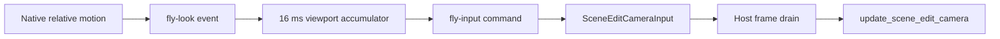

+++
title = 'Editor camera'
weight = 3
+++

# Editor camera

The editor camera is the engine-owned view used to inspect a scene. It is separate from authored `Camera` components, which define game views, and supplies the same `CameraView` to scene rendering, [selection](../selection/), and the [gizmo](../gizmo/).

## Pose and view

`SceneEditCamera` stores position, yaw, pitch, field of view, clip planes, and input speeds. Yaw and pitch are degrees. At zero yaw and pitch the camera faces negative Z, and `forward` derives its direction from the two angles:

```rust
let yaw = self.yaw.to_radians();
let pitch = self.pitch.to_radians();
Vec3::new(
    pitch.cos() * yaw.sin(),
    pitch.sin(),
    -pitch.cos() * yaw.cos(),
).normalize()
```

`view` builds a right-handed world-to-view matrix with positive Y as up. It returns that matrix with the projection parameters in `CameraView`, so render passes and screen-to-world tools use one camera definition.

The camera also carries target position and target angles. Absolute framing synchronizes the targets with the visible pose, while streamed look input moves the targets and lets the visible angles ease toward them. `is_easing` keeps the reactive renderer active until the pose converges.

## Fly input path

Holding the right mouse button over the [viewport panel](../viewport-panel/) asks the native shell to grab and hide the cursor. Raw relative mouse motion accumulates in the shell and arrives in the web UI as `fly-look` events. This native path is necessary because the windowless webview does not provide DOM pointer lock.

The viewport accumulates those deltas and sends a `fly-input` snapshot at most once every 16 milliseconds. Each snapshot includes the six held movement actions. Their defaults are W, S, A, D, Space, and left Shift, and the keybinding registry supplies any user overrides.



The `fly-input` handler adds each look delta to the pending frame input rather than replacing it. `HostLayer::on_update` copies the input and clears only its accumulated look delta before updating the camera. Multiple control messages between engine frames therefore contribute to the same turn.

Right-button release, Escape, focus loss, or panel teardown releases the native pointer lock and sends an inactive snapshot with cleared keys. The camera's `controlling` flag follows that active state.

## Motion and smoothing

`update_scene_edit_camera` adds the look delta to `target_yaw` and `target_pitch`, then clamps target pitch to -89 through 89 degrees. The visible angles use exponential smoothing with the shared `SMOOTH_TAU` constant. The easing tail requests frames after the final input sample until the target pose is reached.

Translation uses the current forward vector, its horizontal right vector, and world Y. The combined direction is multiplied by `move_speed * dt`, making speed independent of engine frame rate. The same delta moves both position and target position, so held-key translation responds without an easing offset.

Preview panes reuse the camera in orbit mode. An `OrbitState` holds a pivot and radius plus their targets; angle, pivot, and radius ease independently, then the eye is placed on the orbit arc. A free-eye `set-camera` leaves orbit mode and snaps to the requested pose.

## Focus and control commands

`get-camera` returns the complete editor camera DTO. `set-camera` accepts partial free-eye fields or an orbit sample with `pivot` and `distance`, which lets tools drive the same state used by native input.

The `focus` command frames an entity from the current viewing direction. When render bounds are available, it uses the model forest's combined axis-aligned bounding box and computes this distance:

```text
distance = max(radius / tan(verticalFov / 2) * 1.3, 0.5)
position = boundsCenter - forward * distance
```

An entity without render bounds uses its world translation and a distance of 5 units. Both paths call `sync_target`, so focus lands at the framed pose immediately.

## Persistence

Project save writes `position`, `yaw`, `pitch`, and `fov` into the `editorCamera` sidecar object. Project load applies the fields that are present, leaves unspecified fields unchanged, exits orbit mode, and synchronizes the target pose. Clip planes and movement speeds remain session state.

## In the code

| What | File | Symbols |
|---|---|---|
| Camera pose, orbit, and view | `engine/crates/sceneedit/src/camera.rs` | `SceneEditCamera`, `OrbitState`, `forward`, `view`, `sync_target`, `is_easing` |
| Per-frame camera update | `engine/crates/sceneedit/src/camera.rs`, `smoothing.rs` | `SceneEditCameraInput`, `update_scene_edit_camera`, `SMOOTH_TAU` |
| Native relative motion | `editor/shell/src/main.rs` | `Shell::device_event`, `look_accum`, `emit_to_js` |
| Viewport input stream | `editor/src/panels/ViewportPanel.tsx` | `FLY_STREAM_MS`, `flyingRef`, `sendState`, `endFly` |
| Host frame drain | `engine/crates/host/src/layer/` | `HostLayer::on_update`, `render_activity_reasons` |
| Camera and focus commands | `engine/crates/control/src/commands_scene/` | `register_scene_commands`, `camera_dto`, `focus`, `get-camera`, `set-camera`, `fly-input` |
| Save and load | `engine/crates/sceneedit/src/camera.rs`, `engine/crates/control/src/project_loader.rs` | `to_json`, `from_json`, `install_doc` |

## Related

- [Viewport panel](../viewport-panel/) — owns the screen rectangle and fly-input gesture.
- [Gizmo](../gizmo/) — projects native handles through the same camera view.
- [Play mode](../play-mode/) — switches rendering to the primary game camera during play.
- [Selection](../selection/) — constructs pick rays from the editor view.
- [Scene commands](../../tooling-and-control/scene-commands/) — lists the camera control surface.
