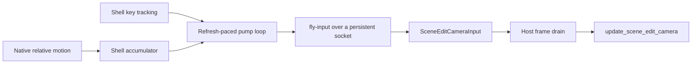

+++
title = 'Editor camera'
weight = 3
+++

# Editor camera

The editor camera is the engine-owned view used to inspect a scene. It is separate from authored `Camera` components, which define game views, and supplies the same `CameraView` to scene rendering, [selection](../selection/), and the [gizmo](../gizmo/).

## Pose and view

`SceneEditCamera` stores position, yaw, pitch, field of view, clip planes, and input speeds. Yaw and pitch are degrees. At zero yaw and pitch the camera faces negative Z, and `forward` derives its direction from the two angles:

```rust
let yaw = self.yaw.to_radians();
let pitch = self.pitch.to_radians();
Vec3::new(
    pitch.cos() * yaw.sin(),
    pitch.sin(),
    -pitch.cos() * yaw.cos(),
).normalize()
```

`view` builds a right-handed world-to-view matrix with positive Y as up. It returns that matrix with the projection parameters in `CameraView`, so render passes and screen-to-world tools use one camera definition.

The camera also carries target angles, which serve the preview panes' orbit mode: orbit input moves the targets and the visible angles ease toward them, and `is_easing` keeps the reactive renderer active until that sweep converges. Free fly applies each sample directly, so outside orbit mode the targets always match the visible pose.

## Fly input path

Holding the right mouse button over the [viewport panel](../viewport-panel/) starts the fly stream: the web UI sends one `fly_stream_start` command carrying the six configured move bindings (defaults W, S, A, D, Space, and left Shift, as DOM key codes), and the shell does the rest natively. It grabs and hides the cursor — the windowless webview does not provide DOM pointer lock — and opens a persistent connection to the engine's control socket.

From then on, no input sample crosses the webview. Raw relative mouse motion accumulates in the shell, the shell tracks the bound move keys from its own window events, and its pump loop — already paced at the monitor refresh — writes one `fly-input` sample per iteration to the engine. The sample rate is the display rate: 240 samples per second on a 240 Hz monitor.



The `fly-input` handler adds each look delta to the pending frame input rather than replacing it. `HostLayer::on_update` copies the input and clears only its accumulated look delta before updating the camera. Multiple samples between engine frames therefore contribute to the same turn.

The shell also owns the gesture's end. Right-button release, Escape, and focus loss all stop the fly synchronously inside the shell's own event handlers — releasing the pointer lock, sending a final inactive sample with cleared keys, and announcing a `fly-ended` event the web UI mirrors into its gesture state — so a stop can never be lost in transit. Panel teardown, the one end the shell cannot observe, sends `fly_stream_stop` from the frontend. The camera's `controlling` flag follows the streamed active state.

## Motion and smoothing

`update_scene_edit_camera` adds the look delta to `target_yaw` and `target_pitch`, then clamps target pitch to -89 through 89 degrees. In free fly the visible angles snap onto the targets the same frame, so every sample lands whole with no filter and no ease-out tail.

Translation uses the current forward vector, its horizontal right vector, and world Y. The combined direction is multiplied by `move_speed * dt`, making speed independent of engine frame rate.

Preview panes reuse the camera in orbit mode, which is the smoothed path. An `OrbitState` holds a pivot and radius plus their targets; angle, pivot, and radius ease independently with the shared `SMOOTH_TAU` constant, then the eye is placed on the orbit arc, so a fast drag sweeps the circle instead of cutting a chord across it. A free-eye `set-camera` leaves orbit mode and snaps to the requested pose.

## Focus and control commands

`get-camera` returns the complete editor camera DTO. `set-camera` accepts partial free-eye fields or an orbit sample with `pivot` and `distance`, which lets tools drive the same state used by native input.

The `focus` command frames an entity from the current viewing direction. When render bounds are available, it uses the model forest's combined axis-aligned bounding box and computes this distance:

```text
distance = max(radius / tan(verticalFov / 2) * 1.3, 0.5)
position = boundsCenter - forward * distance
```

An entity without render bounds uses its world translation and a distance of 5 units. Both paths call `sync_target`, so focus lands at the framed pose immediately.

## Persistence

Project save writes `position`, `yaw`, `pitch`, and `fov` into the `editorCamera` sidecar object. Project load applies the fields that are present, leaves unspecified fields unchanged, exits orbit mode, and synchronizes the target pose. Clip planes and movement speeds remain session state.

## In the code

| What | File | Symbols |
|---|---|---|
| Camera pose, orbit, and view | `engine/crates/sceneedit/src/camera.rs` | `SceneEditCamera`, `OrbitState`, `forward`, `view`, `sync_target`, `is_easing` |
| Per-frame camera update | `engine/crates/sceneedit/src/camera.rs`, `smoothing.rs` | `SceneEditCameraInput`, `update_scene_edit_camera`, `SMOOTH_TAU` |
| Native input stream | `editor/shell/src/fly.rs`, `shell.rs`, `main.rs` | `FlyStream`, `FlyBindings`, `Shell::device_event`, `look_accum`, `apply_fly`, `stop_fly` |
| Fly start + gesture mirror | `editor/src/panels/ViewportPanel/useFlyCamera.ts` | `useFlyCamera`, `flyingRef` |
| Host frame drain | `engine/crates/host/src/layer/` | `HostLayer::on_update`, `render_activity_reasons` |
| Camera and focus commands | `engine/crates/control/src/commands_scene/` | `register_scene_commands`, `camera_dto`, `focus`, `get-camera`, `set-camera`, `fly-input` |
| Save and load | `engine/crates/sceneedit/src/camera.rs`, `engine/crates/control/src/project_loader.rs` | `to_json`, `from_json`, `install_doc` |

## Related

- [Viewport panel](../viewport-panel/) — owns the screen rectangle and fly-input gesture.
- [Gizmo](../gizmo/) — projects native handles through the same camera view.
- [Play mode](../play-mode/) — switches rendering to the primary game camera during play.
- [Selection](../selection/) — constructs pick rays from the editor view.
- [Scene commands](../../tooling-and-control/scene-commands/) — lists the camera control surface.
