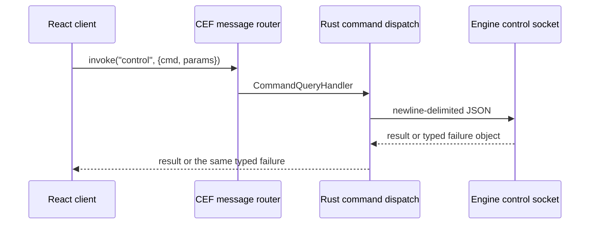

+++
title = 'Editor shell and the viewport bridge'
weight = 1
+++

# Editor shell and the viewport bridge

The editor combines a React frontend, a Rust desktop shell, and a separate engine host. The shell renders the frontend through [CEF off-screen rendering](https://bitbucket.org/chromiumembedded/cef/wiki/GeneralUsage#markdown-header-off-screen-rendering), owns the native window, and presents engine frames below transparent regions of the web UI.

The engine host has no editor panels. It renders the scene, publishes viewport frames, and serves the same [control protocol](../../tooling-and-control/control-plane-architecture/) used by the `sa` CLI.

## Application boundary

The Rust shell creates a [`winit`](https://docs.rs/winit/latest/winit/) toplevel and a windowless CEF browser. Development loads the Vite URL from `SAFFRON_DEV_URL`; a packaged editor serves the built frontend through the `saffron-app://` scheme.

CEF delivers BGRA `on_paint` buffers to `UiCompositor`. The shell preserves their alpha channel so the platform compositor can show the [native viewport surfaces](../viewport-compositing/) beneath the UI. Input, cursors, drag-and-drop, and native window operations return through the shell because windowless CEF owns no platform window of its own.

The shell spawns `saffron-host` with a per-process control socket and two per-view shared-memory names:

| Environment variable | Purpose |
|---|---|
| `SAFFRON_EDITOR_NATIVE_VIEWPORT=1` | Runs the host without a window or swapchain |
| `SAFFRON_CONTROL_SOCK` | Selects the PID-scoped JSON socket |
| `SAFFRON_VIEWPORT_SHM_SCENE` | Publishes the `scene` view ring |
| `SAFFRON_VIEWPORT_SHM_ASSET` | Publishes the `assetPreview` view ring |
| `SAFFRON_APPDATA_DIR` | Shares the editor's application-data root |

`backend::env::engine_env` adds the platform GPU-loader environment. Distinct socket and segment names let editor windows supervise independent host processes.

## Frontend-to-shell IPC

The frontend's `invoke(command, args)` serializes a CEF query as JSON. `CommandQueryHandler` receives the query in the browser process, moves dispatch to a worker thread, and completes the CEF callback with a JSON result or structured error.



Shell events travel in the other direction. Worker threads post an event to the main-thread inbox; the main loop evaluates `window.__saffronShellEvent(name, payload)`, and `listen` fans it out to frontend subscribers.

## Engine control passthrough

Every typed engine operation converges on `call`, which invokes one shell command named `control`:

```ts
return await invoke<CommandResultMap[C]>("control", {
  cmd,
  params: params ?? {},
});
```

The shell's `control_request_with_params` writes one request envelope to the Unix socket and reads one
response. A mutex permits only one outstanding socket round trip, matching the host's frame-driven
control drain. An engine failure retains its complete generated `ControlFailureDto` through the Rust
shell, CEF rejection, `InvokeError`, and `ControlError`.

The bridge uses `transport`, `malformed-reply`, or `bridge` for failures created outside engine
dispatch. It rejects string-only failures and unknown object fields, so every caller observes one
closed error contract. A domain diagnostic reaches the panel with its exact nested fields intact.

Adding an engine command does not require another shell dispatch arm. The protocol DTOs provide the frontend parameter and result types, while a client method can give panels a domain-specific name.

Commands for native editor resources use dedicated shell handlers. These cover engine supervision, window controls, file dialogs, settings, viewport geometry, trace serving, and Asset Store connectors.

## Platform backends

`backend/mod.rs` selects one window-system module at compile time and re-exports a fixed surface. Shared shell code depends on `Handles`, `UiCompositor`, `presenter`, key translation, CEF bootstrap, window operations, and environment helpers.

```rust
#[cfg(target_os = "linux")]
#[path = "wayland/mod.rs"]
mod imp;

#[cfg(target_os = "macos")]
#[path = "appkit/mod.rs"]
mod imp;

pub use imp::{Handles, UiCompositor, bootstrap, env, keys, presenter, window};
```

Any other target fails at compile time. There is no runtime backend selection or trait-object dispatch.

| Concern | Linux (`wayland`) | macOS (`appkit`) |
|---|---|---|
| Window chrome | Borderless window with frontend titlebar | Native decorations and transparent titlebar |
| UI frames | `wl_shm` buffers on the toplevel surface | IOSurface pool on a UI `CALayer` |
| Engine frames | One `wl_subsurface` per view | One `CALayer` per view |
| Viewport pacing | `wl_surface.frame` callbacks | `CADisplayLink` from the `NSView` |
| OSR scale | Scale 1 buffers | Window backing scale, including Retina |
| CEF pump | Shell loop calls `do_message_loop_work` | Timer on the shared `NSRunLoop` |
| CEF bootstrap | Linked `libcef` | Framework loaded from the app bundle |

The macOS editor runs from an `.app` bundle. Its `Contents/Frameworks` directory contains `Chromium Embedded Framework.framework` and five CEF helper applications, following [CEF's macOS bundle model](https://bitbucket.org/chromiumembedded/cef/wiki/GeneralUsage.md#markdown-header-macos). The bundle builder assembles this layout for `just run`.

## Startup and recovery

The shell installs the UI compositor and both viewport presenters when the toplevel resumes. Each presenter retries its shared-memory open until the host creates the segment. The shell spawns no host of its own: the frontend starts a project session (`session_start`) when a project is picked or when the environment names one, passing the project as the child's boot intent (`SAFFRON_PROJECT`, plus `SAFFRON_PROJECT_DISPLAY_NAME` for a created project). `start_session` arms a per-session watcher that reports startup failure and any exit — `session-exited` carries the exit code, whether the stop was requested, and the tail of the host log — while success remains owned by the frontend probe.

`ViewportPanel` polls `viewport-native-info` with a 1.5-second per-attempt timeout and 150-millisecond retries. A successful reply changes the engine phase to `ready`. `LoadingOverlay` stays opaque over the viewport for every other phase, so an absent first frame never exposes the desktop through the transparent region. The `idle` phase means no session exists; a session start flips it to `attaching` once the child is spawned.

The reconcile service checks `session_status` once per second while the editor is focused and a session may be live. `child_alive` uses `Child::try_wait`, which distinguishes a running child from an exited process. Failure changes the phase to `error` and restores the loading overlay.

Retry starts a fresh session for the current project and returns to attachment probing. Restart first stops the session — `quit`, force-terminate any remaining child, remove the socket and both shared-memory names — then starts a fresh one.

## In the code

| What | File | Symbols |
|---|---|---|
| Frontend shell API | `editor/src/shell/index.ts` | `invoke`, `listen`, `getCurrentWindow` |
| Typed engine client | `editor/src/control/client.ts` | `call`, `client`, `ControlError` |
| CEF query router | `editor/shell/src/ipc.rs` | `CommandQueryHandler`, `browser_router` |
| Native dispatch | `editor/shell/src/commands.rs` | `dispatch` |
| Socket passthrough | `editor/shell/src/control.rs` | `control_request_with_params`, `ControlError` |
| Host supervision | `editor/shell/src/engine.rs` | `start_session`, `stop_session`, `child_alive`, `teardown` |
| Backend contract | `editor/shell/src/backend/mod.rs` | `Handles`, `UiCompositor`, `presenter`, `bootstrap` |
| Readiness and overlay | `editor/src/panels/ViewportPanel.tsx`, `editor/src/app/LoadingOverlay.tsx` | `ViewportPanel`, `LoadingOverlay` |

## Related

- [Viewport compositing](../viewport-compositing/) — shared-memory publication and native presentation
- [Viewport panel](../viewport-panel/) — bounds, parking, and pointer input for the scene view
- [Shared types](../../tooling-and-control/shared-types/) — generated TypeScript command contracts
- [Control-plane architecture](../../tooling-and-control/control-plane-architecture/) — host-side dispatch and response envelopes
