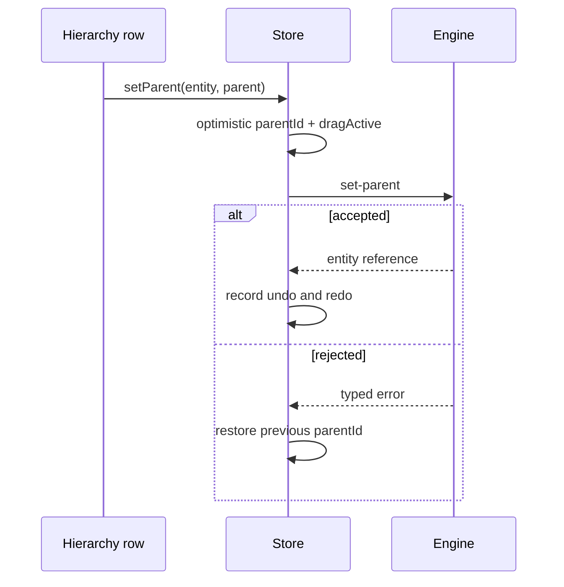

+++
title = 'Hierarchy panel'
weight = 5
+++

# Hierarchy panel

The Hierarchy panel is the scene outliner. It presents entities as a tree and provides selection, framing, creation, renaming, duplication, deletion, and parent changes from one surface.

The panel renders the store's entity slice and does not fetch on its own. The editor's [reconciliation loop](../selection/) refreshes that slice when the engine's scene version changes.

## Building the tree

`list-entities` returns a flat array. Each row contains an identifier, name, optional parent identifier, and an optional bone flag. `buildTree` groups those rows into a forest while preserving their engine-provided sibling order.

```ts
export interface TreeNode {
  entity: EntityListEntry;
  children: TreeNode[];
}

const roots = buildTree(hideBones ? reanchorPastBones(entities) : entities);
```

A missing parent, root identifier, unknown parent, or self-reference places the entity at the forest root. These guards prevent malformed input from creating a client-side traversal loop.

Expansion state lives outside the versioned entity data and persists per project in local storage. Removed identifiers are pruned when the entity list changes. Selection from the viewport or control plane expands every ancestor of the selected row, so an external selection remains visible.

## Display filters

The bone toggle removes rows marked as skeleton joints. `reanchorPastBones` attaches each surviving descendant to its nearest visible ancestor, which keeps meshes and other children reachable when a rig's joint rows are hidden. Reparent validation still uses the unfiltered entity list.

The component toggle makes the selected entity expandable with read-only component rows. These rows reuse the active `inspect` result and the [Inspector](../inspector/) component order, so they make no extra control request. Clicking one opens the Inspector and scrolls its matching component section into view.

## Selection and focus

Clicking an entity writes its identifier to the store before sending `select`. The local row highlights immediately, and `selectionVersion` reconciliation confirms the engine result. Clicking empty panel space clears local selection and sends `deselect`.

The Focus context action sends `focus`, which frames the entity with the [editor camera](../editor-camera/). Double-click starts inline rename; Enter or blur commits a nonempty trimmed name, while Escape cancels.

## Reparenting

An entity can be dropped on another row, assigned through Parent to, or detached through Unparent and the root drop strip. The client rejects the dragged entity and every member of its subtree as targets before sending a command.



The engine rejects cycles and self-parenting, then rebases the child's local transform to preserve its world placement. The store holds `dragActive` across the round trip so reconciliation cannot overwrite the optimistic tree. A successful change records inverse `set-parent` calls for undo and redo.

## Creation and asset drops

The Add menu offers Empty, Cube, Plane, Sphere, three light types, Camera, Reflection Probe, and Fog Volume. Named Empty opens a compact name form and uses `create-entity`; presets use `add-entity`. The engine selects each new entity, and the client mirrors that identifier before the next list refresh.

Dropping model assets from the Assets panel onto the hierarchy background calls `instantiate-model` for each model in the payload. Other asset types are ignored. Entity reparent drags use a separate MIME type and remain scoped to row and root targets.

Creation and model instantiation record an undo action that destroys the new entity. Redo is disabled because recreating it would assign a different identifier.

## Copy, delete, and rename

`copy-entity` creates a fresh entity, serializes each component from the source into it, preserves component order, and joins the source's parent. The engine selects the copy, while the client records the same destroy-only undo used for entity creation.

`destroy-entity` removes the chosen entity and its subtree. The engine clears selection when the selected entity lies anywhere in that subtree. The focused-row delete binding invokes the same action as the context menu and defaults to Delete.

Rename applies the name optimistically, sends `rename-entity`, and records the previous and new values for undo and redo after success. A rejected command appears through the shared notification path.

## In the code

| What | File | Symbols |
|---|---|---|
| Panel actions | `editor/src/panels/HierarchyPanel.tsx` | `HierarchyPanel`, `TreeActions` |
| Tree, filters, and drag targets | `editor/src/panels/HierarchyTree.tsx` | `HierarchyTree`, `TreeRow`, `isInSubtree`, `subtreeIds`, `RenameRow` |
| Tree and optimistic state | `editor/src/state/store.ts` | `buildTree`, `reanchorPastBones`, `setParent`, `expandedIds`, `recordEntityCreation` |
| Creation menu | `editor/src/app/CreateMenu.tsx` | `CREATE_PRESETS`, `CreateMenu`, `NamedEmptyForm` |
| Scene command registration | `engine/crates/control/src/commands_scene.rs` | `register_scene_commands`, `list-entities`, `set-parent`, `add-entity`, `copy-entity`, `destroy-entity`, `rename-entity` |

## Related

- [Scene hierarchy](../../scene-and-ecs/scene-hierarchy/) — explains relationship storage and world-preserving reparenting.
- [Inspector](../inspector/) — edits the selected entity's component data.
- [Selection](../selection/) — explains optimistic selection and version reconciliation.
- [Editor camera](../editor-camera/) — implements entity framing for Focus.
- [Scene commands](../../tooling-and-control/scene-commands/) — documents the entity control surface.
