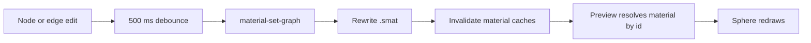

+++
title = 'Material-graph live preview'
weight = 6
+++

# Material-graph live preview

The material-graph editor pairs its node canvas with a live sphere rendered by the engine. Graph edits change the same `.smat` asset that scene entities use, so the preview shows the material under the normal forward+ pipeline and [image-based lighting](../../image-based-lighting/).

## Shared preview view

The material graph is a main work-area tab. While it is active, the scene surface is parked and the graph uses the `assetPreview` view described in the [asset editor](../asset-editor/). The renderer therefore draws one selected editor view per frame.

The asset editor and material graph cannot own the preview scene together. Activating a material-graph tab unmounts the kept asset-editor workspace, which exits its subject. `MaterialGraphEditor` then enters a material preview and sizes the same presented surface to its Preview pane.

Leaving the graph tab unmounts its workspace and calls `exit-asset-preview`. That drops the isolated scene and restores the authored camera, selection, overlay settings, and exposure.

## Material subject

`enter_material_preview` creates a built-in sphere whose first `MaterialSet` slot references the selected material by id. The shared preview furnisher adds a procedural sky and key light, frames the camera, and leaves the floor hidden for this subject.

The id reference connects edits to rendering:

The editor converts its node and edge state to the wire graph after 500 ms without another change. `material-set-graph` stores that graph, tries to lower it into ordinary PBR parameters, and returns `foldable`. A foldable graph renders through those parameters.

A graph that cannot fold also compiles a per-material scene-shader variant. The renderer finds that artifact through the material id when it rebuilds the invalidated cache entry. The standalone Compile button invokes `material-compile-graph`, which compiles the graph's self-contained fragment target and reports success in the toolbar.

There is no image readback in the interactive path. The preview scene remains live, and the next rendered frame after the asset update resolves the current material cache entry.

## Editing and history

The graph loads from `material-get` and converts to the node-canvas representation. A new connection replaces any existing source for the same input pin, and self-connections are rejected. The context menu adds nodes at the pointer's graph coordinates.

Undo and redo use a per-tab snapshot history. Each entry stores the graph before and after a settled edit. Replaying an entry updates the node canvas and sends the same `material-set-graph` command, while the following React settle is marked as replayed to prevent a duplicate history entry.

## Preview controls

Drag input orbits around the framed sphere through `useOrbitCamera`. Zoom is disabled because the sphere is the fixed inspection subject. The hook eases current camera state toward the input target and coalesces `set-camera` calls.

The EV slider covers `-6` to `+6` stops through the renderer's exposure control. Preview entry stashes the authored exposure, and preview exit restores it. `useSubsurfaceBounds` sends the Preview pane's bounds to the `assetPreview` surface once the subject and camera are ready.

The Preview pane is transparent so the native presented surface remains visible below the CEF interface. The toolbar, graph canvas, and Preview header paint opaque backgrounds around that region.

## In the code

| What | File | Symbols |
|---|---|---|
| Material preview scene | `engine/crates/control/src/commands_asset/` | `enter_material_preview`, `build_preview_scene`, `furnish_preview_scene` |
| Graph storage and lowering | `engine/crates/control/src/commands_asset/` | `material-set-graph`, `lower_graph_to_params`, `material-compile-graph` |
| Material rewrite and cache invalidation | `engine/crates/assets/src/material/`, `engine/crates/assets/src/lib.rs` | `update_material_asset`, `AssetServer::invalidate_material_caches` |
| Graph workspace and live pane | `editor/src/panels/MaterialGraphEditor.tsx` | `GraphCanvas`, `graphsEqual`, `compile` |
| Graph conversion | `editor/src/materials/graph.ts` | `flowToGraph`, `graphToFlow`, `NODE_SPECS` |
| Snapshot undo and redo | `editor/src/lib/useTabSnapshotHistory.ts` | `useTabSnapshotHistory` |
| View ownership | `editor/src/app/App.tsx` | `previewTabActive`, `activeRenderView`, `mountedAssetId` |

## Related

- [Asset editor](../asset-editor/) - the isolated preview scene and shared presented view
- [Native materials](../../materials-and-pipelines/native-materials/) - `.smat` storage and parameter resolution
- [Material node-graph codegen](../../materials-and-pipelines/node-graph-codegen/) - graph lowering and Slang generation
- [Viewport compositing](../viewport-compositing/) - how the native preview appears below the web interface
