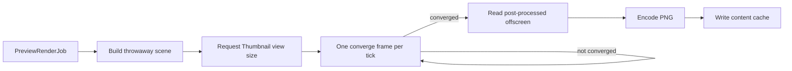

+++
title = 'Mesh thumbnails'
weight = 11
+++

# Mesh thumbnails

Mesh thumbnails are rendered asset previews, not static type icons. They use the same [forward+ scene graph](../../lighting-and-brdf/clustered-forward/) as the interactive asset preview, then cross the control socket as base64-encoded PNG data.

The thumbnail system also handles models, materials, texture maps, and HDRIs. Each asset kind becomes a small furnished scene on an offscreen renderer view.

## Preview subjects

`request_thumbnail` classifies the requested asset into a `PreviewRenderKind`. The control layer maps that kind to a `PreviewSubject` when the host drains the render queue:

| Asset kind | Preview subject |
|---|---|
| Mesh | The mesh with one default material slot |
| Model | The instantiated model forest with its materials and node transforms |
| Material | The material on the built-in sphere, including displacement |
| Texture | The texture on a sphere through a material matching its semantic role |
| HDRI | A chrome ball lit by and reflecting the HDRI |

Animation assets have no thumbnail subject and fall back to their type icon in the Assets panel.

`build_preview_scene_for_thumbnail` creates a throwaway scene with no floor. Meshes, models, materials, and ordinary textures use a procedural environment with a key light. An HDRI supplies image-based lighting to its chrome ball, while the thumbnail view keeps the fixed studio gradient as the visible background.

## Framing

The preview builder computes the world-space axis-aligned bounds of every renderable node in the subject forest. It derives a center and bounding-sphere radius, using a radius of 1 for degenerate or unresolved bounds.

```text
distance = radius / tan(verticalFov / 2) * margin
eye = center + normalize(1, 0.7, 1) * distance
```

The eye vector produces the three-quarter view. Subject-specific margins frame a smooth HDRI ball most tightly, leave displacement headroom for material and texture spheres, and give arbitrary mesh bounds more room. Near and far planes expand from the resulting distance and radius.

## Main-graph render

Queued jobs render on the engine's render thread through `ViewId::Thumbnail`. The view owns separate targets and temporal state, so the Scene and asset-preview views retain their accumulated histories. A separate preview IBL state also prevents a thumbnail environment bake from replacing the project's lighting state.

One tile is in flight at a time, and it advances by exactly one frame per update tick: a preview is an amortized job on the ordinary frame loop, costing a tick the same single frame a viewport does. The tile's furnished scene is built once when the job starts; each later tick re-renders it, so the thumbnail view accumulates its temporal history across ticks the way a viewport does.



A tile reads back once it has rendered at least eight frames and the preview environment's asynchronous bake has landed; 256 frames bound a bake that never completes. The render disables the editor grid and camera models but otherwise uses the scene pipeline, materials, post-processing, and the requested square extent.

Each tick enters and leaves the thumbnail view through `set_active_view_no_reset`, so neither the tile's accumulated history nor the viewport's is cleared by the excursion. Only the tile's first frame resets the thumbnail view, giving a fresh subject a clean history.

The tile's square size is requested through `set_viewport_desired_size`, which records it and reallocates at the next frame boundary. A view resize idles the GPU and rebuilds every target of the view, so landing it between a frame slot's begin and its submit would strand that slot's fence.

`encode_active_offscreen_png` waits for a safe readback, converts the post-processed framebuffer to RGB, and encodes it with the Rust `image` crate's PNG encoder. The reply reports dimensions read from the encoded image rather than echoing the request.

## Pending requests

`get-thumbnail` defaults to 128 pixels and `view-asset` defaults to 512; either takes an explicit size. A disk-cache hit returns PNG data immediately. A miss inserts a deduplicated `PreviewRenderJob` and returns a pending response with empty image data.

Every caller takes that one path, so the material editor's live pane, an Assets tile, and the View modal are one mechanism at three sizes. After the PNG reaches the cache, the next request becomes a cache hit. Rendering and readback stay on the render thread; the pending control response keeps the request from blocking on that work, and a queued or converging tile is a render-activity reason, so the reactive loop holds full cadence until the queue empties.

The editor retries a pending response after 60 milliseconds, doubles the delay after each miss, and caps it at 1 second — `getThumbnailUrl` for a tile, `getMaterialPreviewBase64` for the material editor's pane. A rejected request settles the tile to its asset-type icon without an error toast.

## Content-addressed cache

Cache files live in the app-level thumbnail directory and use this shape:

```text
v<THUMBNAIL_CACHE_VERSION>-<contentHash>-<size>.png
```

Mesh, texture, and model entries use their catalog content hash. A model hash covers mesh chunks, node transforms, material state, and referenced texture bytes. Materials use a live hash of resolved parameters, texture identifiers, shader, and blend mode, so changing a parent material also changes an instance's key.

The cache is shared across projects and asset identifiers that resolve to the same content. Writes cap it at 1 GiB; crossing the cap removes oldest files until usage reaches 80 percent. `thumbnail-cache` reports entry count and bytes or clears the directory.

Changing `THUMBNAIL_CACHE_VERSION` changes the filename prefix for every asset kind. Old files then age out through the same size-cap eviction.

## Browser cache

`AssetTile` requests a 128-pixel image and displays it in a 72-pixel square. `getThumbnailUrl` converts the base64 payload to a `Blob`, creates an object URL, and caches the URL with its fetched size. A cached image satisfies any request for the same asset at an equal or smaller size.

The in-flight map lets concurrent consumers share one retry loop per asset. Replacing a cached image revokes its prior object URL. Project or catalog replacement calls `invalidateThumbnails`, which revokes every client URL; the content-addressed disk cache remains available to the next request.

## In the code

| What | File | Symbols |
|---|---|---|
| Request classification and disk cache | `engine/crates/assets/src/thumbnail/` | `request_thumbnail`, `PreviewRenderKind`, `PreviewRenderJob`, `THUMBNAIL_CACHE_VERSION`, `write_thumbnail_cache` |
| Preview scene and framing | `engine/crates/control/src/commands_asset/` | `PreviewSubject`, `build_preview_scene_for_thumbnail`, `compute_preview_bounds`, `frame_preview_camera` |
| Preview job and convergence | `engine/crates/host/src/layer/` | `HostLayer::drive_preview_render_queue`, `start_preview_job`, `advance_preview_job`, `PreviewRenderState` |
| Offscreen view isolation | `engine/crates/rendering/src/renderer/` | `ViewId::Thumbnail`, `scene_ibl`, `encode_active_offscreen_png`, `set_active_view_no_reset` |
| Deferred view resize | `engine/crates/rendering/src/renderer/` | `set_viewport_desired_size`, `reconcile_pending_view_targets`, `begin_offscreen_frame` |
| PNG conversion | `engine/crates/rendering/src/thumbnail.rs` | `convert_to_rgb`, `encode_to_png`, `ThumbnailPng` |
| Thumbnail commands | `engine/crates/control/src/commands_asset/` | `thumbnail_result`, `get-thumbnail`, `view-asset`, `thumbnail-cache` |
| Blob URL cache and retries | `editor/src/state/store/thumbnails.ts` | `getThumbnailUrl`, `getMaterialPreviewBase64`, `getCachedThumbnailUrl`, `invalidateThumbnails` |
| Grid tile display | `editor/src/components/AssetTile.tsx` | `AssetTile`, `THUMBNAIL_FETCH_SIZE`, `ThumbnailLoading` |

## Related

- [Assets panel and thumbnails](../assets-panel-and-thumbnails/) — explains grid loading, selection, and asset details.
- [Asset editor](../asset-editor/) — uses the interactive version of the preview scene.
- [Material graph live preview](../material-graph-live-preview/) — updates material assets shown by the preview path.
- [Asset commands](../../tooling-and-control/asset-commands/) — documents thumbnail and larger-view requests.
- [Tonemap and exposure](../../screen-space-and-post/tonemap-and-exposure/) — explains the display transform applied before PNG readback.
