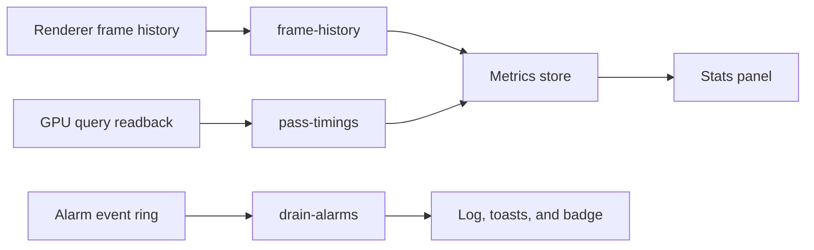

+++
title = 'Metrics dashboard'
weight = 16
+++

# Metrics dashboard

The metrics dashboard is the editor's live view of engine performance. It combines frame history, per-pass GPU timing, memory pressure, draw statistics, and active alarms in the Stats dock panel.

Stats and the [Profiler](../profiler-panel/) answer different questions. Stats shows the current trend and whether it crosses a budget. Profiler records exact CPU and GPU spans for a bounded capture.

## Telemetry flow

The editor keeps performance work off the fast scene-reconciliation path. That path samples cheap state, including `render-stats`, at about 20 Hz. A separate metrics timer wakes every 100 ms and fetches only when the selected refresh interval has elapsed; the default interval is 1 second.

The alarm drain and active-alarm list run even when Stats is closed. `frame-history` runs only while the panel is open, and `pass-timings` also requires the GPU profiler to be enabled. The `since` cursor advances to the drain's high-water sequence, so a later poll catches up without repeating events.

Pause stops the metrics lane and freezes the panel. Alarm events remain in the engine ring and are drained after resume. The panel samples high-frequency `render-stats` and UI-rate values from the store at the selected refresh interval, which avoids rerendering the entire dashboard at the fast poll rate.

## Frame-time graph

`FrameTimeGraph` uses [uPlot](https://github.com/leeoniya/uPlot), a Canvas chart updated through `setData`. A store subscription schedules one update with `requestAnimationFrame` when frame history changes. React state does not carry the plotted samples.

The client retains 72,000 frames in typed arrays and deduplicates overlapping `frame-history` windows by absolute `frameIndex`. The graph selects the requested range, averages it into time buckets, and coarsens the buckets when needed to stay at or below 200 points.

The settings popover separates three controls:

| Control | Choices | Effect |
|---|---|---|
| Range | 10 s to 5 min | Amount of retained history shown |
| Window | 50 ms to 1 s | Averaging interval for each point |
| Refresh | 250 ms to 5 s | Metrics fetch and panel update interval |

The horizontal axis counts down to `now`. Total, CPU, and GPU series use monotone cubic paths. The vertical ceiling is anchored above the frame budget, grows immediately for a spike, and shrinks only after five lower-range updates. A dashed line marks the active budget.

## Dashboard sections

The headline section compares mean frame time with the configured budget and labels the current CPU/GPU bottleneck. It also reports p50, p95, p99, p99.9, maximum frame time, and the stutter count from the renderer's rolling history.

Per-pass rows preserve render-graph execution order. Each row shows milliseconds and its share of the whole frame budget. The GPU-total label is the span from the earliest timed scope to the latest; pass durations can overlap and do not add to that value.

The VRAM gauge appears when the renderer reports a device-local memory budget. The remaining counters cover draw calls, batches, instances, triangles, descriptor binds, pipelines, acceleration structures, active rendering features, engine frame rate, editor poll rate, and webview frame rate.

The Profiler switch selects `timestamps` or `off`. Target FPS is shown from the shared performance config; the Render panel owns the control that changes it. A software-rasterizer banner identifies GPU timings that measure CPU rasterization work.

## Thresholds and alarms

`perfThresholds.ts` mirrors the engine's frame-time and VRAM thresholds from `PerfConfig`. Frame-time grading considers the budget, frozen-frame threshold, and multiples of the running median. VRAM grading uses the configured warning and critical fractions.

Per-pass bars use fixed shares of the frame budget: above 25 percent is amber and above 50 percent is red. These shares are editor presentation rules, not fields in `PerfConfig`.

Alarm events have `info`, `warning`, or `critical` severity. Info remains in the Stats log. Warning toasts are limited to one per fingerprint in 10 seconds, while critical toasts remain until resolution. A `resolved` event dismisses the active toast for its fingerprint.

The titlebar badge reflects alarms that are still firing. Frame-wide alarms open Stats; an alarm tied to a render pass opens Profiler for capture and pass inspection.

## In the code

| What | File | Symbols |
|---|---|---|
| Metrics scheduling and store slices | `editor/src/state/store.ts` | `pollMetrics`, `FRAME_HISTORY_SAMPLES`, `setFrameHistory`, `appendAlarmEvents` |
| Dashboard | `editor/src/panels/RenderStatsPanel.tsx` | `RenderStatsPanel`, `useThrottledStats` |
| Frame graph | `editor/src/components/FrameTimeGraph.tsx` | `FrameTimeGraph`, `niceCeil` |
| Retained samples and bucketing | `editor/src/lib/frameSeries.ts` | `appendFrameSamples`, `bucketSeries`, `resetFrameSeries` |
| Range, window, refresh, and pause | `editor/src/components/MetricsRefreshControl.tsx` | `MetricsRefreshControl` |
| Status colors | `editor/src/lib/perfThresholds.ts` | `frameTimeStatus`, `vramStatus`, `passStatus` |
| Alarm notifications and titlebar badge | `editor/src/lib/alarmToasts.ts`, `editor/src/components/AlarmBadge.tsx` | `routeAlarmToasts`, `AlarmBadge` |

## Related

- [Performance telemetry](../../frame-and-render-graph/performance-telemetry/) - renderer measurements and frame-history semantics
- [Performance alarms](../../frame-and-render-graph/performance-alarms/) - detector thresholds and event lifecycle
- [Profiler panel](../profiler-panel/) - bounded CPU/GPU capture and trace export
- [Dock system](../dock-system/) - how the Stats panel opens and moves
