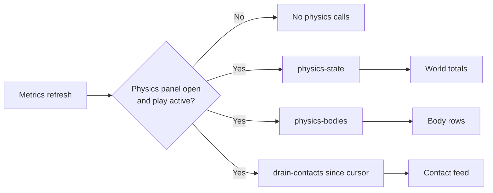

+++
title = 'Physics panel'
weight = 8
+++

# Physics panel

The Physics panel inspects the live [physics world](../../physics/physics-world-lifecycle/) during Play and Paused states. It shows world totals, body activity, contact transitions, and test controls for the selected rig's ragdoll.

## Gated telemetry

Physics telemetry follows the editor's configurable metrics refresh interval. The polling lane makes the three read-only calls only while the panel is open and the play state is not Edit:

`physics-state` reports whether a world is active plus its total and dynamic body counts. `physics-bodies` returns the owning entity, motion type, active state, and world position for every body. The panel displays each entity name or shortened identifier beside its motion type and awake or sleeping state.

The commands are safe to call in Edit: they return inactive or empty results when no play world exists. The panel still gates the calls because Edit has no live state to display.

## Contact feed

`drain-contacts` returns contact transitions whose sequence number is greater than the editor's cursor. A fresh Play session resets the cursor and clears the displayed feed. Each successful drain advances the cursor to the response's high-water sequence number.

The editor reverses each oldest-first response before prepending it to a 200-entry newest-first log. A plus sign marks contact begin, a minus sign marks contact end, and a `trigger` badge identifies events involving a [sensor collider](../../physics/collision-layers-and-triggers/). The panel shows `events dropped` when the engine's contact ring reports overflow.

## Ragdoll controls

The Ragdoll section appears when the selected entity has a `BonePhysics` component. Its controls are available while Play or Paused provides a live physics world:

| Control | Command | Effect |
|---|---|---|
| Go limp | `enable-ragdoll` | Creates or enables the [ragdoll](../../physics/ragdoll/) with passive bodies. |
| Active (motors) | `set-ragdoll { active }` | Enables or disables [active-ragdoll](../../physics/active-ragdoll/) pose motors. |
| Physics blend | `set-ragdoll { bodyWeight }` | Sets the whole-body physics weight from 0 to 1. |

The panel requests `get-ragdoll` when the selection or play state changes and refreshes the readout after each control command. The result reports whether a ragdoll is present, whether its motors are active, its mean body weight, and its bone count. The blend slider updates the local readout during a drag while the command applies the value to the live rig.

Character movement belongs to gameplay scripts and the `move-character` control command. The Physics panel keeps its interactive tools focused on rig testing; component authoring stays in the [Physics inspector](../physics-inspector/).

## In the code

| What | File | Symbols |
|---|---|---|
| Panel and ragdoll controls | `editor/src/panels/PhysicsPanel.tsx` | `PhysicsPanel`, `Stat`, `SectionLabel` |
| Telemetry state and gated poll | `editor/src/state/store.ts` | `CONTACT_LOG_LIMIT`, `appendContactEvents`, `physicsState`, `physicsBodies`, `contactLog` |
| Typed control calls | `editor/src/control/client.ts` | `physicsState`, `physicsBodies`, `drainContacts`, `enableRagdoll`, `setRagdoll`, `getRagdoll` |
| Physics command handlers | `engine/crates/control/src/commands_physics.rs` | `register_physics_commands`, `ragdoll_result_for` |

## Related

- [Physics inspector](../physics-inspector/) — author rigid bodies, colliders, characters, and bone physics.
- [Physics world lifecycle](../../physics/physics-world-lifecycle/) — follow world creation, stepping, and teardown around Play.
- [Collision layers and triggers](../../physics/collision-layers-and-triggers/) — define collision filtering and sensor events.
- [Ragdoll](../../physics/ragdoll/) — understand passive bodies, constraints, and animation blending.
- [Active ragdoll](../../physics/active-ragdoll/) — understand motor-driven pose following.
- [Character controller](../../physics/character-controller/) — drive gameplay movement through the virtual character.
