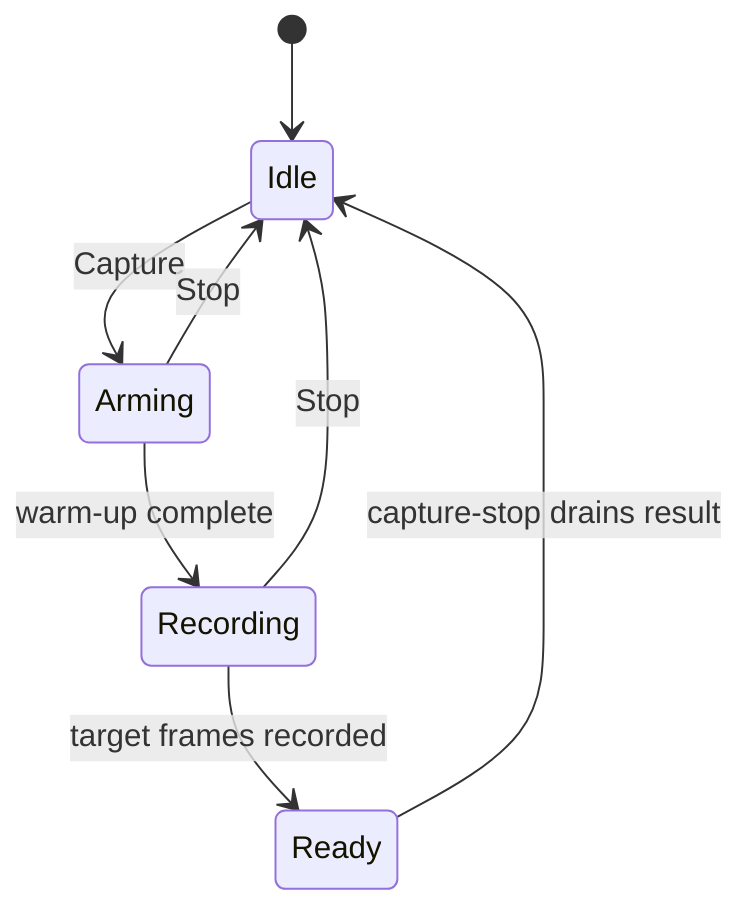

+++
title = 'Profiler panel'
weight = 17
+++

# Profiler panel

The Profiler panel records a bounded CPU and GPU timing capture, then presents its render passes as an aggregate table or a flame chart. It is request-scoped: opening the panel does not start a capture or add a continuous polling lane.

The [metrics dashboard](../metrics-dashboard/) shows live trends and alarms. Profiler answers which pass consumed time in a selected frame window.

## Capture lifecycle

The joined Capture control combines a start/stop button with a frame-count selector. The available windows are 1, 8, 64, and 256 frames, and the selected value persists in editor storage. A single-frame request uses `single`; the other presets use `frames`.

The editor polls `profiler.capture-status` every 150 ms while the recorder is arming or recording. The status call is non-destructive and updates the frame counter. When the engine reports `ready`, one `profiler.capture-stop` call drains the capture into the store.

Pressing Stop before completion drains the frames available at that point. A single-flight guard prevents the button and status poll from issuing two stop calls. The progress bar remains visible for at least one second, so a one-frame capture still has a legible completion state.

Capturing temporarily selects the required renderer profiling mode and restores the previous mode on stop. The panel shows separate notices when the device is a software rasterizer or when calibrated CPU/GPU timestamps are unavailable. The underlying timing and capture state machine are described in [Renderer profiling](../../frame-and-render-graph/renderer-profiling/).

## Per-pass table

The default result view groups GPU spans by pass name. It sums every occurrence, divides duration by captured frame count, and sorts rows from highest to lowest average GPU time. A pass that occurs more than once per frame receives an `xN/frame` label.

Each row reports:

| Column | Meaning |
|---|---|
| GPU ms | Average duration per captured frame |
| % span | Share of the earliest-to-latest GPU interval |
| % budget | Share of the capture's target-frame budget |

Passes can overlap, so `% span` values are not expected to sum to 100 percent. Row colors use the same fixed pass-budget shares as Stats: above 25 percent is amber and above 50 percent is red.

When a capture contains pipeline statistics, rows also derive overdraw, culling, vertex reuse, and compute invocation counts. Counts are summed before ratios are calculated, which weights the result by occurrence.

## Flame graph

The flame action opens the capture in a main editor tab. A Canvas flame chart shows a CPU render-thread lane and a GPU queue lane. Parent indices rebuild nested spans, and correlated captures place both lanes on the host clock.

Span color reflects its share of the frame budget. Selecting a span stores its pass name and gives matching nodes a distinct highlight. An uncorrelated capture labels the GPU lane as using its own zero rather than implying alignment with the CPU lane.

## Trace export

The download menu writes either Chrome Trace JSON or a [Perfetto](https://perfetto.dev/) protobuf through the native file bridge. Both formats are derived from the structured capture kept in the editor store.

Open in Perfetto sends the protobuf bytes to the shell's loopback trace server. The shell returns a `127.0.0.1` URL, then opens `ui.perfetto.dev` with that URL as its import target. The server supplies CORS and private-network headers so the external browser can fetch the trace.

The titlebar alarm badge opens Profiler when an active alarm names a render pass. Frame-wide performance alarms open Stats instead.

## In the code

| What | File | Symbols |
|---|---|---|
| Profiler dock panel | `editor/src/panels/ProfilerPanel.tsx` | `ProfilerPanel` |
| Capture controls and status polling | `editor/src/components/CaptureControls.tsx` | `CaptureControls`, `drainCapture`, `WINDOW_PRESETS` |
| Per-pass aggregation | `editor/src/components/CaptureTable.tsx` | `CaptureTable`, `addStats`, `statsLine` |
| Flame chart | `editor/src/components/CaptureFlame.tsx` | `CaptureFlame` |
| Span-tree conversion | `editor/src/lib/captureTree.ts` | `spansToFlameTree`, `CaptureTree` |
| Trace encoders | `editor/src/lib/chromeTrace.ts`, `editor/src/lib/perfettoExport.ts` | `captureToChromeTrace`, `toPerfettoTrace` |
| Loopback trace delivery | `editor/shell/src/state.rs`, `editor/shell/src/commands.rs` | `ShellState::serve_trace`, `start_trace_server`, `serve_trace` |
| Capture commands | `engine/crates/control/src/commands_render.rs` | `profiler.capture-start`, `profiler.capture-status`, `profiler.capture-stop` |

## Related

- [Renderer profiling](../../frame-and-render-graph/renderer-profiling/) - GPU queries, clock correlation, and capture state
- [Metrics dashboard](../metrics-dashboard/) - live performance trends and alarm history
- [Performance alarms](../../frame-and-render-graph/performance-alarms/) - the events that deep-link into Profiler
- [Dock system](../dock-system/) - the movable diagnostics panel that contains Profiler
