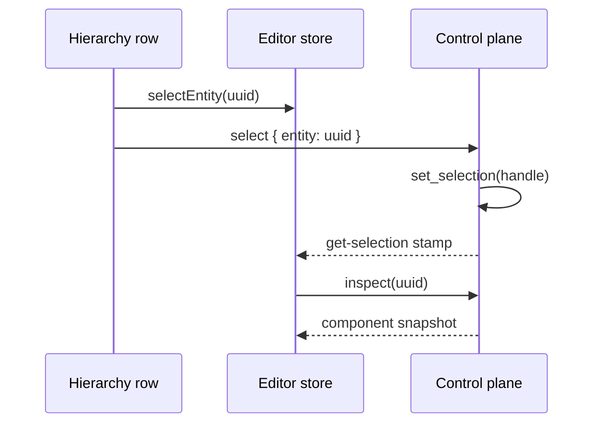

+++
title = 'Selection'
weight = 9
+++

# Selection

Selection identifies the one scene entity targeted by the editor's hierarchy, Inspector, gizmo, and focus command. The engine owns the authoritative entity handle, while the editor store mirrors its stable uuid for immediate UI feedback. Asset-grid multi-selection is separate local state in the [Assets panel](../assets-panel-and-thumbnails/).

## Selection inputs

An entity becomes selected through a hierarchy row, a viewport pick, a control command, or an edit that creates or restores an entity. Deselect comes from an empty viewport pick, empty hierarchy space, the configured Deselect shortcut, or the `deselect` command.

Hierarchy selection is optimistic. The row writes `selectedId` before sending `select`, so its highlight and dependent UI respond without waiting for the socket. The viewport cannot know the picked uuid in advance; it writes the `pick` result into the store as soon as the command returns instead of waiting for the reconcile poll.



`SceneEditContext::set_selection` increments `selection_version` and publishes `on_selection_changed`. The same method handles direct selection, deselection, picking, play-state remapping, and asset-preview transitions. Destroying a subtree clears selection when the selected entity is the destroyed root or one of its descendants.

## Viewport picking

A left press in the viewport always begins the [gizmo](../gizmo/) gesture. If the pointer stays within three CSS pixels before release, the editor calls `pick` at the original press coordinate. A larger movement is treated as a gizmo drag and does not run the pick.

The command checks meshless point-light, spot-light, and camera billboards first, because a glyph is overlay art with no draw record behind it. A billboard uses a 13-pixel half-size hit region and the nearest matching glyph wins.

Everything else answers from the [GPU selection-ID readback](../../scene-and-ecs/picking/): the frame's own binned cut is replayed into a one-texel identity target at the clicked pixel, and the record found there resolves to an entity, a plant, or a cosmetic micro blade. Deformed and procedurally generated geometry therefore picks exactly where it was drawn.

A hit on a mesh inside a model instance resolves through `model_root_of`, so the model container becomes selected rather than an internal mesh or bone entity. A miss sets the engine selection to `Entity::NULL` and returns `hit: false`.

```json
{
  "hit": true,
  "id": "12001",
  "name": "Hero",
  "kind": "mesh"
}
```

## Reconcile stamps

The focus-gated fast poll reads `get-selection` at a target rate of 20 Hz together with render stats and gizmo state. Its selection payload contains the selected entity plus `selectionVersion` and `sceneVersion`. The store compares both the stamp and uuid against its last accepted values.

A selection change schedules `inspect` for the selected uuid. A scene change also refreshes the hierarchy, assets, and environment. Heavy refreshes are skipped when neither stamp changed, and a pending refresh replaces an older one while another is in flight.

`dragActive` freezes reconcile writes during gizmo, hierarchy, and inspector gestures. The fast poll resumes after release and applies the authoritative state. `sceneEntitiesLive` adds another gate around asset-preview tab switches, so preview entities and their selection never flash in the Scene hierarchy or Inspector.

## Scene transitions

Entering Play duplicates the authored scene, then resolves the selected uuid into the play scene and selects that twin. Stopping Play resolves the uuid back into the authored scene; a runtime-created selection with no authored twin becomes empty.

Opening an asset preview stashes the authored selection and selects the preview root. Returning to the Scene view restores the stashed entity when it still exists. These transitions call `set_selection`, so their stamps travel through the same reconcile path as a click or control command.

## In the code

| What | File | Symbols |
|---|---|---|
| Selection state and signal | `engine/crates/sceneedit/src/context.rs` | `SceneEditContext::selected`, `SceneEditContext::set_selection`, `on_selection_changed` |
| Selection and pick commands | `engine/crates/control/src/commands_scene/` | `select`, `get-selection`, `deselect`, `pick`, `pick_billboard` |
| Selection replay and readback | `engine/crates/rendering/src/renderer/selection_pick.rs` | `Renderer::pick_selection_id` |
| Model-container resolution | `engine/crates/scene/src/hierarchy.rs` | `Scene::model_root_of` |
| Store mirror and reconcile | `editor/src/state/store.ts` | `selectedId`, `selectEntity`, `startReconcile`, `selectionVersion` |
| Hierarchy selection | `editor/src/panels/HierarchyPanel.tsx` | `HierarchyPanel`, `onSelect` |
| Viewport gesture | `editor/src/panels/ViewportPanel.tsx` | `ViewportPanel`, `runPick`, `DRAG_THRESHOLD_PX` |
| Deselect shortcut | `editor/src/app/useGizmoShortcuts.ts` | `useGizmoShortcuts` |

## Related

- [Picking](../../scene-and-ecs/picking/) — the selection replay and how a record becomes an identity
- [Hierarchy panel](../hierarchy-panel/) — optimistic row selection and empty-space deselect
- [Gizmo](../gizmo/) — click-versus-drag arbitration
- [Inspector](../inspector/) — component snapshot refreshed for the selection
- [Play mode](../play-mode/) — selection remapping between authored and play scenes
