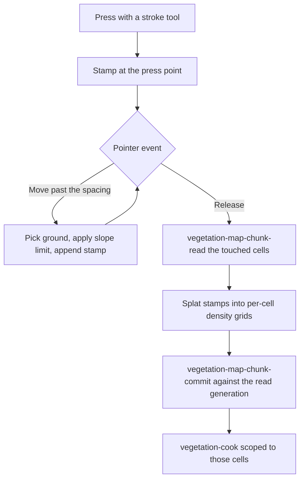

+++
title = 'Vegetation mode'
weight = 19
+++

# Vegetation mode

Vegetation mode is the editor's planting surface: a tool palette, a brush, and an ordered layer list that turn viewport gestures into authored edits on a [vegetation map](../../geometry-and-assets/vegetation-assets/). It is a closable panel outside the default layout, and its keys and pointer routes are scoped to it.

## Entering the mode

The Vegetation panel opens from the Editing group of the Tools menu and docks into the right dock. The mode's scope is that panel's presence in the Scene dock tree. With it open the floating viewport toolbar appears, the digit keys select tools, and a viewport press routes to the active tool; with it closed the same keys and presses fall through to plain selection and gizmo work.

Select, Lasso, and Promote author nothing, so they stay live through a [play session](../play-mode/). Every other tool writes the map and stands down while the world runs: the palette disables its button and the tooltip says why.

The panel and the toolbar read one shared tool vocabulary, so a tool has the same icon, label, and key wherever it appears. Keys are commands in the `vegetation` scope and rebind like any other in [editor settings](../editor-settings/).

| Tool | Key |
|---|---|
| Select | `1` |
| Lasso | `2` |
| Paint | `3` |
| Erase | `4` |
| Density | `5` |
| Reapply | `6` |
| Single | `7` |
| Fill | `8` |
| Spline | `9` |
| Volume | `0` |
| Exclude | `Shift+1` |
| Pin | `Shift+2` |
| Promote | `Shift+3` |

A press in the viewport routes by the active tool. Paint, Erase, Density, Reapply, and Exclude rasterize a brush stroke; Lasso traces a ring on the ground; Volume drags a box. A click with Single, Fill, Pin, Promote, or Spline runs that tool's one-shot gesture, and a click with Select ray-picks like an ordinary viewport press.

## The brush

Every brush tool reads the radius: the five stroke tools stamp at it, Spline sweeps its influence at it, and Volume raises its box by it. The rest of the brush narrows by tool. Falloff reaches the stroke tools and Volume, which take a soft edge from it, but not Spline, whose influence carries no edge profile. Spacing, projection, and the slope limit reach only the stroke tools, because only they sample along a pointer path. The panel and the toolbar readout both show exactly the dimensions the active tool consumes, so no control on screen feeds nothing.

| Parameter | Range | Effect |
|---|---|---|
| Radius | 0.5–64 m | Stamp disk radius in world metres |
| Falloff | 0–1 | Fraction of the radius that fades out; 0 paints a hard disk |
| Spacing | 0.1–16 m | Distance the pointer travels before the next stamp lands |
| Projection | View ray, straight down | Where a sample lands: the camera ray's hit, or a downward cast above it |
| Max slope | 0–90° | Drops authored stroke samples on ground steeper than this; 90° keeps every one |

Density and Fill carry a target density from 0 to 1 as well: the level a Density stroke drives its texels to, and the level a Fill lays across a cell. Pointer pressure scales every stamp, so a pen's light pass writes less than a firm one.

`]` and `[` scale the radius by 1.25 within the same bounds, so resizing mid-stroke needs no trip to the panel.

## Species

The Species section lists the project's plant assets with a filter box and a thumbnail per row from the shared thumbnail cache. A click selects one species and Ctrl or Cmd adds to the selection; each selected row carries a weight from 0 to 1. Single plants the first selected species. A project with no plant assets gets a line pointing at importing a `.splant` package instead of an empty list.

## Painting is a chunk transaction

A press with a stroke tool and an armed layer owns the whole gesture. Each pointer move picks the ground under the cursor, applies the projection and the slope limit, and appends a stamp once the pointer has travelled the spacing distance. One pick is in flight at a time and extra samples drop, so a fast drag cannot pile round-trips into the serialized control bridge.

The release reads every chunk the stamps reach, seeds a grid per cell from the existing tile for that layer and channel, splats the stamps, and commits the replacements as one optimistic transaction. The commit carries the generation the read returned plus a bumped revision per chunk, so the engine rejects it if another authored edit landed first instead of letting it overwrite. A cells-scoped cook then makes the stroke visible.

How a stamp lands depends on the tool. Paint and Erase accumulate a signed weight, Density drives each texel toward the target level, and Exclude writes the layer's signed-blocker slot rather than its field slot.

A fresh painted tile is a 64×1×64 grid over a level-zero cell: 64 metres of cell edge at one texel per metre, one collapsed vertical slab, and 256 quantum steps spanning zero to full density. Positions cross the wire as integer ticks at 4096 per metre, which is what keeps a painted stroke reproducible across machines.

Undo captures the pre-stroke payloads and the keys the stroke created. Replaying re-reads current revisions first, so the pair stays valid after later edits to the same cells; a chunk the stroke created is removed rather than zeroed. Reapply records no undo entry: it recooks the cells a stroke covered without touching authored data, which refreshes a region after its inputs changed elsewhere.

## Layers

The panel polls the bound map from `vegetation-runtime-status` and its ordered layers from `vegetation-asset-summary` every two seconds, so stroke commits and recooks keep the badges honest.

Clicking a row arms it as the edit target. A density or scalar-field operator gives the row a field channel, and a blocker operator gives it the signed-blocker slot Exclude writes. A volume or spline row takes an analytic shape instead of tiles, and a locked row takes no edit at all.

Mute, solo, lock, and reorder each commit through `vegetation-map-layer-commit` as one transaction against the generation just read, and each records its inverse. Solo mutes every other row in that single transaction, and a second solo on the same row unmutes all.

Reordering by drag or by a row's up and down buttons moves the row to an index and renumbers the run it passed through. The inverse replays the order set captured before the move, so an undo restores the whole run rather than one swap.

An amber dot marks a layer whose authored edits no cook has consumed. It reads the engine's own dirty set rather than a local guess about what changed.

## Placing plants one at a time

Five tools and one shortcut work on individual plants instead of density fields. Each gesture that changes a plant records one undoable edit whose inverse is a typed mutation, never a rewrite of cooked bytes.

| Gesture | Mutation | Inverse |
|---|---|---|
| Single, click ground | Anchor addition at the picked point | Tombstone, then regrow |
| A plain click on a plant | Selects that macro plant | None (the selection is transient) |
| Lasso, trace a ring | Selects every plant rooted inside it | None |
| Select, drag the one selected plant | Transform override streamed per sample | Override restoring the captured transform |
| `Delete` | One tombstone per selected plant | Regrow each at its inspected lifecycle and phenotype |
| Pin, click a plant | Pin row in the layer's anchor-override chunk | The opposite toggle |
| Promote, click a plant | Promotion to a transient entity view | Demotion |

An anchor mints an explicit-namespace [`PlantId`](../../scene-and-ecs/vegetation-state/): the high two bits of its first byte are set to `01`, and the reducer rejects any other namespace for an authored point. A drag preserves the plant's orientation and scale, so moving it never quietly re-rolls its placement. A pin protects a plant across recooks, so hand-placed work survives a rule change upstream.

A lasso tests where each plant is rooted rather than what its ring covers on screen, so foliage leaning in from outside does not join the selection. A `Delete` over a multi-plant selection is one edit, so one undo brings the whole set back.

## Analytic shapes

A volume or spline layer holds one shape rather than a grid of texels, so its gesture rewrites the layer's operator instead of a tile. Volume drags two ground corners into a box raised by the brush radius, with the falloff as its soft edge. Spline collects picked ground points, `Enter` commits the polyline at the brush radius, and `Escape` drops the points; the toolbar counts what the gesture has collected.

Each shape commits through `vegetation-map-layer-commit` against the generation just read, then recooks the cells its bounds reach. The include or exclude sense the layer carries is kept, because that is an authored decision about the layer rather than about one drag. The inverse restores the layer's prior operator and bounds.

## Estimate, cook, and review

Three sections cover the round trip from an edit to visible plants.

**Estimate** preflights a region through `vegetation-preflight-region` and cancels the retained job immediately. The reply predicts candidates, accepted points, micro samples, and the peak memory bound without evaluating anything. The region is the last stroke's bounds, or the whole map before any stroke.

**Cook map** queues [a cook](../../geometry-and-assets/vegetation-cooking/) over the map and polls `vegetation-cook-status` at 1 Hz until it reaches a terminal state. While the job runs the section shows its completed nodes and published cells beside a cancel button. A failed cook raises one toast carrying the engine's message.

**Review changes** diffs the two most recently completed manifests through `vegetation-topology-diff`. It reports how many cells changed, the added, removed, and moved totals across them, and the authored overrides that no plant claims. A recook keeps an unclaimed override until its plant returns, so the list is a hint about upstream edits rather than a set of errors.

## Resident population

The bottom section reads `vegetation-render-stats` at 1 Hz and reports what is on screen: instances and field tiles per family, resident cell count, summed predicted micro instances, and page faults. With nothing streaming it says so in place, because an unbound map is a fact about the scene rather than a failed call. Frame cost and budget breaches live in the [ecology and telemetry panels](../ecology-and-telemetry-panels/).

## In the code

| What | File | Symbols |
|---|---|---|
| Panel, layer transactions, cook and population sections | `editor/src/panels/VegetationPanel.tsx` | `VegetationPanel`, `useVegetationMap`, `commitLayersPatch`, `soloLayer`, `reorderLayer` |
| Tool vocabulary shared by panel, toolbar, and shortcuts | `editor/src/panels/vegetationTools.ts` | `VEGETATION_TOOLS`, `isBrushTool`, `isStrokeTool`, `isRuntimeTool` |
| Floating viewport toolbar | `editor/src/panels/VegetationViewportToolbar.tsx` | `VegetationViewportToolbar` |
| Stroke rasterization and chunk transactions | `editor/src/panels/vegetationPainting.ts` | `commitStroke`, `commitFill`, `recookRegion`, `togglePin`, `splat`, `strokeBounds` |
| Analytic shape transactions | `editor/src/panels/vegetationShapes.ts` | `commitVolume`, `commitSpline`, `boundsAround` |
| Anchor and mutation records | `editor/src/panels/vegetationPlanting.ts` | `anchorRecord`, `worldToCell`, `freshExplicitPlantId` |
| Which gesture a press begins, and how it samples | `editor/src/panels/ViewportPanel/vegetationPress.ts` | `beginVegetationPress`, `moveVegetationPress`, `finishVegetationPress`, `clickVegetationTool`, `sampleStroke` |
| Pointer routing and the plant drag | `editor/src/panels/ViewportPanel/index.tsx` | `samplePlantDrag`, `finishPress`, `runPick` |
| Gesture commits | `editor/src/panels/ViewportPanel/viewportVegetation.ts` | `plantAt`, `strokeCommit`, `reapplyCommit`, `pinAt`, `fillAt`, `promoteAt`, `lassoSelect` |
| Mode state and brush shape | `editor/src/state/store/slices/vegetation.ts`, `editor/src/state/store/types.ts` | `createVegetationSlice`, `VegetationBrush`, `VegetationPaintTarget` |
| Scoped shortcuts | `editor/src/app/useVegetationShortcuts.ts` | `useVegetationShortcuts`, `deleteSelectedPlants` |
| Typed commands | `editor/src/control/client/vegetation.ts` | `vegetationMapChunkRead`, `vegetationMapChunkCommit`, `vegetationCook`, `vegetationMutate` |

## Related

- [Vegetation asset workspaces](../vegetation-asset-workspaces/) — author the plant families and biome graphs this mode paints with
- [Ecology and telemetry panels](../ecology-and-telemetry-panels/) — drive the biological clock and watch what vegetation costs
- [Vegetation assets](../../geometry-and-assets/vegetation-assets/) — the `.splant`, `.sbiome`, and `.svegmap` formats behind the layer list
- [Vegetation cooking](../../geometry-and-assets/vegetation-cooking/) — what a cook does with an authored chunk
- [Vegetation state](../../scene-and-ecs/vegetation-state/) — plant identity, mutations, and the runtime store a stroke feeds
- [Undo/redo](../undo-redo/) — how each gesture's inverse is recorded and replayed
- [Debug visualization](../debug-visualization/) — cell, bound, rejection, and heatmap overlays for a painted region
