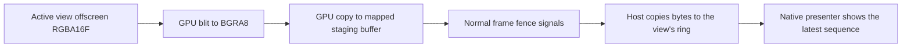

+++
title = 'Viewport compositing'
weight = 2
+++

# Viewport compositing

The editor places the engine's 3D frame below the transparent CEF interface. The engine never
sends scene pixels through the webview. It renders offscreen, publishes BGRA8 pixels to shared
memory, and lets the native shell present them in a platform surface below the UI.

This keeps panels, menus, selection chrome, and translucent overlays in the web layer while the
system compositor combines them with the live viewport. An opaque backdrop below both layers
provides the page background wherever neither the UI nor a viewport is opaque.

## The layer stack

Both shell backends implement the same three-plane stack:

```text
front   CEF UI                 transparent where the viewport shows through
        Scene / asset view    one native presentation surface per editor view
back    backdrop              opaque theme background
```

The platform objects differ, but their roles do not.

| Plane | Linux | macOS |
|---|---|---|
| UI | Toplevel `wl_surface` painted from CEF's shared-memory frames | Transparent `CALayer` backed by an IOSurface pool |
| Viewport | Desynchronized [`wl_subsurface`](https://wayland.freedesktop.org/docs/html/apa.html#protocol-spec-wl-subsurface) below the toplevel | Opaque `CALayer` at z-position `-1` |
| Backdrop | Opaque subsurface below both viewport surfaces | Opaque `CALayer` at z-position `-2` |

On Linux, each viewport's `wl_shm_pool` wraps the engine's segment directly. The shell does not
copy those pixels again. On macOS, a reader copies the newest ring slot into an
[IOSurface](https://developer.apple.com/documentation/iosurface), then Core Animation uses that
surface as the viewport layer's contents.

## The published frame ring

Each visible engine view owns a POSIX shared-memory segment. Its byte layout is a fixed 32-byte
header followed by four equal-capacity frame slots.

| Header word | Meaning |
|---|---|
| `0` | Magic `0x5346_5633` (`SFV3`) |
| `1`, `2` | Published width and height |
| `3` | Sequence number; `0` means no frame |
| `4` | Ring depth, fixed at `4` |
| `5` | Capacity of one slot in bytes |
| `6`, `7` | Low and high words of the segment generation |

Frame sequence `s` occupies slot `s % 4`. For example, sequence `11` uses slot `3`. The writer
copies the pixels, updates the dimensions, issues a release fence, and writes the new sequence
last. This is a single-writer form of the sequence-counter pattern described by the Linux kernel's
[seqlock documentation](https://docs.kernel.org/locking/seqlock.html). Readers ignore sequence `0`
and sequences they have already presented, so neither process waits for the other.

Slots start with enough capacity for a 3840 x 2160 BGRA8 frame. The segment grows when a larger
frame arrives and never shrinks during the process lifetime. Growth and engine restarts can replace
the object behind the same shared-memory name. Each mapping gets a fresh 64-bit generation, so both
presenters check the generation and size every 250 ms and remap when either changes. The explicit
generation also works when POSIX shared-memory metadata does not expose a stable inode.

## Engine readback

The readback is part of the renderer's normal frame submission:



Each frame-in-flight slot owns its BGRA8 image and mapped staging buffer. `record_shm_copy`
records the format-converting blit and image-to-buffer copy in the same command buffer as the
scene. It adds no queue submission or synchronous wait. When `begin_offscreen_frame` later waits
that slot's normal fence, `stage_pending_shm_publish` exposes the completed mapping and the host
copies it into shared memory.

The renderer only records this path for a view whose segment is enabled. The thumbnail view is
separate: it produces PNG data and is never published to a viewport segment.

## Native presentation

### Wayland

The presenter creates one desynchronized subsurface for `scene` and one for `assetPreview`. Both
sit below the UI toplevel and above the backdrop. [`wp_viewport`](https://wayland.app/protocols/viewporter)
scales the current buffer to the pane's logical bounds, so geometry follows a dock drag even before
a newly sized engine frame arrives.

For each new sequence, the presenter creates or reuses the matching `wl_buffer`, attaches it,
damages the surface, and commits. Frame callbacks pace further commits to the compositor. A bounded
fallback keeps the first or occluded frame moving when callbacks are withheld. Optional
`wp_presentation` feedback supplies presented and discarded counts plus the observed refresh rate.

Parking detaches the buffer and exposes the backdrop. Unparking forces the retained ring frame to
attach again, then normal sequence polling resumes.

### AppKit

Each view has a reader thread and a three-entry IOSurface pool. The reader takes a surface that
WindowServer is not using, copies the latest BGRA8 slot into it, and places it in a single ready
slot. When all three surfaces are busy, it skips the attempt and retries the same sequence.

A `CADisplayLink` runs on the main thread. On each display tick it applies pane geometry, hides or
shows parked layers, and assigns ready surfaces to `CALayer.contents` inside a transaction with
implicit animations disabled. The display link also reports the refresh rate of the display that
contains the editor window.

## View identity and geometry

The Scene and asset-preview panes each keep a complete presentation path: a `ViewTarget`, a shared
memory ring, native bounds, and a native surface or layer. `set-active-view` selects which target the
renderer advances. Switching views resets the newly active target's temporal history so TAA, SSGI,
ReSTIR, and DDGI converge from valid input instead of reprojecting stale state.

The web UI reports pane bounds in logical pixels through `set_viewport_bounds`. The shell stores
position, size, UI offset, and parked state in atomics shared with the presenter. A settled resize
also sends `set-viewport-size` in device pixels. That command recreates the selected view's render
targets eagerly after waiting for the device to become idle; presentation stretches the previous
frame to the current pane while the new extent is being produced.

## In the code

| What | File | Symbols |
|---|---|---|
| View identity and target ownership | `engine/crates/rendering/src/renderer.rs` · `view_target.rs` | `ViewId`, `ViewTarget`, `set_active_view`, `reset_view_temporal` |
| GPU readback pipeline | `engine/crates/rendering/src/renderer.rs` | `record_shm_copy`, `stage_pending_shm_publish`, `pending_shm_view` |
| Shared-memory ring producer | `engine/crates/rendering/src/shm_publish.rs` | `ShmPublish`, `SHM_HEADER_BYTES`, `SHM_RING_SLOTS`, `publish` |
| Per-view host wiring | `engine/crates/host/src/viewport_shm.rs` · `layer.rs` | `ViewportShmPublisher`, `configs_from_env`, `publish_pipelined_view` |
| Portable geometry and ring reader | `editor/shell/src/viewport.rs` | `Viewports`, `ViewportShared`, `open_shm`, `stat_shm` |
| Wayland viewport surfaces | `editor/shell/src/backend/wayland/presenter.rs` | `install`, `ViewSurface`, `step_view` |
| AppKit viewport layers | `editor/shell/src/backend/appkit/presenter.rs` | `install`, `PresenterTick`, `read_view` |
| IOSurface rotation | `editor/shell/src/backend/appkit/iosurface.rs` | `IoSurfacePool`, `write_bgra` |
| UI and backdrop planes | `editor/shell/src/backend/{wayland,appkit}/compositor.rs` | `UiCompositor`, `ensure_backdrop` |

## Related

- [Editor shell and the viewport bridge](../editor-shell-and-viewport-bridge/)
- [Viewport panel](../viewport-panel/)
- [Asset editor](../asset-editor/)
- [Main loop and run](../../app-lifecycle-and-window/main-loop-and-run/)
