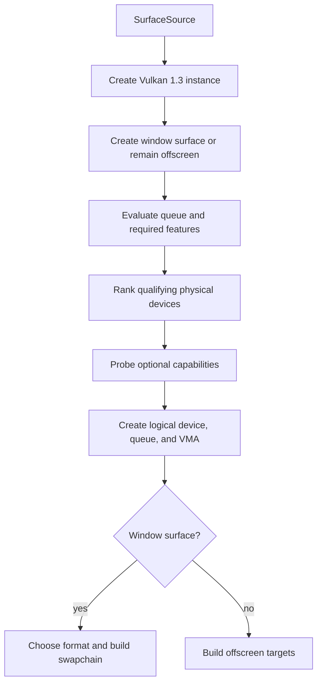

+++
title = 'Device & swapchain'
weight = 2
+++

# Device & swapchain

The renderer builds one immutable `Device` that owns the Vulkan instance, selected physical device,
logical device, graphics queue, optional extension dispatch tables, and VMA allocator. Windowed output
also gives it a surface and a swapchain loader. Every GPU resource keeps the logical device and
allocator alive through a shared `DeviceResources` handle.

Device creation separates requirements from capabilities. A candidate must support the renderer's
core resource and synchronization model, while optional features select faster or richer paths without
excluding otherwise usable hardware.

## Surface modes

`SurfaceSource` determines whether presentation is part of device qualification:

| Source | Instance surface extensions | Queue requirement | Output |
|---|---|---|---|
| `Window` | `VK_KHR_surface` and the platform extension | graphics and present in one family | swapchain |
| `Offscreen` | none | graphics | offscreen image and readback |

The editor-facing host uses `Offscreen` and publishes rendered frames through shared memory. The
windowed application path uses `Window`, obtains raw display and window handles through `ash-window`,
and creates a platform surface. Both modes share the same device selection and renderer construction.

## Instance policy

The instance requests [Vulkan 1.3](https://registry.khronos.org/vulkan/specs/1.3-extensions/html/).
Debug builds enable `VK_LAYER_KHRONOS_validation` and `VK_EXT_debug_utils` when the layer is installed;
`SAFFRON_FORCE_VALIDATION` and `SAFFRON_DISABLE_VALIDATION` override that decision. Warning and error
messages increment `validation_issue_count`, which gives smoke tests a validation-clean assertion.

When the loader advertises `VK_KHR_portability_enumeration`, instance creation enables it and sets
`ENUMERATE_PORTABILITY_KHR`. This exposes portability devices such as MoltenVK through the same
enumeration path used for native Vulkan drivers.

## Device qualification

`select_physical_device` evaluates every enumerated device. A candidate needs API version 1.3, a
graphics queue family, and present support on that same family when a surface exists. The following
feature bits also gate selection:

| Feature set | Required bits | Renderer use |
|---|---|---|
| Vulkan 1.2 | `runtimeDescriptorArray`, `descriptorBindingPartiallyBound`, `descriptorBindingSampledImageUpdateAfterBind`, `shaderSampledImageArrayNonUniformIndexing` | bindless sampled-image arrays |
| Vulkan 1.2 | `bufferDeviceAddress` | GPU addresses for acceleration-structure inputs |
| Vulkan 1.3 | `dynamicRendering` | attachment-based graphics pass recording |
| Vulkan 1.3 | `synchronization2` | stage, access, and layout barriers |

Qualifying devices are ranked discrete, integrated, virtual, then CPU or other. Ranking is a preference,
so a software rasterizer remains valid when it is the best qualifying device. Devices of the same class
retain the loader's enumeration order.

The logical device creates one queue from the selected family. It enables the required feature chain
plus `shaderDrawParameters`, which the fullscreen Slang shaders require for `SV_VertexID`.

## Optional capabilities

`probe_optional_features` records capabilities that choose renderer paths:

| Capability | Required support | Effect |
|---|---|---|
| Ray queries | acceleration-structure and ray-query extensions and feature bits | resolves the acceleration-structure dispatch |
| Mesh shaders | `VK_EXT_mesh_shader` with mesh and task shader bits | resolves mesh-task commands |
| Indirect rendering | `multiDrawIndirect` and `drawIndirectCount` | permits multi-draw and GPU-written draw counts |
| Indirect AS builds | `accelerationStructureIndirectBuild` | permits GPU-provided primitive counts |
| Material sampling | `samplerAnisotropy` | caps anisotropy at the lesser of 16 and the device limit |
| Diagnostics | pipeline statistics and calibrated timestamps | enables deeper counters and CPU/GPU clock correlation |
| Memory reporting | `VK_EXT_memory_budget` | enables driver-reported budget telemetry |
| Wireframe | `fillModeNonSolid` | enables line polygon mode |

The capability record also identifies software rasterizers and stores
`minUniformBufferOffsetAlignment`. Extension dispatch tables exist only when their matching capability
is enabled. `VK_KHR_portability_subset` is enabled whenever the selected device advertises it.

## Surface format and capture

The windowed path prefers `B8G8R8A8_UNORM` with `SRGB_NONLINEAR`; if unavailable, it uses the first
advertised surface format. The offscreen path uses the preferred format directly because it has no
surface to query.

Window capture requires the surface to allow `TRANSFER_SRC` on swapchain images. That bit becomes
`capture_supported` and adds `TRANSFER_SRC` to image usage when available. A surface without it still
presents normally but rejects window-capture requests.

## Swapchain policy

`Swapchain::new` queries [surface capabilities](https://docs.vulkan.org/refpages/latest/refpages/source/VkSurfaceCapabilitiesKHR.html)
for every construction. A fixed surface extent wins; otherwise the requested size is clamped to the
advertised minimum and maximum. The image count is one above the minimum, capped by a nonzero maximum.

The swapchain uses `FIFO`, opaque composition, the surface's current transform, exclusive sharing, and
one array layer. Images support color attachment and transfer destination usage, plus transfer source
usage when capture is supported. Every returned image receives a 2D view, one render-finished semaphore,
and one tracked in-flight fence slot.

## Rebuild and teardown

`Renderer::recreate_swapchain` ignores zero-sized and offscreen requests. For a windowed resize it waits
for device idle, clears any remembered acquired image, destroys the swapchain's views and semaphores,
and constructs the complete swapchain again. Frame-indexed presentation synchronization remains because
it does not depend on the surface extent.

Teardown waits for device idle before renderer-owned resources are released. `DeviceResources::drop`
destroys the VMA allocator before the logical device. `Device::drop` destroys the surface and debug
messenger, releases the shared resource bundle, and destroys the Vulkan instance last.

## In the code

| What | File | Symbols |
|---|---|---|
| Device ownership and surface modes | `device.rs` | `Device`, `SurfaceSource`, `WindowSurface` |
| Instance construction | `device.rs` | `API_VERSION`, `create_instance`, `validation_enabled` |
| Physical-device selection | `device.rs` | `select_physical_device`, `evaluate_device`, `find_graphics_queue_family`, `DevicePreference` |
| Capability negotiation | `device.rs` | `Capabilities`, `probe_optional_features`, `create_logical_device` |
| Surface policy | `device.rs` | `choose_surface_format`, `surface_capture_supported` |
| Swapchain ownership | `swapchain.rs` | `Swapchain`, `new`, `destroy`, `choose_extent`, `choose_image_count` |
| Resize path | `renderer.rs` | `recreate_swapchain` |
| Shared device lifetime | `resources.rs` | `DeviceResources`, `drop` |

## Related

- [Dynamic rendering](../dynamic-rendering/) - explains attachment-based pass recording
- [Synchronization2 and barriers](../synchronization2-and-barriers/) - explains resource ordering
- [Frame sync](../frame-sync-and-resize/) - covers acquisition, submission, and presentation
- [VMA allocator](../vma-allocator/) - covers buffer and image allocation
