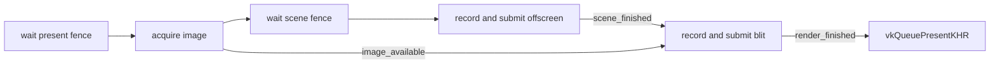

+++
title = 'Frame sync'
weight = 6
+++

# Frame sync

Frame synchronization controls when Anima may reuse command buffers, per-frame descriptors, transient
allocations, offscreen images, and swapchain images. Two frame slots allow the CPU to prepare work
while an earlier submission executes. Fences protect host-side reuse; binary semaphores order GPU
submissions and presentation.

The editor/headless path submits one offscreen command buffer and publishes through shared memory. The
standalone windowed path performs that same offscreen submit, then performs a second submit that blits
the completed offscreen image to an acquired swapchain image.

## Offscreen frame ring

`MAX_FRAMES_IN_FLIGHT` is two. Each `FrameRing` slot owns the resources reused at that cadence:

```rust
struct FrameData {
    command_pool: vk::CommandPool,
    command_buffer: vk::CommandBuffer,
    image_available: vk::Semaphore,
    in_flight: vk::Fence,
}
```

`in_flight` is created signaled. `begin_offscreen_frame` waits for the current slot, making its command
pool, descriptor pools, profiler queries, readback memory, and transient allocation cursor reusable.
It then resets the fence and command pool. The scene submit attaches that fence and advances the ring.

The editor/headless host needs no acquire semaphore. It records the full offscreen graph, includes the
shared-memory readback copy, and submits once. When the same slot returns two frames later, the fence
wait makes the readback host-visible before publication.

## Windowed present ring

Windowed rendering adds a `PresentSync` slot beside each `FrameRing` slot. A present slot owns a blit
command pool and buffer, a `scene_finished` semaphore, and a `present_fence`. `PresentSync` also owns
the active acquire-to-present transaction: its swapchain image, frame slot, and one-shot scene signal
state stay together until presentation consumes them.

`begin_present_frame` follows this order:

1. Wait for the slot's `present_fence`, which protects the prior blit command buffer and semaphore
   reuse.
2. Acquire a swapchain image, signaling the slot's `image_available` semaphore.
3. Run `begin_offscreen_frame`, which waits for and resets the separate scene-submit fence.

Acquisition occurs before the scene fence reset. If acquire returns `ERROR_OUT_OF_DATE_KHR`, the frame
can return early without leaving an unsignaled scene fence that the next frame would wait for.

The scene render then submits its offscreen command buffer, signals `scene_finished`, fences
`in_flight`, and advances `FrameRing`. The signal is emitted once and only when that slot owns an
active swapchain acquisition. Thumbnail, IBL convergence, and other internal offscreen renders run
outside the transaction and never touch presentation semaphores.

## Blit and present

`present_active_view_to_swapchain` takes the active transaction and records a second command buffer
for its exact slot. It
transitions the offscreen image to `TRANSFER_SRC_OPTIMAL`, transitions the acquired swapchain image
from `UNDEFINED` to `TRANSFER_DST_OPTIMAL`, blits, and leaves the swapchain image in
`PRESENT_SRC_KHR`.

The blit submit waits for both conditions:

- `image_available`: the presentation engine has released the acquired image.
- `scene_finished`: the offscreen submit has completed the source image.

It signals that swapchain image's `render_finished` semaphore and fences the slot's `present_fence`.
`vkQueuePresentKHR` waits for `render_finished`.



## Per-image presentation state

`image_available`, `scene_finished`, and both submit fences are indexed by the two-frame ring.
`render_finished` is indexed by swapchain image instead. This follows the
[Khronos guidance for swapchain semaphore reuse](https://docs.vulkan.org/guide/latest/swapchain_semaphore_reuse.html):
the semaphore consumed by presentation belongs to the acquired image, not merely the current
in-flight frame.

`Swapchain::images_in_flight` stores the `present_fence` that last submitted each image. After an
image is acquired, the renderer waits for that tracking fence before reusing the image's
`render_finished` semaphore, then records the current slot's present fence in its place. The image's
tracking fence can equal the current slot's fence. The renderer deduplicates the two handles and
waits for the complete set before resetting the slot fence, so an alias cannot become an unsignaled
second wait.

`ERROR_OUT_OF_DATE_KHR` during acquire skips the frame. `ERROR_OUT_OF_DATE_KHR` and
`SUBOPTIMAL_KHR` from present are nonfatal; the window resize event drives swapchain recreation.

## View resize

`set_viewport_desired_size` records a view's display extent. When its input or display extent changes,
`apply_render_extent` waits for the device to become idle before replacing resources. A display-size
change rebuilds the offscreen image, input depth, screen-space chain, AA targets and histories, and
ReSTIR view resources. `ViewTarget::generation` increments when the base targets change.

Dynamic resolution changes only the input extent while holding the display extent fixed. It rebuilds
input-resolution depth, motion, G-buffer, screen-space, and ReSTIR resources. The
`build_aa_targets_preserving_temporal` path retains display-resolution TAA history and lock images, so
the accumulator remains on the same output grid.

Both paths rebuild descriptor bindings after their images change. Replaced `Image` values release
their VMA allocations through RAII after the device-idle boundary.

## Swapchain resize

`recreate_swapchain` waits for the device to become idle and verifies that no acquire-to-present
transaction is active. It destroys the old swapchain and creates one for the requested surface
extent. Image views, `render_finished` semaphores, and `images_in_flight` tracking are recreated with
the image set. `PresentSync` remains because its per-slot command and synchronization resources do
not depend on the surface extent.

In the standalone windowed host, `FrameHost::resized` rebuilds the swapchain and applies the same size
to the active offscreen view. A zero extent represents a minimized window and does not trigger
recreation.

## In the code

| What | File | Symbols |
|---|---|---|
| Scene frame slots | `engine/crates/rendering/src/frame.rs` | `MAX_FRAMES_IN_FLIGHT`, `FrameData`, `FrameRing` |
| Present frame slots and blit | `engine/crates/rendering/src/present.rs` | `PresentSync`, `PresentSlot`, `record_present_blit` |
| Per-image presentation state | `engine/crates/rendering/src/swapchain.rs` | `Swapchain`, `render_finished`, `image_in_flight`, `set_image_in_flight` |
| Offscreen begin and submit | `engine/crates/rendering/src/renderer.rs` | `begin_offscreen_frame`, `render_scene_offscreen` |
| Acquire, blit, and present | `engine/crates/rendering/src/renderer.rs` | `begin_present_frame`, `present_active_view_to_swapchain` |
| View extent changes | `engine/crates/rendering/src/renderer.rs`, `engine/crates/rendering/src/view_target.rs` | `set_viewport_desired_size`, `apply_render_extent`, `ViewTarget::resize`, `build_aa_targets_preserving_temporal` |
| Window resize bridge | `engine/crates/app/src/lib.rs` | `FrameHost::resized` |

## Related

- [Device and swapchain](../device-and-swapchain/): constructs the surface presentation resources
- [Cross-frame layouts](../../frame-and-render-graph/cross-frame-layouts/): carries image layouts between frames
- [Ash and the Vulkan seam](../vulkan-hpp-no-exceptions/): handles Vulkan status results explicitly
- [Render graph](../../frame-and-render-graph/render-graph-overview/): records the offscreen work before submission
