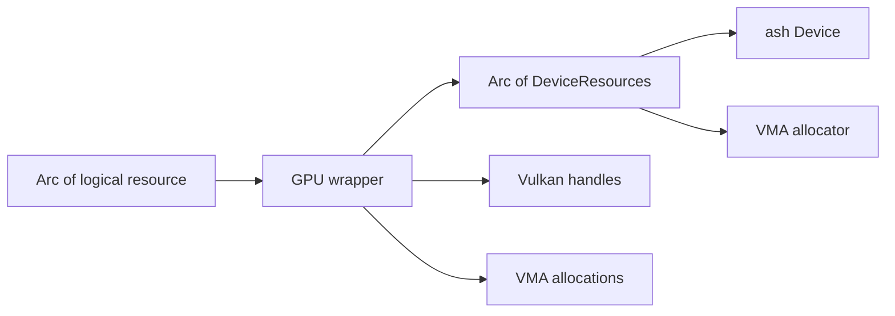

+++
title = 'Meta-layer resources'
weight = 7
+++

# Meta-layer resources

A meta-layer resource is a Rust value that owns related Vulkan handles and VMA allocations. It gives
one logical resource one destruction path while still exposing the handles needed to record commands.
`Buffer`, `Image`, `GpuTexture`, `GpuMesh`, `Pipeline`, and `AccelerationStructure` are representative
wrappers. More specialized values such as `GpuLut`, `GpuSdf`, and `DefaultHeightMinMax` follow the same
ownership rule.

This layer does not hide Vulkan state or synchronization. It localizes ownership: successful
construction transfers every acquired handle into a wrapper, and that wrapper releases them in
dependency order. A constructor that fails partway instead destroys the handles it acquired before it
returns the error.

## One owner for each handle set

`Pipeline` shows the basic shape:

```rust
pub struct Pipeline {
    resources: Arc<DeviceResources>,
    pipeline: vk::Pipeline,
    layout: vk::PipelineLayout,
}

impl Drop for Pipeline {
    fn drop(&mut self) {
        unsafe {
            self.resources.device().destroy_pipeline(self.pipeline, None);
            self.resources.device().destroy_pipeline_layout(self.layout, None);
        }
    }
}
```

Rust moves the wrapper without copying its ownership, and [`Drop`](https://doc.rust-lang.org/std/ops/trait.Drop.html)
runs when the successful value leaves scope. Each implementation destroys dependent objects first:
an `Image` releases its view before its VMA image, while an `AccelerationStructure` releases its Vulkan
acceleration-structure handle before the backing buffer.

The wrapper and `Arc<T>` solve different problems. The wrapper uniquely owns the Vulkan objects.
`Arc<GpuMesh>`, `Arc<GpuTexture>`, or `Arc<Pipeline>` lets caches, per-frame state, and recorded work
share that logical resource. Destruction starts only when the last logical owner releases its `Arc`.

## The device lifetime anchor

Every owning wrapper stores `Arc<DeviceResources>`. The bundle contains the `ash::Device` and VMA
allocator needed by `Drop`, so neither can disappear while a wrapper is releasing its objects. This is
an owned lifetime link rather than a borrow from `Device`.



`DeviceResources::drop` releases the allocator before calling `vkDestroyDevice`. The surrounding
`Device::drop` releases this bundle before destroying the Vulkan instance. Vulkan requires an
application to destroy child objects before their parents, as defined by the
[Vulkan object model](https://docs.vulkan.org/spec/latest/chapters/fundamentals.html#fundamentals-objectmodel-overview).

## CPU lifetime is not GPU completion

An `Arc` proves that CPU owners still retain a wrapper; it does not prove that the GPU has finished
using its handles. Per-frame code therefore pins resources in structures such as `SceneDrawList::live_textures`
and retains replaced buffers for the frame ring where required. Whole-application teardown calls
`Device::wait_idle` before layer detachment and resource release.

The teardown sequence has three independent obligations:

1. Wait until submitted GPU work has completed every use of the resource.
2. Release every logical resource owner so its wrapper can run `Drop`.
3. Release `DeviceResources`, then destroy the Vulkan instance.

Thread traits are declared only where the contained state supports them. `Buffer`, `Image`, `Image3D`,
and `Pipeline` are `Send`; shared uploaded resources including `GpuTexture`, `GpuSdf`, `GpuMesh`, and
`AccelerationStructure` are both `Send` and `Sync`. A `GpuTexture` can consequently return its bindless
slot through `Arc<Mutex<Vec<u32>>>` even when its last owner drops on a worker thread.

## In the code

| What | File | Symbols |
|---|---|---|
| Resource wrappers and destruction | `engine/crates/rendering/src/resources.rs` | `Buffer`, `Image`, `Image3D`, `GpuTexture`, `GpuLut`, `GpuSdf`, `GpuMesh`, `Pipeline`, `AccelerationStructure` |
| Shared device and allocator bundle | `engine/crates/rendering/src/resources.rs` | `DeviceResources`, `DeviceResources::drop` |
| Logical-resource sharing | `engine/crates/rendering/src/draw_list.rs` | `SceneDrawList`, `SceneDrawList::live_textures` |
| Wrapper construction | `engine/crates/rendering/src/upload.rs` | `Uploader::upload_mesh`, `GpuTexture::from_parts` |
| Ordered device teardown | `engine/crates/rendering/src/device.rs` | `Device::wait_idle`, `Device::drop` |

## Related

- [Ash and the Vulkan seam](../vulkan-hpp-no-exceptions/): raw calls and typed Vulkan errors
- [VMA allocator](../vma-allocator/): allocation policy behind the wrappers
- [GPU mesh upload](../../geometry-and-assets/gpu-mesh-upload/): construction of shared GPU meshes
- [Material and PSO selection](../../materials-and-pipelines/material-and-pso-selection/): cached pipeline ownership
