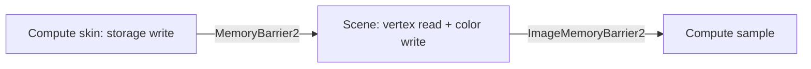

+++
title = 'Barriers'
weight = 4
+++

# Barriers

A Vulkan barrier defines an execution dependency, a memory dependency, and, for images, a layout
transition. Anima expresses these dependencies with Vulkan 1.3
[`synchronization2`](https://docs.vulkan.org/guide/latest/extensions/VK_KHR_synchronization2.html)
structures and `cmd_pipeline_barrier2`.

Most frame-level dependencies come from the render graph. A pass declares how it uses each imported
resource, and the graph compares that declaration with the resource's tracked state. This makes stage,
access, and layout selection part of the graph contract rather than pass-body bookkeeping.

## Dependency scopes

Every synchronization2 barrier carries source and destination stage and access masks. The source scope
identifies earlier accesses that must become available; the destination scope identifies later accesses
that must see them. Image barriers also name the old and new layouts for the affected subresources.

The graph uses two barrier forms:

| Barrier | Resource | Additional state |
|---|---|---|
| `vk::ImageMemoryBarrier2` | one imported image | old layout, new layout, aspect, mip, and layer range |
| `vk::MemoryBarrier2` | an imported buffer dependency | stage and access scopes |

Explicit subsystem paths also use `vk::BufferMemoryBarrier2` when a dependency targets a specific
buffer range or host read. Multiple barriers for one pass are collected in a single
`vk::DependencyInfo` and emitted through one `cmd_pipeline_barrier2` call.

## Usage contract

`RgUsage` is the vocabulary available to graph passes. `usage_info` maps each value to its destination
stage, access mask, image layout, and read/write classification.

| Usage | Stage | Access | Image layout |
|---|---|---|---|
| `ColorWrite` | `COLOR_ATTACHMENT_OUTPUT` | `COLOR_ATTACHMENT_WRITE` | `COLOR_ATTACHMENT_OPTIMAL` |
| `DepthWrite` | `EARLY_FRAGMENT_TESTS \| LATE_FRAGMENT_TESTS` | `DEPTH_STENCIL_ATTACHMENT_WRITE` | `DEPTH_ATTACHMENT_OPTIMAL` |
| `SampledRead` | `FRAGMENT_SHADER` | `SHADER_SAMPLED_READ` | `SHADER_READ_ONLY_OPTIMAL` |
| `StorageWriteCompute` | `COMPUTE_SHADER` | `SHADER_STORAGE_WRITE` | buffer |
| `StorageReadCompute` | `COMPUTE_SHADER` | `SHADER_STORAGE_READ` | buffer |
| `StorageReadFragment` | `FRAGMENT_SHADER` | `SHADER_STORAGE_READ` | buffer |
| `StorageImageRwCompute` | `COMPUTE_SHADER` | `SHADER_STORAGE_READ \| SHADER_STORAGE_WRITE` | `GENERAL` |
| `SampledReadCompute` | `COMPUTE_SHADER` | `SHADER_SAMPLED_READ` | `SHADER_READ_ONLY_OPTIMAL` |
| `VertexInputRead` | `VERTEX_ATTRIBUTE_INPUT` | `VERTEX_ATTRIBUTE_READ` | buffer |
| `AccelStructBuildRead` | `ACCELERATION_STRUCTURE_BUILD_KHR` | `SHADER_READ` | buffer |
| `IndexInputRead` | `INDEX_INPUT` | `INDEX_READ` | buffer |
| `IndirectCommandRead` | `DRAW_INDIRECT` | `INDIRECT_COMMAND_READ` | buffer |

Color and depth attachments implicitly apply `ColorWrite` and `DepthWrite`. An MSAA resolve target is a
second write with the same usage as its source attachment.

## Hazard derivation

Each imported resource tracks its last stage, last access, whether that access wrote, whether the
resource has been touched, and its image layout. `apply_access` uses one conservative hazard rule:

```rust
let hazard = (target.is_write && r.touched)
    || (!target.is_write && r.last_was_write);
```

The rule produces these cases:

| Earlier access | Later access | Barrier |
|---|---|---|
| read | read | no, unless an image layout changes |
| write | read | yes |
| read | write | yes |
| write | write | yes |

An image emits `ImageMemoryBarrier2` when either a hazard exists or its target layout differs. A buffer
emits `MemoryBarrier2` only for a hazard. After the decision, the target stage, access, write flag, and
layout become the state used by the next pass.

The graph's image barriers cover one mip and one layer of the imported resource and set both queue-family
indices to `QUEUE_FAMILY_IGNORED`. Queue ownership transfer is unnecessary because renderer work uses one
graphics queue family.

## Example sequence

Consider compute skinning followed by a scene draw. The skin pass declares `StorageWriteCompute` for the
deformed vertex buffer. The scene pass declares `VertexInputRead`, so the graph emits a memory dependency
from compute shader storage writes to vertex attribute reads.

If that scene pass also writes a new color image, its first `ColorWrite` changes the image from
`UNDEFINED` to `COLOR_ATTACHMENT_OPTIMAL`. A later compute pass that samples the image declares
`SampledReadCompute`, producing a read-after-write dependency and a transition to
`SHADER_READ_ONLY_OPTIMAL`.



## Cross-frame layouts

Persistent images carry their layout through an external graph slot. `alloc_external_layout` creates the
slot, `import_image` uses it as the entry layout, and graph execution writes the resolved exit layout
back. The owner reads that value after execution and supplies it on the next frame.

`seed_image_state` treats an imported `SHADER_READ_ONLY_OPTIMAL` image as having a prior fragment sampled
read. This supplies the source scope when the first graph access writes that image. Other entry layouts
start at `TOP_OF_PIPE` with an empty access mask until an in-graph access establishes state.

## Explicit barriers

The graph coordinates dependencies between declared passes and resources. Explicit synchronization2
barriers remain appropriate where work happens inside one pass body or outside the frame graph:

- upload copies, mip generation, and resource initialization;
- clear, scan, emit, and draw phases recorded inside one compute or graphics body;
- acceleration-structure scratch reuse and build-to-read dependencies;
- offscreen readback and host-visible staging buffers;
- the offscreen-to-swapchain blit and transition to `PRESENT_SRC_KHR`;
- multi-layer or persistent subsystem resources managed by their owning module.

These sites build the same barrier2 structures and dependency info used by the graph. Their scopes come
from the commands immediately surrounding them rather than an `RgUsage` declaration.

## Feature boundary

Physical-device evaluation requires `synchronization2`, and logical-device creation enables it through
`PhysicalDeviceVulkan13Features`. Graph and subsystem recording can therefore use barrier2 commands on
every supported device.

## In the code

| What | File | Symbols |
|---|---|---|
| Usage vocabulary | `render_graph.rs` | `RgUsage`, `RgUsageInfo`, `usage_info` |
| Resource state and hazard rule | `render_graph.rs` | `RgResourceState`, `apply_access`, `DerivedBarriers` |
| Pass-level derivation and emission | `render_graph.rs` | `derive_pass_barriers`, `execute_profiled` |
| Cross-frame layout slots | `render_graph.rs` | `alloc_external_layout`, `external_layout`, `import_image`, `seed_image_state` |
| Present transitions | `present.rs` | `record_present_blit`, `barrier` |
| Upload transitions | `upload.rs` | `record_texture_upload`, `mip_barrier`, `transition_image` |
| Acceleration-structure ordering | `rt.rs` | `record_tlas_build_plan`, `accel_scratch_barrier`, `accel_build_to_fragment_barrier` |
| Device feature gate | `device.rs` | `evaluate_device`, `create_logical_device` |

## Related

- [Render graph overview](../../frame-and-render-graph/render-graph-overview/) - explains graph construction and execution
- [Usage and barrier derivation](../../frame-and-render-graph/usage-and-barrier-derivation/) - gives pass declaration examples
- [Dynamic rendering](../dynamic-rendering/) - consumes the attachment layouts prepared by these barriers
- [Frame sync](../frame-sync-and-resize/) - covers synchronization between submissions and presentation
