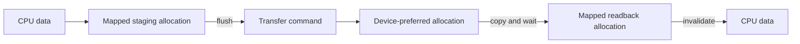

+++
title = 'VMA allocator'
weight = 3
+++

# VMA allocator

The Vulkan Memory Allocator (VMA) selects memory types, suballocates device memory, and binds memory to
engine-owned buffers and images. Anima creates one allocator with each logical device and accesses it
through the Rust `vk-mem` binding. Swapchain images remain owned by the swapchain; render targets,
uploaded assets, staging buffers, and acceleration-structure storage use VMA.

Vulkan exposes memory heaps and types but leaves allocation strategy to the application. The caller
must satisfy size, alignment, memory-type, and binding requirements described by the
[Vulkan memory model](https://docs.vulkan.org/spec/latest/chapters/memory.html). VMA performs that
selection and suballocation while the resource wrappers retain explicit control over usage flags,
mapping intent, synchronization, and destruction.

## Allocator creation

`create_allocator` supplies the ash instance, logical device, and physical device to VMA. It also sets
the engine API version and `BUFFER_DEVICE_ADDRESS`, because mesh and acceleration-structure buffers use
device addresses.

```rust
let mut create_info = vk_mem::AllocatorCreateInfo::new(instance, device, physical_device);
create_info.vulkan_api_version = API_VERSION;
create_info.flags = vk_mem::AllocatorCreateFlags::BUFFER_DEVICE_ADDRESS;

let allocator = unsafe { vk_mem::Allocator::new(create_info) }?;
```

The allocator lives beside the ash device in `DeviceResources`. Resource wrappers clone
`Arc<DeviceResources>`, so their `Drop` implementations can call VMA without borrowing `Device`.
`DeviceResources::drop` releases the allocator before it destroys the logical device.

## Allocation patterns

An allocation request combines Vulkan usage with a VMA memory preference. Anima uses three recurring
patterns from the [VMA usage guidance](https://gpuopen-librariesandsdks.github.io/VulkanMemoryAllocator/html/usage_patterns.html):

| Data flow | VMA choice | Examples |
|---|---|---|
| GPU reads and writes | `AutoPreferDevice` | render targets, mesh buffers, acceleration-structure storage |
| CPU writes, GPU reads | `Auto` + `HOST_ACCESS_SEQUENTIAL_WRITE` + `MAPPED` | upload staging, frequently updated uniform buffers |
| GPU writes, CPU reads | `AutoPreferHost` or `Auto` + `HOST_ACCESS_RANDOM` + `MAPPED` | LUT bake readback, shared-memory capture |

`AutoPreferDevice` expresses locality without selecting a heap or memory type by index. `Image::new`,
`Image3D::new`, and `make_device_buffer` use this path. VMA returns the Vulkan handle and allocation as
a pair; the owning wrapper later passes the same pair to `destroy_image` or `destroy_buffer`.

Mapped allocations expose `AllocationInfo::mapped_data`. `Buffer::mapped_bytes` turns that pointer into
an exclusive byte slice tied to a mutable borrow of the wrapper. Mapping persistence avoids a map and
unmap cycle for every update, but it does not replace cache management or GPU synchronization.

## Upload and readback example

A mesh upload writes vertices and indices into one sequential mapped `StagingBuffer`, then calls
`StagingBuffer::flush` before recording the transfer into device-preferred buffers. VMA makes the flush
a no-op for host-coherent memory and performs the required cache operation otherwise.

The readback direction is symmetric. LUT baking copies the GPU image into a random-access mapped buffer,
waits for the submitted copy, then calls `invalidate_allocation` before reading through the mapped
pointer. Flush makes host writes visible to the device; invalidation makes device writes visible to the
host.



## Ownership and diagnostics

VMA owns memory blocks and suballocation metadata. Each resource wrapper owns its VMA allocation and
paired Vulkan object. Dropping `Buffer`, `Image`, `GpuMesh`, or `AccelerationStructure` calls the
matching VMA destroy function; upload error paths free partial allocations before returning.

Resource tests call `calculate_statistics` before and after wrapper destruction and compare the live
allocation count. This leak check works without `VK_EXT_memory_budget`, including on llvmpipe, so it
tests ownership independently of optional heap-budget telemetry.

## In the code

| What | File | Symbols |
|---|---|---|
| Allocator setup | `engine/crates/rendering/src/device/` | `create_allocator`, `AllocatorCreateFlags::BUFFER_DEVICE_ADDRESS` |
| Shared allocator lifetime | `engine/crates/rendering/src/resources/` | `DeviceResources`, `DeviceResources::drop` |
| General buffer and image allocation | `engine/crates/rendering/src/resources/` | `Buffer::new`, `Image::new`, `Image3D::new` |
| Upload staging and device-local buffers | `engine/crates/rendering/src/upload/` | `StagingBuffer`, `StagingBuffer::flush`, `make_device_buffer` |
| Readback cache invalidation | `engine/crates/rendering/src/upload/` | `Uploader::bake_look_lut`, `Uploader::run_bake_passes` |
| Allocation leak probe | `engine/crates/rendering/src/resources/` | `live_allocations`, `wrappers_drop_reclaims_every_allocation` |

## Related

- [Meta-layer resources](../meta-layer-resources/): wrappers that own VMA allocations
- [Device and swapchain](../device-and-swapchain/): logical-device and swapchain ownership
- [GPU mesh upload](../../geometry-and-assets/gpu-mesh-upload/): staging transfers into device memory
- [Bindless textures](../../materials-and-pipelines/bindless-textures/): sampled images allocated through VMA
