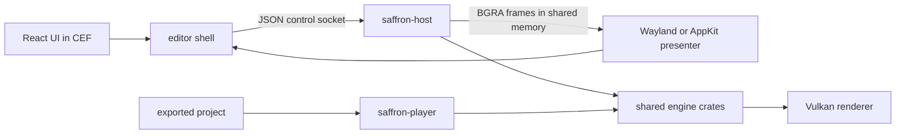
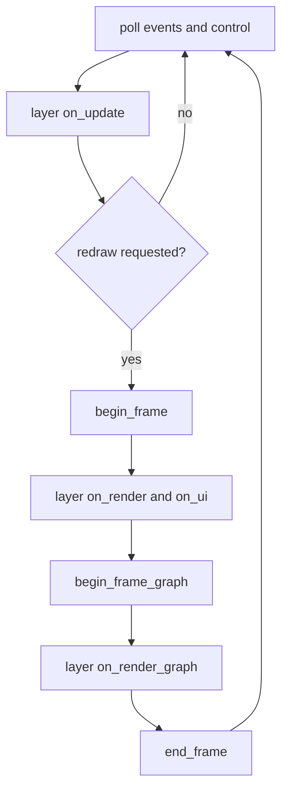

+++
title = 'Overview'
weight = 5
+++

# Overview

Anima separates the editor UI, the viewport host, and exported games into distinct processes. They share the scene, asset, simulation, and rendering crates rather than embedding editor code in the engine runtime.

## Runtime shape

The editor is a CEF/React application inside a native Rust shell. The shell spawns `saffron-host`, sends JSON commands over a Unix socket, and presents the host's offscreen frames beneath transparent UI regions.

Exported projects run through `saffron-player`. The player loads `app.json` and `project.json`, owns a window and swapchain, and drives animation, physics, and Luau through the same `RuntimeSession` used by editor play mode.

The [editor shell and viewport bridge](../explanations/ui-and-editor/editor-shell-and-viewport-bridge/) explains the process boundary. The [control plane](../explanations/tooling-and-control/control-plane-architecture/) and [viewport compositing](../explanations/ui-and-editor/viewport-compositing/) cover the two cross-process transports.

## One frame

Both host modes use the `saffron-app` lifecycle. A layer updates engine state, submits direct GPU work, and adds render-graph passes. `end_frame` derives barriers, executes the graph, and either publishes or presents the image.

Rendering is reactive. Active simulation requests continuous frames, edits request a fresh frame, and an idle scene leaves the last published image in place. Shutdown waits for the GPU before layer teardown and resource destruction.

## Engine data flow

Projects serialize a registry-driven `hecs` scene and an asset catalog. Importers turn source models, images, materials, and animation data into engine assets; `RuntimeSession` advances scripts, animation, and physics against a play-scene copy.

The renderer gathers visible scene data into GPU resources and declares passes in a render graph. Each pass states its image and buffer usage, so the graph derives synchronization and layouts before recording work. The frame then passes through lighting, post-processing, the native overlay, and presentation.

## Code map

| Area | Entry points | Role |
|---|---|---|
| App lifecycle | `saffron_app::run`, `Layer`, `step_frame` | Bring-up, reactive frame dispatch, teardown |
| Editor host | `saffron_host::run_host`, `HostLayer` | Control plane, project session, offscreen frame publishing |
| Exported game | `saffron-player::main`, `PlayerLayer` | Windowed project runtime and swapchain presentation |
| Simulation | `saffron_runtime::RuntimeSession` | Shared animation, physics, and Luau play state |
| Rendering | `Renderer`, `RenderGraph` | Vulkan resources, graph execution, presentation |

## Explore by area

| Area | Sections |
|---|---|
| Foundations | [Core conventions](../explanations/core-and-conventions/), [app lifecycle](../explanations/app-lifecycle-and-window/), [Vulkan](../explanations/vulkan-foundation/), [architecture](../explanations/architecture-and-conventions/) |
| Rendering | [Frame graph](../explanations/frame-and-render-graph/), [materials](../explanations/materials-and-pipelines/), [lighting](../explanations/lighting-and-brdf/), [IBL](../explanations/image-based-lighting/), [shadows](../explanations/shadows-and-culling/) |
| Image quality | [Screen-space and post](../explanations/screen-space-and-post/), [anti-aliasing](../explanations/anti-aliasing/), [GI and ray tracing](../explanations/global-illumination-and-raytracing/) |
| Content and simulation | [Geometry and assets](../explanations/geometry-and-assets/), [scene and ECS](../explanations/scene-and-ecs/), [animation](../explanations/animation/), [physics](../explanations/physics/), [scripting](../explanations/scripting/) |
| Editor and tools | [UI and editor](../explanations/ui-and-editor/), [tooling and control](../explanations/tooling-and-control/), [asset stores](../explanations/asset-store-and-connectors/) |

Use [How-to](../how-to/) for executable recipes, [Reference](../reference/) for lookup tables, and [Tutorials](../tutorials/) for guided builds.
