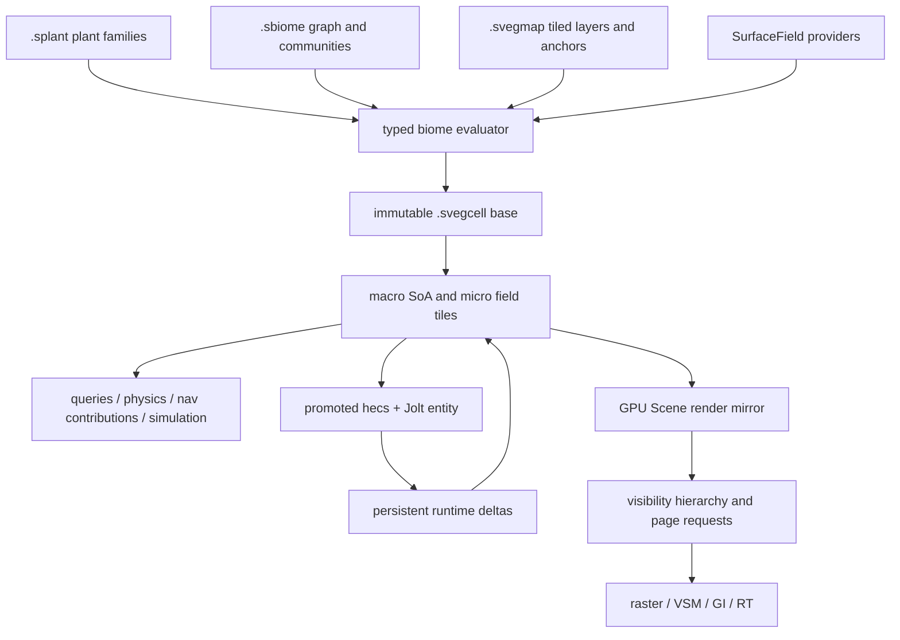

# Foliage and vegetation

**Status:** IN PROGRESS

This planset builds vegetation as a deterministic world system, not as a collection of foliage
draw calls. Three vegetation-specific logical asset types describe plant families, biome rules,
and world authoring. A shared spatial substrate evaluates them into immutable, cell-addressed
artifacts; a compact runtime store overlays persistent mutations; and the renderer consumes that
state through the same GPU Scene used by ordinary meshes. Grass, trees, editor painting, procedural
generation, physics promotion, saves, future networking, shadows, GI, and ray tracing therefore
share one source of truth.

The rendering destination is virtualized aggregate foliage. Near vegetation uses reusable
micro-instanced plant parts and triangle clusters. Projected appearance error selects progressively
coarser hierarchy cuts, including aggregate voxel clusters that preserve canopy volume, coverage,
thin-sheet transmission, material moments, and normal distributions. There is no terminal billboard,
artist-authored foliage LOD chain, material-WPO wind path, CPU foliage draw loop, or terrain-only
grass system.

## Outcome

When the planset is complete:

- one `.splant` asset describes a normalized plant family, regardless of whether its source is an
  imported family recipe or the native botanical graph;
- one `.sbiome` asset contains a typed placement/ecological-rule graph and can also serve as a
  reusable typed subgraph module without creating another asset kind;
- one tiled `.svegmap` package owns the world's painted fields, blockers, local graph instances,
  explicit plants, anchors, pins, and authored overrides;
- one scene-level `VegetationField` component references the active `.svegmap`; local regions are
  layers inside that map, not additional competing field components;
- disposable `.svegcell` and `.splantc` artifacts contain compiled cell and plant render data;
  deleting the cache loses no authored or persistent runtime state;
- macro plants use stable opaque 128-bit `PlantId`s and compact columnar state; micro grass is a
  spatially stable reconstruction from authoritative density/attribute fields and does not pretend
  that every blade is a saved object;
- explicit plants, procedurally cooked plants, and authority-created runtime plants occupy distinct
  identity namespaces but reduce through the same state model;
- one typed `VegetationMutation` reducer drives editor undo envelopes, compact save snapshots/tails,
  and future sequenced network envelopes without conflating their different retention semantics;
- the persistent GPU Scene is a derived render mirror updated by deltas, never the scene or
  vegetation authority;
- all geometry passes consume one semantic visible-cluster stream. Portable compute plus indexed
  multi-draw-indirect is required; mesh shaders, opacity micromaps, and vendor RT structures are
  capability executors over identical content;
- wind is structured deformation driven by the shared Environment wind field, with current and
  previous state reused by depth, shading, motion, shadows, GI, and ray tracing;
- a physical-atlas virtual shadow-map system replaces fixed foliage-hostile shadow maps; and
- a dedicated Vegetation mode and plant/biome workspaces replace any temptation to enlarge the
  Environment panel. Environment keeps the shared wind and calendar controls only.

## One ownership model



State precedence is fixed:

```text
authored sources → cooked base cell → persistent runtime delta → transient predicted/cosmetic state
```

No layer writes backward. Generated artifacts, GPU buffers, vegetation BVHs, Jolt bodies, nav
contributions, picking buffers, and promoted entities are replaceable views carrying their source
generation. A cache rebuild cannot resurrect a harvested plant or erase an authored override.

## Design stance

### One vegetation vocabulary

The editor does not gain separate stores for painted foliage, terrain grass, procedural foliage,
runtime GPU grass, and actor foliage. Brushes, splines, volumes, graph nodes, explicit anchors, and
runtime additions all produce inputs or mutations against the same map and point schema. The
renderer never becomes an authoring format.

### Cells own storage, not visual quality

`WorldCellKey` and its hierarchy group authored tiles, dependencies, compilation, residency, and
simulation. Frustum visibility, occlusion, representation choice, and LOD remain per
instance/hierarchy node/cluster. Cell-wide culling or cell-wide LOD transitions are forbidden.
Heightfield terrain is not a prerequisite; it later implements the same `SurfaceField` contract as
the initial mesh provider.

### Determinism is designed, not hoped for

Macro identity and gameplay-affecting placement use specified canonical numerics, stable node GUIDs,
domain-separated counter-based randomness, finite influence radii, halo evaluation, deterministic
tie-breaking, and one canonical owner cell. Cross-vendor floating-point shader output is not assumed
bit-identical. GPU nodes can affect persistent macro results only when their integer/fixed-point
implementation passes CPU/GPU byte-equivalence gates. Cosmetic micro reconstruction is explicitly
tainted and cannot feed collision, navigation, saves, ecology, or gameplay queries.

### Virtualized aggregate geometry, not classic foliage tricks

The plant cooker retains repeated branches, fronds, leaves, flowers, and blades as micro-instanced
parts. It builds a portable cluster hierarchy with bounds, normal cones, deformation influence,
page dependencies, and an appearance error that includes silhouette, projected coverage,
transmitted energy, normal distribution, and material variation. Aggregate voxel nodes preserve
foliage volume at distance. No octahedral beauty impostor or crossed-card terminal is authored beside
this hierarchy.

### Quality is portable; acceleration is optional

Every representation renders on the required compute + indexed-MDI path used by MoltenVK. Mesh
shaders can consume the same semantic cluster records when their feature bits and limits are suitable,
but cannot unlock a unique quality tier. KHR ray tracing without opacity micromaps remains correct via
any-hit. Optional OMM and NVIDIA cluster/partitioned acceleration structures reduce cost without
changing content. Experimental Vulkan work graphs remain a future executor until standardized and
portable.

## Canonical authored and derived data

| Data | Owner | Rule |
|---|---|---|
| Plant structure, representations, intrinsic lifecycle/phenology, wind anatomy, collision/nav policy defaults | `.splant` | One source union: imported recipe or embedded native botanical graph; both compile to one payload. |
| Density, community weights, suitability, competition, companions, succession, scatter graph | `.sbiome` | Distribution rules live here, not copied into plants or maps. |
| Tiled painted fields, blockers, regions, graph parameter instances, explicit plants, pins, authored overrides | `.svegmap` | One logical catalog asset with sparse internal chunks; never runtime save state. |
| Accepted macro columns, micro field tiles, provenance tables, collision/nav derivations, dependency hashes | `.svegcell` | Content-addressed, sectioned, immutable, non-catalog cache/package artifact. |
| Plant geometry hierarchy, part table, triangle/voxel pages, deformation metadata, material/RT derivations | `.splantc` | Content-addressed, platform-profiled derived artifact; `.splant` remains the sole recook source. |
| Harvested/damaged/moved/burned/grown/removed state | save/runtime vegetation state | Bound to the exact base manifest; never written into map or cell cache. |
| Render handles, page tables, indirect commands, HZB history | GPU Scene/view state | Fully derived and generation-tagged. |

## Phases

| Phase | File | Summary | Depends on |
|---|---|---|---|
| 1 | [`phase-1-spatial-numeric-foundation.md`](phase-1-spatial-numeric-foundation.md) | Add the shared hierarchical spatial substrate, coordinate/numeric contract, surface-field interfaces, residency facets, generation tokens, and deterministic RNG primitives. | — |
| 2 | [`phase-2-domain-assets-mutations.md`](phase-2-domain-assets-mutations.md) | Fix the complete vegetation domain: logical assets, plant IDs, point schema, provenance, layer algebra, lifecycle state, material/coverage schema, mutations/reducer, manifests, and `VegetationField`. | 1 |
| 3 | [`phase-3-graph-determinism.md`](phase-3-graph-determinism.md) | Build the typed graph IR, authority/taint system, samplers and ecological-rule operators, CPU reference evaluator, permitted GPU executor, halos, and determinism property gates. | 1–2 |
| 4 | [`phase-4-cooker-cell-artifacts.md`](phase-4-cooker-cell-artifacts.md) | Build content-addressed incremental cooking for imported plants, tiled maps, sectioned cells, canonical manifests, dependency invalidation, and atomic publication. | 2–3 |
| 5 | [`phase-5-runtime-cells-persistence.md`](phase-5-runtime-cells-persistence.md) | Add the facet-resident runtime cell store, macro SoA, micro fields, spatial queries, base-plus-delta reduction, save snapshots/tails, cancellation, prefetch, and unload/reload correctness. | 1, 4 |
| 6 | [`phase-6-virtual-geometry-render-substrate.md`](phase-6-virtual-geometry-render-substrate.md) | Add graph-managed buffer/indirect usages, global geometry/material/page arenas, thin-sheet shading, coverage processing, assembly/triangle/aggregate-voxel hierarchy cook, and portable representation contracts. | 2, 4 |
| 7 | [`phase-7-gpu-scene-visibility-cutover.md`](phase-7-gpu-scene-visibility-cutover.md) | Atomically replace CPU draw gathering and the opt-in meshlet split with a persistent GPU Scene, guaranteed-root residency, two-stage HZB visibility, canonical visible records, required indexed MDI, and an optional mesh-shader executor. | 6 |
| 8 | [`phase-8-vegetation-rendering.md`](phase-8-vegetation-rendering.md) | Connect macro snapshots and micro fields to the GPU Scene with stable transitions, geometry-first grass/leaves, transparent sorting, picking, streaming feedback, and representative stress fixtures. | 5, 7 |
| 9 | [`phase-9-editor-authoring-debug.md`](phase-9-editor-authoring-debug.md) | Build the dedicated Vegetation mode, plant and biome asset workspaces, tiled brush/layer tools, graph editing, transactions, undo, rejection diagnostics, provenance, and cost overlays. | 3, 5, 8 |
| 10 | [`phase-10-wind-deformation-phenology.md`](phase-10-wind-deformation-phenology.md) | Extend the shared Environment wind into a spatial field, add structured plant deformation and interaction fields, exact previous-state motion, and lifecycle/season phenotype rendering. | 2, 5, 8 |
| 11 | [`phase-11-virtual-shadows-lighting-rt.md`](phase-11-virtual-shadows-lighting-rt.md) | Replace fixed raster shadows with physical-atlas VSM, then close foliage consistency across GDF/DDGI/SSGI/ReSTIR/reflections and KHR RT/OMM/vendor tiers. | 7–8, 10 |
| 12 | [`phase-12-interaction-physics-queries-nav.md`](phase-12-interaction-physics-queries-nav.md) | Add facet-resident Jolt proxies, atomic promotion/demotion, complete `WorldHitTarget` cutover, script/control queries, persistent disturbance, products, and navigation contribution seams. | 5, 8, 10 |
| 13 | [`phase-13-ecology-catchup.md`](phase-13-ecology-catchup.md) | Add fixed-tick lifecycle/ecological rule simulation, cross-cell competition, succession, propagation, checkpoints, deterministic catch-up, and fire/weather ownership hooks. | 3, 5, 12 |
| 14 | [`phase-14-botanical-authoring-interchange.md`](phase-14-botanical-authoring-interchange.md) | Add native procedural/manual botanical authoring and normalize glTF/USD/Houdini/SpeedTree-originated standard exports into the same `.splant` and point contracts. | 2, 6, 9–10 |
| 15 | [`phase-15-production-platform-closure.md`](phase-15-production-platform-closure.md) | Close export cooking, incremental distributed work, future networking codecs, multi-source residency, telemetry, pathological tests, NVIDIA/AMD/MoltenVK quality parity, docs, and integrated scale budgets. | 1–14 |

Phases 1–5 deliberately establish identity, deterministic evaluation, mutation semantics, and
persistence before plants become broadly editable. Phases 6–7 establish the final renderer before
vegetation rendering; no disposable CPU foliage renderer is ever introduced. Phase 7 is the atomic
cutover: the old static gather, transparent sorting, shadow-only gathers, and opt-in per-instance
mesh-task loop are deleted in the same phase that every responsibility moves to the GPU Scene.

## Current-code grounding

| Concern | Current files and symbols | Consequence for the plan |
|---|---|---|
| CPU scene gather | `engine/crates/assets/src/render_scene.rs` — `DrawListBuild`, `gather_static_draw_list`, `gather_skinned_draw_list`, `SceneRenderer::submit_draw_list` | Phase 7 must move every consumer and delete this gather, not add vegetation beside it. |
| CPU frame batching | `engine/crates/rendering/src/instancing.rs`; `draw_list.rs` — `DrawItem`, `DrawBatch`, `SceneDrawList` | The 256-byte per-frame `InstanceData` and CPU buckets cannot scale to vegetation. |
| Opt-in meshlet path | `engine/crates/rendering/src/meshlet_raster.rs`; `engine/assets/shaders/meshlet.slang` | It emits one mesh-task draw per instance/submesh and only frustum-culls spheres; Phase 7 retires it. |
| Existing Vulkan capabilities | `engine/crates/rendering/src/device.rs` — `Capabilities`, `draw_indirect_count`, `mesh_shader_supported` | Query individual feature bits/limits; portable indexed MDI is required on MoltenVK. |
| Render graph | `engine/crates/rendering/src/render_graph.rs`, `transient.rs` | Phase 6 adds persistent/transient buffers and indirect access/barrier declarations before culling. |
| Virtual hierarchy | `engine/crates/geometry/src/virtual_hierarchy.rs`; `engine/crates/rendering/src/upload.rs` | One portable appearance-error hierarchy feeds artifact codecs and execution packing. |
| Material schema | `engine/crates/assets/src/material.rs` — `MaterialAsset`; `render_material.rs`; `lighting.slang` — `SurfaceData` | Thin-sheet and coverage contracts land before plant hierarchy baking. |
| Asset catalog | `engine/crates/scene/src/environment.rs` — `AssetType`; `engine/crates/assets/src/scan.rs`, `names.rs`, `manage.rs` | Add Plant/Biome/VegetationMap through every frozen map and scan/rename/delete route. |
| Scene component registry | `engine/crates/scene/src/registry.rs` — `register_builtin_components`, `BUILTIN_COMPONENT_NAMES`; `engine/crates/protocol/src/scene_dto.rs` — `COMPONENT_NAMES` | `VegetationField` is one fully registered serialized component with generated DTOs. |
| Surface picking | `engine/crates/assets/src/render_scene.rs` — `SceneSurfaceHit`, `pick_scene_surface` | Replace the entity/point-only shape with the shared provider hit including normal, tangent, tags, identity, and revision. |
| Shared wind/calendar | `engine/crates/scene/src/environment.rs` — `WindSettings`, `TimeOfDaySettings`, `SceneEnvironment` | Extend this single source; never add foliage-private wind or calendar state. |
| ECS mutation seam | `engine/crates/scene/src/scene.rs` — `add_component`, `remove_component`, `with_component_mut`, `for_each` | Phase 7 adds a tracked delta journal and world-transform dirtiness so rendering scales with changes. |
| Physics hit identity | `engine/crates/physics/src/types.rs` — `RayHit`; `world.rs` — `BodyEntry`, `map_ray_hit` | Phase 12 makes the breaking tagged-target cutover through Rust, protocol, `sa`, Luau, contacts, and tests. |
| Editor docking | `editor/src/state/dockLayout.ts`; `components/dock/panelRegistry.tsx`; `panels/AssetEditorWorkspace.tsx` | Vegetation gets its own closable scene tool/panel and asset workspaces; Environment remains focused. |
| Generated protocol | `engine/crates/protocol/src/{dto,scene_dto,command,codegen}.rs`; `engine/xtask/src/protocol/` | Rust DTOs remain the only source; regenerate `editor/src/protocol/sa-types.ts`, never hand-edit it. |

## Non-negotiable invariants

- No terrain-only grass or foliage API.
- No one-hecs-entity-per-decorative-plant model.
- No instance-buffer slot, Jolt body ID, hecs handle, accepted-array ordinal, or render LOD as plant identity.
- No GPU floating-point decision may affect authoritative plant identity or persistent acceptance.
- No authored data exists only as GPU transforms, brush gesture replay, or generated cache bytes.
- No separate painted, procedural, runtime, editor, save, and future-network override schemas.
- No renderer-owned plant truth and no renderer container as an authoring format.
- No cell-wide visual culling or LOD.
- No manually-authored foliage LOD chain, terminal beauty billboard, or distant wind cutoff.
- No material-WPO wind or separate trample shader path.
- No source-format-specific runtime renderer.
- No mesh-shader-only, vendor-only, or experimental-work-graph-only quality feature.
- No silent queue/list overflow; retain a resident parent and report pressure.
- No stale async publication after cancellation or generation change.
- No partial cell or multi-cell transaction publication.
- No cache regeneration that changes authored/runtime truth.
- No dynamic weather invalidation of placement unless a declared simulation mutation changes state.
- No proprietary SpeedTree-format promise without verified SDK licensing and redistribution terms.

## External ownership boundaries

- `saffron-spatial` owns coordinates, hierarchical keys, spatial sources, cancellation, and facet
  residency. It has no Saffron dependencies and remains independent of scene, assets, vegetation,
  rendering, Jolt, and networking.
- `saffron-material` owns generic surface, coverage, thin-sheet, and aggregate-material vocabulary.
- `saffron-vegetation` owns plant/biome/map formats, IDs, graph IR, cell payloads, state reduction,
  lifecycle rules, and snapshot/delta codecs without depending on rendering or Jolt.
- `saffron-vegetation-gpu` is the sole Vulkan adapter for vegetation graph execution and depends on
  both `saffron-rendering` and `saffron-vegetation`.
- `saffron-assets`, `saffron-runtime`, rendering, physics, control, host, player, and editor integrate
  those lower-level contracts without creating cycles.
- The future terrain system implements `SurfaceField`; it does not add terrain grass.
- The future large-world planset adopts `saffron-spatial`; it does not add another grid or residency
  scheduler.
- The future navigation system consumes obstacle/cost contributions and dirty regions; this planset
  does not implement pathfinding or a foliage-private navmesh.
- The future fire system owns heat propagation and smoke; vegetation owns fuel, moisture, health,
  phenotype, and typed mutation hooks.
- The future networking system owns transport, authority, reliability, and general replication;
  vegetation owns manifest binding, cell interest keys, idempotent mutation codecs, and snapshots.

## Milestone rule

Every phase updates all affected Rust DTOs, generated TypeScript, command inventory, control handlers,
`sa` surfaces, editor clients, persistence, tests, and docs in the same change. Each phase ends with:

```sh
just engine
just prepare-for-commit
just schema
just test
just e2e
```

GPU phases also run validation-clean representative and stress scenes on NVIDIA, AMD, and Apple through
MoltenVK. Use the repository's standard headless/run recipes and GPU-driver macro. The plan never treats
Epic/NVIDIA timing or compression figures as Anima acceptance thresholds; Phase 1 records Anima's own
quality and performance budgets before implementation.

The research record and source-by-source conclusions are in [`00-prior-art.md`](00-prior-art.md).
